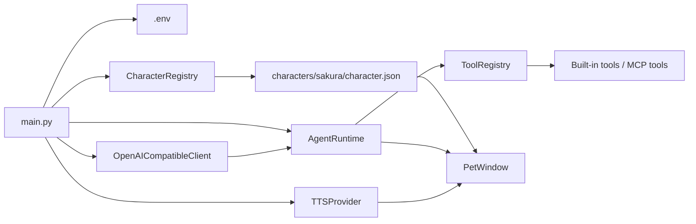

[中文](README.md) | [English](README.en.md)

# Sakura Desktop Pet

A desktop character Agent that stays on screen, chats, changes expressions, speaks through optional TTS, remembers what you explicitly allow it to remember, and uses tools after permission when a task needs more than text.


## Why This Exists

Most AI chat apps are still text boxes that answer questions. Sakura is built for a different feeling: a character remains on your desktop, speaks in her own voice, reacts with portraits, can set reminders, read pages, and, when allowed, look at the current screen.

So Sakura is no longer just "desktop pet + chat." It is now a desktop companion Agent. The model first decides whether tools are needed, calls built-in or MCP tools when appropriate, then returns short playable segments. Each segment contains Japanese text, Chinese subtitles, and a tone label, so the UI can synchronize subtitles, portraits, and optional TTS around the same reply structure.

## What It Is

Sakura Desktop Pet is a Python / PySide6 desktop app. It starts from `main.py`, loads runtime settings from `.env`, scans character packages under `characters/<character_id>/character.json`, and creates a frameless, draggable, always-on-top pet window.

The bundled character is `夜乃桜`. A character package can define:

- persona card and initial message
- default portrait and tone-specific portraits
- GPT-SoVITS model paths, tone reference audio, and language settings
- the reply tones the model is allowed to use

## Key Capabilities

- **Character packages.** `CharacterRegistry` scans `characters/*/character.json` and validates character cards, portraits, and voice resources. Adding a new character is mostly adding a new package directory.

- **Segmented bilingual replies.** The model must return JSON segments with `ja`, `zh`, and `tone`. Sakura can speak Japanese while showing either Japanese or Chinese subtitles.

- **Tone-driven portraits and voice.** `PetWindow` maps each `tone` to a portrait and sends Japanese text to the TTS provider. With GPT-SoVITS enabled, it can switch configured weights and choose tone reference audio.

- **Agent tool loop.** `AgentRuntime` plans whether tools are needed, executes todo, reminder, note, memory, browser, screen observation, and MCP tools, then generates the final desktop-pet reply from tool results.

- **On-demand screen observation.** When the user's request needs the current screen and both privacy switches are enabled, Sakura captures the screen under the cursor and sends it as an OpenAI-compatible `image_url` message. Screenshots are not written to chat history.

- **Controlled browser.** Sakura can open an app-managed browser window, extract page text and links, scroll, click CSS selectors, and summarize the result through the model. State-changing browser actions require confirmation.

- **Local memory, reminders, and data.** Todos, reminders, notes, and long-term memory live under `data/`. Long-term memory uses a proposal-and-confirmation flow: the app writes confirmed memory only after the user explicitly approves it.

- **MCP extension.** `data/config/mcp.yaml` can register stdio or SSE MCP servers. External tools are prefixed, added to Sakura's tool registry, and gated by configured risk.

## With and Without Sakura

| Without Sakura | With Sakura |
|---|---|
| Chat happens in a normal text window | The character remains as a desktop pet |
| Replies are plain text blobs | Replies become playable display / voice / expression segments |
| Expressions and voice are separate systems | Tone labels drive both portraits and TTS references |
| Tool use requires manual app switching | The model can plan and call tools inside the conversation |
| Screen capture can easily become persistent data | Screenshots are attached only to the current turn; history stores only a marker |
| External abilities must be hard-coded | MCP servers can be connected through YAML |
| Memory can be silently written by the model | Candidate memory requires explicit user confirmation |

## How It Works

### Startup

When you run `python main.py`, Sakura:

1. Creates a `QApplication`.
2. Loads API settings from `.env` through `ApiSettings.load()`.
3. Scans character packages with `CharacterRegistry`.
4. Loads the active character card and reply tones.
5. Creates the built-in tool registry, memory store, reminder store, browser bridge, and optional MCP tools.
6. Creates either a GPT-SoVITS provider or a silent provider.
7. Shows `PetWindow`.



### Conversation and Tools

`PetWindow.send_message()` adds the user message to recent context and starts `ChatWorker` in a `QThread`. The worker calls `AgentRuntime.handle_user_message()`:

1. The model returns planning JSON: `reply` plus `tool_calls`.
2. If no tool is needed, the reply is parsed directly.
3. If tools are needed, `ToolRegistry` either executes them or asks for user confirmation.
4. Tool results are truncated and redacted before being sent back to the model.
5. The model produces the final segmented reply, and the UI plays subtitles, portraits, and voice segment by segment.

One turn can execute up to `3` tool calls. Tool results are capped to roughly `6000` characters before being handed back to the model.

### Screen Observation

Screen observation has two gates:

- The Settings dialog has an "allow on-demand screen observation" privacy switch.
- The context menu has an "allow model vision" switch for the current session.

Only when both are enabled and the model requests `observe_screen` does Sakura capture the screen under the cursor. The screenshot is scaled to a maximum edge of `1280`, encoded as a JPEG data URL, and attached only to the current request. Chat history stores a marker instead of the image.

### Tools and Permissions

Built-in tools include:

| Tool type | Capability |
|---|---|
| Time | Read local time and timezone |
| Todos | Add, list, and complete todos |
| Reminders | Add, list, and cancel one-shot reminders; trigger active desktop reminders when due |
| Notes | Read and write text notes under `data/notes/` |
| Memory | Search, propose, confirm, and forget long-term memory |
| Web | Open external URLs, or use Sakura's controlled browser to read, scroll, click, and inspect state |
| Local folders | Open existing local folders |
| Screen observation | Capture the current screen for a vision-capable model |

Tools that change desktop, browser, or external state require confirmation by default. The "free access" context-menu toggle allows ordinary confirmation tools to run directly, while high-risk or destructive tools still require confirmation.

### MCP Extension

If `data/config/mcp.yaml` exists, Sakura reads it and registers external MCP tools. If the file is missing, MCP stays disabled silently.

Example:

```yaml
enabled: true
default_call_timeout: 30
servers:
  browser:
    transport: stdio
    command: python
    args: ["path/to/server.py"]
    name_prefix: browser__
    risk: medium
```

Supported transports:

- `stdio`
- `sse`

`risk: low` defaults to no confirmation. `medium` and `high` require confirmation unless `requires_confirmation` explicitly overrides the behavior.

## Quick Start

**Prerequisites:** Python 3.10+ is recommended. On Windows, use PowerShell:

```powershell
# 1. Create and activate a virtual environment
python -m venv .venv
.\.venv\Scripts\Activate.ps1

# 2. Install dependencies
pip install -r requirements.txt

# 3. Create local configuration
Copy-Item config.example.env .env

# 4. Edit .env and set at least API_KEY
notepad .env

# 5. Start the desktop pet
python main.py
```

At minimum, `.env` needs:

```env
BASE_URL=https://api.openai.com/v1
API_KEY=your_api_key_here
MODEL=gpt-4.1-mini
CURRENT_CHARACTER_ID=sakura
TTS_ENABLED=false
```

You should see `夜乃桜` near the bottom-right of the screen. Right-click the pet or tray icon to open settings, history, subtitle language, privacy, model vision, free access, and quit actions.

## Optional Voice Setup

Voice is disabled by default. This repository includes the GPT-SoVITS client integration and Sakura's character voice resource configuration, but it does not bundle a GPT-SoVITS server runtime directory. Start your own local GPT-SoVITS API compatible with:

- `POST /tts`
- `GET /set_gpt_weights`
- `GET /set_sovits_weights`

Then enable:

```env
TTS_ENABLED=true
GPT_SOVITS_API_URL=http://127.0.0.1:9880/tts
GPT_SOVITS_REF_LANG=ja
GPT_SOVITS_TEXT_LANG=ja
GPT_SOVITS_TIMEOUT_SECONDS=60
```

The bundled Sakura character package already points to configured GPT / SoVITS model paths and tone references in `characters/sakura/character.json`.

## Configuration

| Key | Purpose | Default |
|---|---|---|
| `BASE_URL` | OpenAI-compatible API base URL | `https://api.openai.com/v1` |
| `API_KEY` | API key for chat requests | empty |
| `MODEL` | Chat model name | `gpt-4.1-mini` |
| `API_TIMEOUT_SECONDS` | Chat request timeout | `60` |
| `SUBTITLE_LANGUAGE` | Speech bubble language: `ja` or `zh` | `ja` |
| `SCREEN_OBSERVATION_ENABLED` | Allow on-demand screen observation | `true` |
| `SAKURA_DEBUG` | Print debug logs | `false` |
| `SAKURA_DEBUG_BODY` | Include full message bodies in debug logs | `false` |
| `CURRENT_CHARACTER_ID` | Active character package id | `sakura` |
| `TTS_ENABLED` | Enable GPT-SoVITS voice | `false` |
| `GPT_SOVITS_API_URL` | Local TTS endpoint | `http://127.0.0.1:9880/tts` |
| `GPT_SOVITS_REF_LANG` | Reference audio language | `ja` |
| `GPT_SOVITS_TEXT_LANG` | Text language sent to TTS | `ja` |
| `GPT_SOVITS_TIMEOUT_SECONDS` | TTS request timeout | `60` |

## Project Map

```text
.
├── main.py                         # Application entry point
├── config.example.env              # Example runtime configuration
├── app/
│   ├── pet_window.py               # Pet UI, tray menu, subtitles, portraits, and tool confirmation
│   ├── api_client.py               # OpenAI-compatible chat/completions client
│   ├── chat_worker.py              # Qt background workers
│   ├── chat_reply.py               # Segmented reply parser and fallback
│   ├── character_loader.py         # Character package scanning and validation
│   ├── screen_observation.py       # On-demand screenshots and multimodal message construction
│   ├── browser_controller.py       # Sakura-controlled browser window
│   ├── settings_dialog.py          # Character, API, TTS, and privacy settings
│   ├── tts.py                      # GPT-SoVITS provider and silent provider
│   └── agent/
│       ├── runtime.py              # Planning, tool calls, and final replies
│       ├── builtin_tools.py        # Built-in tool registration
│       ├── tool_registry.py        # Tool permissions, confirmation, and execution
│       ├── memory.py               # Long-term memory and candidate memory
│       ├── reminders.py            # One-shot reminders
│       └── mcp/                    # MCP config, connection, and tool bridge
├── characters/
│   └── sakura/
│       ├── character.json          # Character manifest
│       ├── card.md                 # Persona card / system prompt
│       ├── portraits/              # Tone-specific portraits
│       └── voice/                  # Model path config and reference audio
├── data/                           # Local history, memory, reminders, todos, notes, and MCP config
└── tests/                          # pytest tests
```

## Tests

```powershell
python -m pytest
```

Tests cover the API client, Agent core flow, chat worker, debug logging, pet window, and TTS behavior.

## License

No root `LICENSE` file is included yet. Check the license of character assets, model weights, and third-party runtimes before redistribution.
