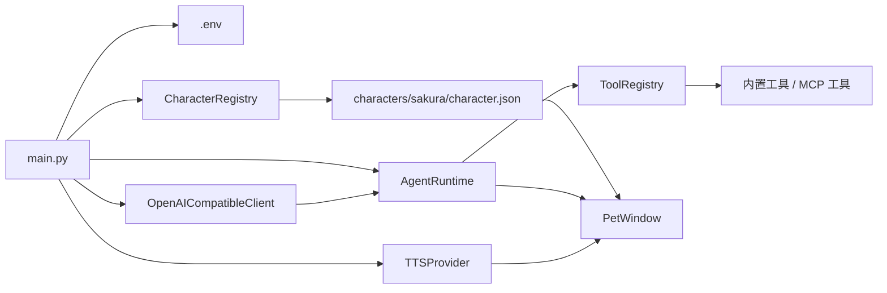

[中文](README.md) | [English](README.en.md)

# Sakura Desktop Pet

一个停在桌面上的角色 Agent：她能聊天、换表情、朗读、记住你允许她记住的事，也能在确认后使用工具帮你处理轻量任务。


## 为什么做它

普通 AI 聊天窗口像一块会回答问题的文本框。Sakura 想做的是另一种体验：角色一直在桌面上，能用自己的语气说话，用立绘表达情绪，在需要时查时间、记提醒、读网页，或者按你的许可看一眼当前屏幕。

所以它现在不只是「桌宠 + 聊天」。核心已经变成一个桌面陪伴型 Agent：模型先判断是否需要工具，必要时调用内置工具或 MCP 工具，再把结果组织成适合桌宠播放的分段回复。每段回复都带日文原文、中文字幕和语气标签，UI 用同一份结构同步字幕、表情和可选 TTS。

## 这是什么

Sakura Desktop Pet 是一个 Python / PySide6 桌面应用。入口是 `main.py`，运行时从 `.env` 读取配置，扫描 `characters/<character_id>/character.json` 角色包，并创建无边框、置顶、可拖拽的桌宠窗口。

当前内置角色是 `夜乃桜`。角色包可以定义：

- 人格卡和初始台词
- 默认立绘与按语气切换的表情立绘
- GPT-SoVITS 模型路径、语气参考音频和语言配置
- 允许模型使用的回复语气集合

## 关键能力

- **角色包驱动。** `CharacterRegistry` 扫描 `characters/*/character.json`，校验角色卡、立绘和语音参考资源。新增角色主要是新增一个角色目录，而不是改主程序。

- **分段双语回复。** 模型必须返回 JSON 片段，每段包含 `ja`、`zh` 和 `tone`。角色可以用日语朗读，同时在气泡中切换日文或中文字幕。

- **语气联动表情和语音。** `PetWindow` 根据每段 `tone` 切换立绘，并把日文文本交给 TTS Provider。启用 GPT-SoVITS 时，会按角色包配置切换权重并选择对应语气参考音频。

- **Agent 工具循环。** `AgentRuntime` 会先让模型规划是否需要工具，再执行待办、提醒、笔记、记忆、浏览器、屏幕观察等工具，最后基于工具结果生成桌宠回复。

- **按需屏幕观察。** 当用户问题需要当前画面，且隐私开关与模型视觉开关都开启时，Sakura 会截取光标所在屏幕，以 OpenAI 兼容的 `image_url` 消息发送给模型；截图不会写入聊天历史。

- **受控浏览器。** Sakura 可以打开一个由应用托管的浏览器窗口，读取页面文本和链接、滚动页面、点击 CSS selector，并把结果交给模型总结。会改变外部状态的动作需要确认。

- **长期记忆、提醒和本地数据。** 待办、提醒、笔记、长期记忆都保存到 `data/` 下。长期记忆采用候选确认机制：只有用户明确要求记住并确认后，才会写入正式记忆。

- **MCP 扩展。** `data/config/mcp.yaml` 可注册 stdio 或 SSE MCP Server，外部工具会带名称前缀挂入 Sakura 的工具注册表，并按风险级别决定是否需要确认。

## 使用前后有什么不同

| 不用 Sakura | 使用 Sakura |
|---|---|
| 聊天发生在普通文本窗口里 | 角色作为桌宠停留在屏幕上 |
| 回复是一整段纯文本 | 回复拆成适合显示、朗读和表情切换的小段 |
| 表情和语音通常互不联动 | 语气标签同时驱动立绘和 TTS 参考音频 |
| 工具调用要靠你手动切换应用 | 模型可在对话中规划并调用内置工具 |
| 看屏幕容易变成长期保存截图 | 截图只按需附加到当前轮消息，历史只保留标记 |
| 外部能力要写死在代码里 | MCP Server 可通过 YAML 配置接入 |
| 长期记忆容易被模型静默写入 | 候选记忆需要用户明确确认 |

## 工作原理

### 启动流程

运行 `python main.py` 后，应用会：

1. 创建 `QApplication`。
2. 通过 `ApiSettings.load()` 从 `.env` 加载 API 配置。
3. 使用 `CharacterRegistry` 扫描角色包。
4. 加载当前角色的人格卡和可用语气。
5. 创建内置工具注册表、记忆库、提醒库、受控浏览器桥接器和可选 MCP 工具。
6. 创建 GPT-SoVITS Provider 或静音 Provider。
7. 显示 `PetWindow`。



### 对话和工具调用

`PetWindow.send_message()` 会把用户输入加入最近上下文，并在 `QThread` 中启动 `ChatWorker`。Worker 调用 `AgentRuntime.handle_user_message()`：

1. 模型先返回工具规划 JSON：`reply` + `tool_calls`。
2. 如果没有工具调用，直接解析为桌宠回复。
3. 如果有工具调用，`ToolRegistry` 判断是直接执行还是等待用户确认。
4. 工具结果会被截断、脱敏后交回模型。
5. 模型生成最终分段回复，UI 再逐段播放字幕、表情和语音。

单轮最多执行 `3` 个工具调用，工具结果默认最多保留约 `6000` 字符给模型，避免上下文失控。

### 屏幕观察

屏幕观察是双开关设计：

- 设置窗口的「允许按需屏幕观察」控制应用是否允许截图。
- 右键菜单的「启用模型视觉」控制当前会话是否把截图能力暴露给模型。

只有两个开关都开启，且模型确实请求 `observe_screen` 时，Sakura 才会截取光标所在屏幕。截图会缩放到最长边 `1280`，以 JPEG data URL 附加到当前轮请求；聊天历史只记录一条「已附加当前屏幕截图」标记。

### 工具和权限

内置工具包括：

| 工具类型 | 能力 |
|---|---|
| 时间 | 获取本机当前时间和时区 |
| 待办 | 新增、列出、完成待办 |
| 提醒 | 新增、列出、取消一次性提醒；到期后主动触发桌宠提醒 |
| 笔记 | 读取和写入 `data/notes/` 下的文本笔记 |
| 记忆 | 搜索、提出候选记忆、确认记忆、忘记记忆 |
| 网页 | 打开外部 URL，或使用 Sakura 受控浏览器读网页、滚动、点击、取状态 |
| 本地文件夹 | 打开已存在的本地文件夹 |
| 屏幕观察 | 按需捕获当前屏幕并交给视觉模型 |

会改变桌面、浏览器或外部状态的工具默认需要确认。右键菜单里的「自由访问权限」可以让普通确认工具直接执行，但高风险或破坏性工具仍会保留确认。

### MCP 扩展

如果存在 `data/config/mcp.yaml`，Sakura 会尝试读取 MCP 配置并注册外部工具。配置文件不存在时，MCP 会静默关闭，不影响主流程。

示例：

```yaml
enabled: true
default_call_timeout: 30
servers:
  browser:
    transport: stdio
    command: python
    args: ["path/to/server.py"]
    name_prefix: browser__
    risk: medium
```

支持的 transport：

- `stdio`
- `sse`

`risk: low` 默认不需要确认；`medium` 和 `high` 默认需要确认，也可以用 `requires_confirmation` 显式覆盖。

## 快速开始

**前置要求：** 推荐 Python 3.10+。Windows 下可以直接使用下面的 PowerShell 命令。

```powershell
# 1. 创建并激活虚拟环境
python -m venv .venv
.\.venv\Scripts\Activate.ps1

# 2. 安装依赖
pip install -r requirements.txt

# 3. 创建本地配置
Copy-Item config.example.env .env

# 4. 编辑 .env，至少填入 API_KEY
notepad .env

# 5. 启动桌宠
python main.py
```

`.env` 至少需要：

```env
BASE_URL=https://api.openai.com/v1
API_KEY=your_api_key_here
MODEL=gpt-4.1-mini
CURRENT_CHARACTER_ID=sakura
TTS_ENABLED=false
```

启动后，你应该能在屏幕右下附近看到 `夜乃桜`。右键桌宠或托盘图标可以打开设置、历史记录、字幕语言、隐私开关、模型视觉开关、自由访问权限和退出菜单。

## 可选语音配置

语音默认关闭。当前仓库提供 GPT-SoVITS 客户端接入和 Sakura 角色的语音资源配置，但不内置 GPT-SoVITS 服务端运行目录。你需要先自行启动一个兼容以下接口的本地 GPT-SoVITS API：

- `POST /tts`
- `GET /set_gpt_weights`
- `GET /set_sovits_weights`

然后在 `.env` 或设置窗口中启用：

```env
TTS_ENABLED=true
GPT_SOVITS_API_URL=http://127.0.0.1:9880/tts
GPT_SOVITS_REF_LANG=ja
GPT_SOVITS_TEXT_LANG=ja
GPT_SOVITS_TIMEOUT_SECONDS=60
```

内置 Sakura 角色包已经在 `characters/sakura/character.json` 中配置了 GPT / SoVITS 模型路径和语气参考表。

## 配置项

| 配置项 | 作用 | 默认值 |
|---|---|---|
| `BASE_URL` | OpenAI 兼容 API 地址 | `https://api.openai.com/v1` |
| `API_KEY` | 聊天请求使用的 API Key | 空 |
| `MODEL` | 聊天模型名称 | `gpt-4.1-mini` |
| `API_TIMEOUT_SECONDS` | 聊天请求超时时间 | `60` |
| `SUBTITLE_LANGUAGE` | 气泡显示 `ja` 或 `zh` | `ja` |
| `SCREEN_OBSERVATION_ENABLED` | 是否允许按需屏幕观察 | `true` |
| `SAKURA_DEBUG` | 是否输出调试日志 | `false` |
| `SAKURA_DEBUG_BODY` | 是否在调试日志中输出完整正文 | `false` |
| `CURRENT_CHARACTER_ID` | 当前角色包 id | `sakura` |
| `TTS_ENABLED` | 是否启用 GPT-SoVITS 语音 | `false` |
| `GPT_SOVITS_API_URL` | 本地 TTS 接口地址 | `http://127.0.0.1:9880/tts` |
| `GPT_SOVITS_REF_LANG` | 参考音频语言 | `ja` |
| `GPT_SOVITS_TEXT_LANG` | 发送给 TTS 的文本语言 | `ja` |
| `GPT_SOVITS_TIMEOUT_SECONDS` | TTS 请求超时时间 | `60` |

## 项目结构

```text
.
├── main.py                         # 应用入口
├── config.example.env              # 示例运行配置
├── app/
│   ├── pet_window.py               # 桌宠窗口、托盘菜单、字幕、表情和工具确认
│   ├── api_client.py               # OpenAI 兼容 chat/completions 客户端
│   ├── chat_worker.py              # Qt 后台线程 Worker
│   ├── chat_reply.py               # 分段回复解析与兜底
│   ├── character_loader.py         # 角色包扫描和校验
│   ├── screen_observation.py       # 按需屏幕截图与多模态消息构造
│   ├── browser_controller.py       # Sakura 受控浏览器窗口
│   ├── settings_dialog.py          # 角色、API、TTS、隐私设置
│   ├── tts.py                      # GPT-SoVITS Provider 与静音 Provider
│   └── agent/
│       ├── runtime.py              # Agent 规划、工具调用和最终回复
│       ├── builtin_tools.py        # 内置工具注册
│       ├── tool_registry.py        # 工具权限、确认和执行
│       ├── memory.py               # 长期记忆与候选记忆
│       ├── reminders.py            # 一次性提醒
│       └── mcp/                    # MCP 配置、连接和工具桥接
├── characters/
│   └── sakura/
│       ├── character.json          # 角色清单
│       ├── card.md                 # 人格卡 / 系统提示词
│       ├── portraits/              # 语气立绘
│       └── voice/                  # 模型路径配置和参考音频
├── data/                           # 本地历史、记忆、提醒、待办、笔记和 MCP 配置
└── tests/                          # pytest 测试
```

## 测试

```powershell
python -m pytest
```

测试覆盖了 API 客户端、Agent 核心链路、聊天 Worker、调试日志、桌宠窗口和 TTS 相关行为。

## 许可证

仓库根目录目前没有提供 `LICENSE` 文件。重新分发角色资源、模型权重或第三方运行时前，请分别确认对应文件的授权。
