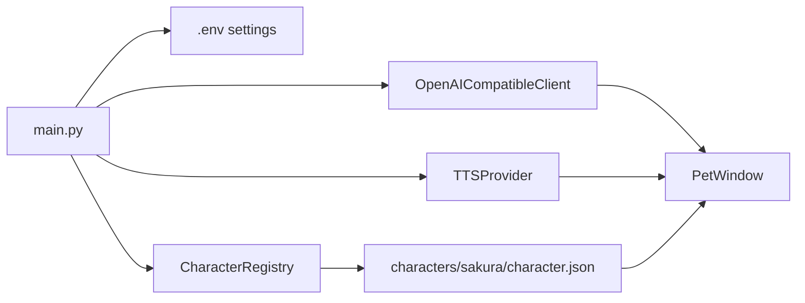

[English](README.md) | [中文](README.zh.md)

# Sakura Desktop Pet

A PySide6 desktop companion that keeps a character on your screen, chats through an OpenAI-compatible API, and optionally speaks through GPT-SoVITS.


## Why This Exists

Most AI chat interfaces are still windows with text inside them. They can answer, but they do not feel present. If you want a character that stays on the desktop, reacts with expressions, speaks in a consistent voice, and keeps a readable history, you usually have to wire those pieces together yourself.

Sakura Desktop Pet puts those pieces behind one character package. The app loads a character card, portrait set, reply tones, voice references, API settings, and chat history, then presents them as a frameless always-on-top desktop pet.

The core idea is simple: the model should not just return a paragraph. It returns short spoken segments, each with Japanese text, Chinese subtitle text, and a tone label. The UI can then synchronize subtitles, expression changes, and optional TTS playback around the same reply structure.

## What It Is

Sakura Desktop Pet is a Python desktop app built with PySide6. It starts from `main.py`, loads configuration from `.env`, scans `characters/<character_id>/character.json`, and creates a floating pet window.

It currently focuses on one bundled character, `夜乃桜`, but the runtime is character-package driven. A character package can define:

- persona prompt and initial message
- default and tone-specific portraits
- GPT-SoVITS model paths and tone reference audio
- the set of reply tones the model is allowed to use

## Key Features

- **Character package runtime.** `app.character_loader.CharacterRegistry` scans `characters/*/character.json`, validates required files, and lets the settings dialog switch the active character without changing code.

- **Segmented bilingual replies.** `app.api_client.OpenAICompatibleClient.chat()` asks the model for strict JSON segments containing `ja`, `zh`, and `tone`, so the pet can speak Japanese while showing either Japanese or Chinese subtitles.

- **Tone-driven expressions.** `app.pet_window.PetWindow` maps each reply segment's tone to a portrait through `CharacterProfile.portrait_for_tone()`, then swaps the visible portrait as the reply advances.

- **Optional GPT-SoVITS voice.** `app.tts.GPTSoVITSTTSProvider` sends each segment to a local GPT-SoVITS API, switches character weights when configured, selects tone reference audio, and plays generated WAV files through Qt Multimedia.

- **Desktop-first controls.** The pet is frameless, draggable, always on top, and controlled through a tray menu with visibility, subtitle language, history, settings, and quit actions.

- **Local chat history.** `app.chat_history.ChatHistoryStore` stores JSONL history per character under `data/chat_history/<character_id>.jsonl`, skipping malformed records instead of failing the whole history view.

## With and Without Sakura

| Without Sakura | With Sakura |
|---|---|
| Chat happens in a normal text window | The character stays as a desktop pet |
| Replies are plain text blobs | Replies are short display and speech segments |
| Translation is a separate step | Japanese text and Chinese subtitle are produced together |
| Expressions are manual or absent | Tone labels drive portrait changes |
| TTS uses one fixed prompt | Tone references can vary per reply tone |
| Settings require editing files only | API, character, and TTS settings are available in the UI |
| History can be lost between sessions | Per-character JSONL history is saved locally |

## How It Works

### Startup Path

When you run `python main.py`, the app:

1. Creates a `QApplication`.
2. Loads API settings from `.env` through `ApiSettings.load()`.
3. Scans character packages with `CharacterRegistry`.
4. Loads the current character and system prompt.
5. Creates either a GPT-SoVITS provider or a silent fallback provider.
6. Shows `PetWindow`.



### Chat Flow

`PetWindow.send_message()` records the user message, disables the input, and starts `ChatWorker` in a `QThread`. The worker calls the OpenAI-compatible `/chat/completions` endpoint through the standard library `urllib` stack.

The system prompt is extended with a reply contract:

```json
{"segments":[{"ja":"日文原文","zh":"中文译文","tone":"中性"}]}
```

`app.chat_reply.parse_chat_reply()` parses that structure. If the model returns plain text or malformed JSON, it falls back to a single neutral segment so the UI can still show a reply.

### Display, Subtitle, and Voice Sync

Each reply segment moves through the same sequence:

1. Preload the portrait for its tone.
2. Ask the TTS provider to speak the Japanese text.
3. Switch the portrait when playback starts.
4. Type the selected subtitle language into the speech bubble.
5. Advance only after both speech display and TTS playback have finished.

If TTS is disabled, `NullTTSProvider` immediately triggers the same callbacks. That keeps the chat flow identical with or without voice enabled.

### GPT-SoVITS Integration

The bundled TTS service lives under `tts/`. Sakura expects a local GPT-SoVITS API compatible with:

- `POST /tts`
- `GET /set_gpt_weights`
- `GET /set_sovits_weights`

When a character package provides voice model paths, the provider switches weights once, then generates WAV audio for each segment. Tone references are loaded from the character package's `voice/refs/ref.txt`.

### Design Choices

| Choice | Why |
|---|---|
| OpenAI-compatible API instead of one SDK | Works with OpenAI and compatible providers through `BASE_URL`, `API_KEY`, and `MODEL` |
| Character packages instead of hard-coded assets | New characters can be added by adding files under `characters/<id>/` |
| JSONL chat history | One bad line does not corrupt the entire history |
| Worker thread for chat requests | The Qt UI stays responsive while the network request is running |
| Silent TTS fallback | Chat remains usable even when GPT-SoVITS is not installed or disabled |

## Quick Start

**Prerequisites:** Python 3.10+ is recommended. On Windows, use PowerShell commands below.

```powershell
# 1. Create and activate a virtual environment
python -m venv .venv
.\.venv\Scripts\Activate.ps1

# 2. Install the desktop app dependency
pip install -r requirements.txt

# 3. Create local configuration
Copy-Item config.example.env .env

# 4. Edit .env and set at least API_KEY
notepad .env

# 5. Start the desktop pet
python main.py
```

At minimum, `.env` needs:

```env
BASE_URL=https://api.openai.com/v1
API_KEY=your_api_key_here
MODEL=gpt-4.1-mini
CURRENT_CHARACTER_ID=sakura
TTS_ENABLED=false
```

You should see the `夜乃桜` desktop pet near the bottom-right of the screen. Right-click the pet or tray icon to open settings, history, subtitle language, and quit actions.

## Optional Voice Setup

Voice is disabled by default. To enable GPT-SoVITS playback:

```powershell
# Install TTS dependencies
pip install -r tts\requirements.txt

# Start the local GPT-SoVITS API
Set-Location tts
python api_v2.py -a 127.0.0.1 -p 9880 -c GPT_SoVITS/configs/tts_infer.yaml
```

Then set these values in `.env` or in the settings dialog:

```env
TTS_ENABLED=true
GPT_SOVITS_API_URL=http://127.0.0.1:9880/tts
GPT_SOVITS_REF_LANG=ja
GPT_SOVITS_TEXT_LANG=ja
```

The Sakura character package already points to its configured GPT and SoVITS model paths through `characters/sakura/character.json`.

## Project Map

```text
.
├── main.py                         # Application entry point
├── config.example.env              # Example runtime configuration
├── app/
│   ├── pet_window.py               # Floating pet UI, tray menu, subtitles, expression flow
│   ├── api_client.py               # OpenAI-compatible chat/completions client
│   ├── chat_reply.py               # Segmented reply parser and fallback logic
│   ├── character_loader.py         # Character package scanning and validation
│   ├── tts.py                      # GPT-SoVITS provider and silent fallback
│   ├── settings_dialog.py          # Character, API, and TTS settings UI
│   └── chat_history.py             # Per-character JSONL history
├── characters/
│   └── sakura/
│       ├── character.json          # Character manifest
│       ├── card.md                 # System prompt / character card
│       ├── portraits/              # Tone-specific portraits
│       └── voice/                  # GPT-SoVITS models and reference audio
├── data/
│   └── chat_history/               # Local chat history
└── tts/                            # Bundled GPT-SoVITS API runtime
```

## Configuration Reference

| Key | Purpose | Default |
|---|---|---|
| `BASE_URL` | OpenAI-compatible API base URL | `https://api.openai.com/v1` |
| `API_KEY` | API key for chat requests | empty |
| `MODEL` | Chat model name | `gpt-4.1-mini` |
| `API_TIMEOUT_SECONDS` | Chat request timeout | `60` |
| `SUBTITLE_LANGUAGE` | `ja` or `zh` speech bubble text | `ja` |
| `CURRENT_CHARACTER_ID` | Active character package id | `sakura` |
| `TTS_ENABLED` | Enable GPT-SoVITS voice | `false` |
| `GPT_SOVITS_API_URL` | Local TTS endpoint | `http://127.0.0.1:9880/tts` |
| `GPT_SOVITS_REF_LANG` | Reference audio language | `ja` |
| `GPT_SOVITS_TEXT_LANG` | Text language sent to TTS | `ja` |
| `GPT_SOVITS_TIMEOUT_SECONDS` | TTS request timeout | `60` |

## License

No root license file is included yet. Check third-party components under `tts/` for their own license files before redistributing model or runtime assets.
