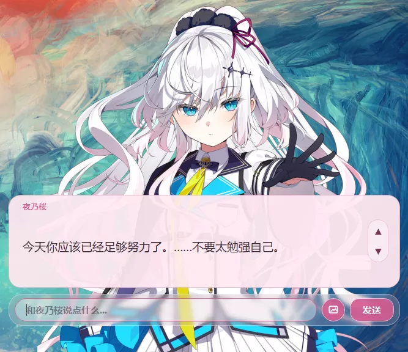
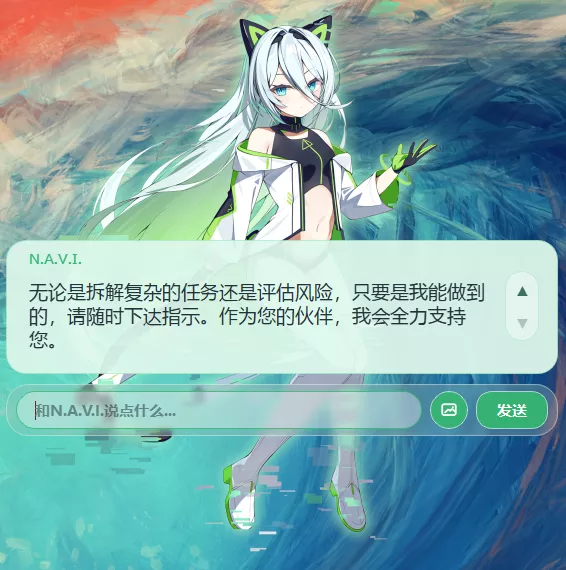

# Sakura Desktop Pet

### 一个能主动感知屏幕内容与系统事件的通用桌宠 Agent 框架

[English](docs/README.en.md) [安装教程](docs/userdocs/SETUP.md) [API配置教程](docs/userdocs/API_CONFIG.md)  [插件开发文档](docs/devdocs/SAKURA_PLUGIN_SDK.md)  [技术文档](docs/devdocs/TECHNICAL_README.md)

> 安装包与发布说明见 [Releases](https://github.com/Rvosy/sakura/releases)，版本变化见 [更新日志](docs/CHANGELOG.md)，使用指南见[用户文档](docs/userdocs/README.md)。

最近推完水晶社的新作，~~推完自动变成学姐的狗~~，已经变成学姐的形状了，夜里辗转反侧怎么都睡不着。便以学姐的名字 **Sakura** 命名这个项目，开发了这个桌宠 Agent 框架。

Sakura 在桌面上显示你选择的角色，用角色卡决定对话风格，并通过插件接入模型、语音和长期记忆。
开启屏幕感知后，她可以结合屏幕内容主动搭话；聊天中也可以搜索网页、调用已启用的工具。

## 效果预览

## 快速开始

1. 从 [Releases](https://github.com/Rvosy/sakura/releases) 下载对应平台的安装包。Windows Setup 直接安装，Portable ZIP 解压后运行 `sakura.exe`；macOS 按[安装指南](docs/userdocs/MACOS_SETUP.md)操作。
2. 首次启动时导入 `.char` 角色包，并按 [API 配置指南](docs/userdocs/API_CONFIG.md)添加模型服务、选择对话模型。
3. 发送一条消息开始聊天。语音、记忆和语音输入按需安装对应插件，见[插件指南](docs/userdocs/RUNTIME_V2_PLUGINS.md)。

Linux x64 从源码安装见 [Linux 使用说明](docs/userdocs/LINUX_SETUP.md)；其他源码运行方式和版本升级见[完整安装指南](docs/userdocs/SETUP.md)。

## 功能特性

- **角色与外观**：导入 `.char` 角色包，在内置角色工坊编辑人设、表现资源、主题和语音资源；气泡、输入栏和窗口材质可调整。
- **聊天与屏幕感知**：文字和图片对话、框选截图、主动搭话、分段字幕与表现播放，详见[聊天与屏幕感知](docs/userdocs/CHAT_SCREEN_AND_CONTEXT.md)。
- **工具与扩展**：自带[网页搜索与读取](docs/userdocs/WEB_SEARCH.md)；浏览器操作、手机网页端等通过[插件](docs/userdocs/RUNTIME_V2_PLUGINS.md)扩展，MCP 基础组件供服务插件使用。
- **语音与记忆**：安装 GPT-SoVITS、Genie 或 Mem0 等可选插件后配置对应能力，详见[安装指南](docs/userdocs/SETUP.md)。
- **日志与历史**：浏览聊天记录，通过[运行日志](docs/userdocs/RUNTIME_LOG_TROUBLESHOOTING.md)查看模型、插件与工具调用的状态及失败原因。

## 文档

| 文档 | 内容 |
|---|---|
| [安装与配置指南](docs/userdocs/SETUP.md) | 完整安装步骤、角色导入、语音配置、版本更新 |
| [API 配置教程](docs/userdocs/API_CONFIG.md) | Base URL、API Key、模型选择和中转站配置 |
| [聊天、截图与屏幕感知](docs/userdocs/CHAT_SCREEN_AND_CONTEXT.md) | 普通聊天、手动截图、主动感知和上下文行为 |
| [运行统计与错误报告](docs/userdocs/REMOTE_DIAGNOSTICS_AND_TELEMETRY.md) | 默认状态、发送范围、关闭方式、诊断 ID 与保存期限 |
| [macOS 使用指南](docs/userdocs/MACOS_SETUP.md) | Apple Silicon/Rosetta、SSL 证书、GPT-SoVITS 语音 |
| [技术架构指南](docs/devdocs/TECHNICAL_README.md) | 运行时架构、启动流程、项目结构、配置项 |
| [Linux 安装指南](docs/userdocs/LINUX_SETUP.md) | Ubuntu 24.04、WebKitGTK、从源码下载 Runtime |
| [插件 SDK 文档](docs/devdocs/SAKURA_PLUGIN_SDK.md) | 插件开发入口 |
| [文档总览](docs/README.md) | 按用户文档、开发文档、spec、ADR、plan、record 和 archive 分类的完整目录 |
| [贡献指南](.github/CONTRIBUTING.md) | 开发环境、分支规范、测试和 PR 要求 |
| [更新日志](docs/CHANGELOG.md) | 各版本的用户可见变化与升级提醒 |

## 致谢与开源许可说明

Sakura Desktop Pet 的桌宠交互和插件设计参考了多个开源项目。感谢 [Shinsekai](https://github.com/RachelForster/Shinsekai) 及其插件生态，为角色交互、插件扩展和兼容设计提供了参考。

本项目采用 MIT License 开源。你可以自由使用、复制、修改、合并、发布、分发、再授权或销售本项目代码，但需要保留本项目的版权声明和 MIT License 文本。

Copyright © 2026 Rvosy

### 第三方代码与兼容说明

本项目中的可选插件 `plugins/optional/playwright_browser` 包含基于以下 MIT 开源项目的代码与改动：

- Project: [`shinsekai-playwright-browser`](https://github.com/RachelForster/shinsekai-playwright-browser)
- License: MIT License
- Copyright: Copyright © 2026 Chihiro

Sakura 在此基础上进行了适配和修改，用于提供 Playwright 浏览器自动化能力。

感谢所有开源项目作者和贡献者。

## Star History

<a href="https://star-history.dera.page/#Rvosy/Sakura&type=date&legend=top-left">
 <picture>
   <source media="(prefers-color-scheme: dark)" srcset="https://star-history.dera.page/svg?repos=Rvosy/Sakura&type=date&theme=dark&legend=top-left" />
   <source media="(prefers-color-scheme: light)" srcset="https://star-history.dera.page/svg?repos=Rvosy/Sakura&type=date&legend=top-left" />
   
 </picture>
</a>
