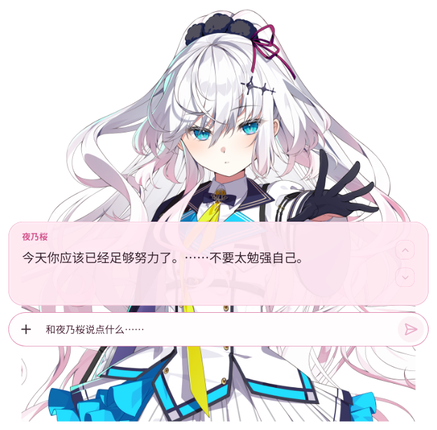
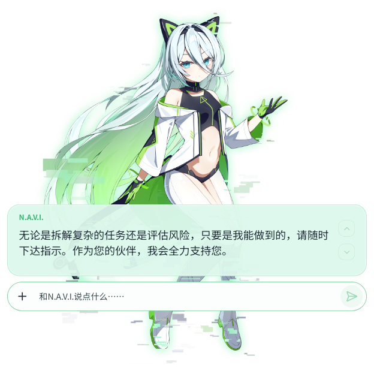
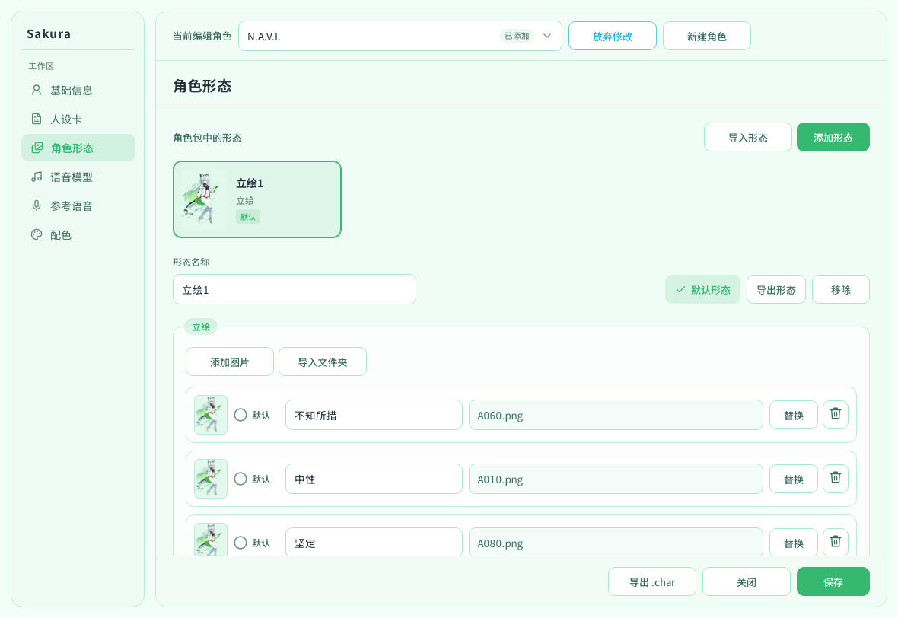

# Sakura Desktop Pet

把喜欢的角色做成能主动看屏幕、陪你交流的 AI 桌宠。

[安装与配置](docs/userdocs/SETUP.md) · [文档](docs/README.md) · [English](docs/README.en.md)

Sakura 是一个可扩展的 AI 桌宠框架。你可以在角色工坊中加入喜欢的角色立绘、编写人设、配置表情和语音，再导出角色包分享。

开启屏幕感知后，角色会定期查看屏幕，由模型判断是否主动搭话。它需要支持图片的模型和系统截图权限，截图会发送给你配置的模型服务。语音、长期记忆、浏览器操作等能力通过插件按需添加。

## 效果预览

同一个框架可以装载不同的角色，下面是 Sakura 和 N.A.V.I. 的桌面效果。

## 制作你的角色

角色工坊可以编辑人设、形态、立绘和表情标签，也能配置语音资源与配色。完成后导出 `.char` 角色包，供自己导入或分享给别人。

图为 1.3.1 Linux 正式版的角色工坊，正在编辑 N.A.V.I. 的立绘。

## 安装与配置

从[图文配置教程](docs/userdocs/SETUP.md)开始：选择安装包、导入角色、连接模型服务。教程也包含可选的语音、记忆和插件配置。

需要准备一个角色包，以及模型服务商提供的 API 地址、密钥和模型名称。模型服务可能收费，请先查看服务商的计费说明。

## 开发与扩展

写插件从 [Plugin API v4 指南](docs/devdocs/SAKURA_PLUGIN_SDK.md)开始；修改框架本身见[开发者文档](docs/devdocs/README.md)。版本变化见[更新日志](docs/CHANGELOG.md)。

## 项目缘起

最近推完水晶社的新作，~~推完自动变成学姐的狗~~，已经变成学姐的形状了，夜里辗转反侧怎么都睡不着。便以学姐的名字 **Sakura** 命名这个项目，开发了这个桌宠 Agent 框架。

## 致谢与开源许可说明

Sakura Desktop Pet 的桌宠交互和插件设计参考了多个开源项目。感谢 [Shinsekai](https://github.com/RachelForster/Shinsekai) 及其插件生态，为角色交互、插件扩展和兼容设计提供了参考。

本项目采用 MIT License 开源。你可以自由使用、复制、修改、合并、发布、分发、再授权或销售本项目代码，但需要保留本项目的版权声明和 MIT License 文本。

Copyright © 2026 Rvosy

### 第三方代码与兼容说明

本项目中的可选插件 `plugins/optional/playwright_browser` 包含基于以下 MIT 开源项目的代码与改动：

- Project: [`shinsekai-playwright-browser`](https://github.com/RachelForster/shinsekai-playwright-browser)
- License: MIT License
- Copyright: Copyright © 2026 Chihiro

Sakura 在此基础上进行了适配和修改，用于提供 Playwright 浏览器自动化能力。

感谢所有开源项目作者和贡献者。
