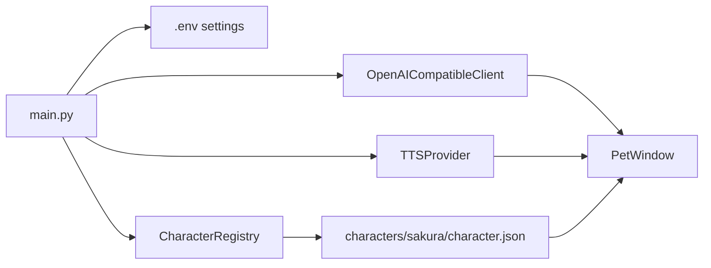

[English](README.md) | [中文](README.zh.md)
<!-- Synced with README.md as of 2026-05-29 -->

# Sakura Desktop Pet

一个 PySide6 桌面宠物应用：把角色立绘放在桌面上，用 OpenAI 兼容 API 聊天，并可选接入 GPT-SoVITS 语音朗读。


## 为什么做它

很多 AI 聊天工具本质上还是一个文本窗口。它们能回答问题，但很难有「角色就在桌面上陪着你」的感觉。想要立绘、表情、字幕、语音和历史记录一起工作，通常要自己把几套东西拼起来。

Sakura Desktop Pet 把这些内容收进一个角色包里。应用启动时会加载角色卡、立绘、可用语气、语音参考、API 配置和聊天历史，然后把它们呈现成一个无边框、置顶、可拖拽的桌宠窗口。

关键点不只是让模型返回一段话，而是让模型返回适合桌宠播放的短段落。每段都包含日文原文、中文字幕和语气标签，界面就能围绕同一份结构同步字幕、表情切换和可选的 TTS 播放。

## 这是什么

Sakura Desktop Pet 是一个用 Python 和 PySide6 写的桌面应用。入口是 `main.py`，运行时从 `.env` 读取配置，扫描 `characters/<character_id>/character.json`，再创建悬浮桌宠窗口。

当前仓库内置角色是 `夜乃桜`，但运行时按角色包加载。一个角色包可以定义：

- 人格提示词和初始消息
- 默认立绘和按语气切换的表情立绘
- GPT-SoVITS 模型路径和语气参考音频
- 允许模型使用的回复语气集合

## 关键特性

- **角色包驱动。** `app.character_loader.CharacterRegistry` 会扫描 `characters/*/character.json`，校验必要文件，并允许在设置窗口里切换当前角色。

- **分段双语回复。** `app.api_client.OpenAICompatibleClient.chat()` 要求模型返回严格 JSON，每段包含 `ja`、`zh` 和 `tone`，因此角色可以用日语朗读，同时显示日文或中文字幕。

- **语气联动表情。** `app.pet_window.PetWindow` 会通过 `CharacterProfile.portrait_for_tone()` 把每段回复的语气映射到立绘，并在回复进入下一段时切换表情。

- **可选 GPT-SoVITS 语音。** `app.tts.GPTSoVITSTTSProvider` 会把每段文本发送到本地 GPT-SoVITS API，按配置切换角色权重，选择语气参考音频，并用 Qt Multimedia 播放生成的 WAV。

- **桌面优先的交互。** 桌宠窗口无边框、可拖拽、置顶显示，并通过托盘菜单提供隐藏显示、字幕语言、历史记录、设置和退出操作。

- **本地聊天历史。** `app.chat_history.ChatHistoryStore` 按角色把历史保存为 `data/chat_history/<character_id>.jsonl`，读取时会跳过坏记录，而不是让整个历史窗口失败。

## 使用前后有什么不同

| 不用 Sakura | 使用 Sakura |
|---|---|
| 聊天发生在普通文本窗口里 | 角色作为桌宠停留在屏幕上 |
| 回复是一整段纯文本 | 回复被拆成适合显示和朗读的小段 |
| 翻译需要额外处理 | 日文原文和中文字幕一起生成 |
| 表情需要手动控制，或者根本没有 | 语气标签自动驱动立绘切换 |
| TTS 通常只有固定参考音频 | 不同语气可以使用不同参考音频 |
| 配置主要靠手改文件 | API、角色和 TTS 可在设置窗口调整 |
| 会话可能在关闭窗口后丢失 | 每个角色都有独立 JSONL 历史 |

## 工作原理

### 启动流程

运行 `python main.py` 后，应用会：

1. 创建 `QApplication`。
2. 通过 `ApiSettings.load()` 从 `.env` 加载 API 配置。
3. 使用 `CharacterRegistry` 扫描角色包。
4. 加载当前角色和系统提示词。
5. 创建 GPT-SoVITS Provider，或在未启用语音时创建静音 Provider。
6. 显示 `PetWindow`。



### 聊天流程

`PetWindow.send_message()` 会记录用户消息、禁用输入框，并在 `QThread` 中启动 `ChatWorker`。Worker 通过标准库 `urllib` 调用 OpenAI 兼容的 `/chat/completions` 接口。

系统提示词会追加一段回复格式约束：

```json
{"segments":[{"ja":"日文原文","zh":"中文译文","tone":"中性"}]}
```

`app.chat_reply.parse_chat_reply()` 负责解析这个结构。如果模型返回的是纯文本或格式不正确的 JSON，解析器会降级为单段中性回复，界面仍然可以继续显示。

### 显示、字幕和语音同步

每个回复片段都会按同一套流程播放：

1. 预加载该语气对应的立绘。
2. 请求 TTS Provider 朗读日文文本。
3. 在播放开始时切换立绘。
4. 把当前字幕语言对应的文本逐字打到气泡里。
5. 等字幕显示和 TTS 播放都结束后，再进入下一段。

如果没有启用 TTS，`NullTTSProvider` 会立即触发同样的回调。因此无论是否开启语音，聊天推进逻辑都是同一套。

### GPT-SoVITS 接入

仓库里的 TTS 服务在 `tts/` 下。Sakura 期望连接一个兼容以下接口的本地 GPT-SoVITS API：

- `POST /tts`
- `GET /set_gpt_weights`
- `GET /set_sovits_weights`

当角色包提供语音模型路径时，Provider 会先切换权重，然后为每段回复生成 WAV 音频。语气参考音频从角色包中的 `voice/refs/ref.txt` 读取。

### 设计取舍

| 选择 | 原因 |
|---|---|
| 使用 OpenAI 兼容 API，而不是绑定某个 SDK | 只要配置 `BASE_URL`、`API_KEY` 和 `MODEL`，就能接入 OpenAI 或兼容服务 |
| 用角色包组织资源 | 新角色可以通过 `characters/<id>/` 增加，不需要改主程序 |
| 聊天历史使用 JSONL | 单条坏记录不会破坏整个历史文件 |
| 聊天请求放到 Worker 线程 | 网络请求期间 Qt 界面仍然响应 |
| TTS 提供静音降级实现 | 没安装或没启用 GPT-SoVITS 时，聊天功能仍然可用 |

## 快速开始

**前置要求：** 推荐 Python 3.10+。Windows 下可以直接使用下面的 PowerShell 命令。

```powershell
# 1. Create and activate a virtual environment
python -m venv .venv
.\.venv\Scripts\Activate.ps1

# 2. Install the desktop app dependency
pip install -r requirements.txt

# 3. Create local configuration
Copy-Item config.example.env .env

# 4. Edit .env and set at least API_KEY
notepad .env

# 5. Start the desktop pet
python main.py
```

`.env` 至少需要这些配置：

```env
BASE_URL=https://api.openai.com/v1
API_KEY=your_api_key_here
MODEL=gpt-4.1-mini
CURRENT_CHARACTER_ID=sakura
TTS_ENABLED=false
```

启动后，你应该能在屏幕右下附近看到 `夜乃桜`。右键桌宠或托盘图标，可以打开设置、历史记录、字幕语言和退出菜单。

## 可选语音配置

语音默认关闭。要启用 GPT-SoVITS 朗读：

```powershell
# Install TTS dependencies
pip install -r tts\requirements.txt

# Start the local GPT-SoVITS API
Set-Location tts
python api_v2.py -a 127.0.0.1 -p 9880 -c GPT_SoVITS/configs/tts_infer.yaml
```

然后在 `.env` 或设置窗口中启用：

```env
TTS_ENABLED=true
GPT_SOVITS_API_URL=http://127.0.0.1:9880/tts
GPT_SOVITS_REF_LANG=ja
GPT_SOVITS_TEXT_LANG=ja
```

内置的 Sakura 角色包已经在 `characters/sakura/character.json` 中配置了对应的 GPT 和 SoVITS 模型路径。

## 项目结构

```text
.
├── main.py                         # Application entry point
├── config.example.env              # Example runtime configuration
├── app/
│   ├── pet_window.py               # Floating pet UI, tray menu, subtitles, expression flow
│   ├── api_client.py               # OpenAI-compatible chat/completions client
│   ├── chat_reply.py               # Segmented reply parser and fallback logic
│   ├── character_loader.py         # Character package scanning and validation
│   ├── tts.py                      # GPT-SoVITS provider and silent fallback
│   ├── settings_dialog.py          # Character, API, and TTS settings UI
│   └── chat_history.py             # Per-character JSONL history
├── characters/
│   └── sakura/
│       ├── character.json          # Character manifest
│       ├── card.md                 # System prompt / character card
│       ├── portraits/              # Tone-specific portraits
│       └── voice/                  # GPT-SoVITS models and reference audio
├── data/
│   └── chat_history/               # Local chat history
└── tts/                            # Bundled GPT-SoVITS API runtime
```

## 配置项

| 配置项 | 作用 | 默认值 |
|---|---|---|
| `BASE_URL` | OpenAI 兼容 API 地址 | `https://api.openai.com/v1` |
| `API_KEY` | 聊天请求使用的 API Key | 空 |
| `MODEL` | 聊天模型名称 | `gpt-4.1-mini` |
| `API_TIMEOUT_SECONDS` | 聊天请求超时时间 | `60` |
| `SUBTITLE_LANGUAGE` | 气泡显示 `ja` 或 `zh` | `ja` |
| `CURRENT_CHARACTER_ID` | 当前角色包 id | `sakura` |
| `TTS_ENABLED` | 是否启用 GPT-SoVITS 语音 | `false` |
| `GPT_SOVITS_API_URL` | 本地 TTS 接口地址 | `http://127.0.0.1:9880/tts` |
| `GPT_SOVITS_REF_LANG` | 参考音频语言 | `ja` |
| `GPT_SOVITS_TEXT_LANG` | 发送给 TTS 的文本语言 | `ja` |
| `GPT_SOVITS_TIMEOUT_SECONDS` | TTS 请求超时时间 | `60` |

## 许可证

仓库根目录目前没有提供 `LICENSE` 文件。重新分发模型或运行时资源前，请分别检查 `tts/` 下第三方组件自带的许可证文件。
