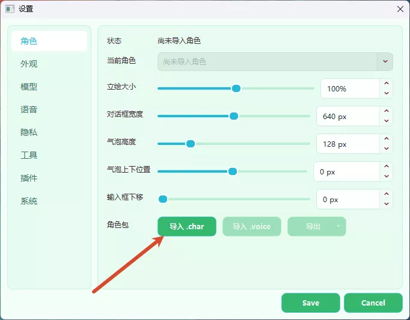

# Sakura 安装与配置指南

> 快速开始请看 [README.md](../README.md)；API 配置教程请看 [API_CONFIG.md](API_CONFIG.md)；macOS 专项问题请看 [MACOS_SETUP.md](MACOS_SETUP.md)。

---

## 第一步：下载发布包

打开 [Releases 页面](https://github.com/Rvosy/sakura/releases)，下载最新的构建包。

| 文件名 | 是什么 | 适合谁下载 |
|:-:|---|---|
| `sakura-v0.9.8-windows-x64.zip` | Windows 完整包，包含项目文件和 `runtime` | Windows 新手推荐 |
| `runtime-windows-x64.zip` | 只有 Windows 预置 Python 运行环境 | 拉源码、缺 `runtime` 的用户 |
| `sakura.char` | 默认 Sakura 角色包（含语音权重） | 想使用默认角色的用户 |
| `models--sentence-transformers--all-MiniLM-L6-v2.zip` | 长期记忆所需的本地向量模型 | 首次启动自动下载失败时手动导入 |

> 如果你只是想运行桌宠，下载 `sakura-v0.9.8-windows-x64.zip` 这个**完整包**。`runtime` 包不是完整程序，单独下载后不能直接启动。

`0.9.9-dev` 及后续完整包还会在根目录携带 `sakura-desktop.exe`（macOS 为 `sakura-desktop`）。它是唯一生产桌面程序；`runtime` 中的 Python 作为后台 Brain Host 使用。

---

## 第二步：安装依赖

解压完整包后，进入解压出来的软件目录。

- **Windows 用户：** 双击 `install.bat`，等待完成（约 5-15 分钟）。
- **Mac 用户：** 可尝试双击 `install.command`，或在终端进入项目目录后运行 `bash scripts/install.sh`。从源码运行、依赖问题、Apple Silicon/Rosetta 架构问题以及 GPT-SoVITS 语音搭建，详见 **[MACOS_SETUP.md](MACOS_SETUP.md)**（已在 Apple Silicon 实机测试）。
- **Linux 用户：** 当前没有正式发布包；如果从源码运行，进入项目目录后运行 `bash scripts/install.sh`。

> 如果是直接拉取的源码，需要先从 Release 页面下载对应平台的预编译依赖包（`sakura-runtime-*.zip`），把里面的 `runtime` 文件夹放到项目根目录，再运行安装脚本。不管下载的是 Release 完整包还是 GitHub 源码，这一步都要做。装完命令行窗口会自动关闭。

源码开发还需要 Rust stable 和 Tauri 2 对应的系统依赖，然后先构建桌面程序：

```powershell
cargo build --release --manifest-path desktop/src-tauri/Cargo.toml
```

生产依赖不再安装 PySide6。只有需要运行旧 Qt 开发回退或其 UI 测试时，才额外安装 `requirements-legacy-qt.txt`。

---

## 第三步：启动

- **Windows 用户：** 双击 `start.bat`
- **Mac 用户：** 双击 `start.command`，或在终端运行 `bash scripts/start.sh`
- **Linux 用户：** 在终端运行 `bash scripts/start.sh`

这些脚本都会调用 `main.py`，再由它启动 Tauri 主程序和后台 Brain Host；不会自动回退到旧 Qt。如果提示未找到 Tauri 主程序，请确认完整包根目录存在 `sakura-desktop`，或按上面的 Cargo 命令先完成源码构建。

首次启动若尚未配置角色或模型，可从桌宠菜单打开**设置**和**角色工作室**完成配置。已有 `data/`、`characters/`、聊天历史、记忆和插件配置会直接沿用，不需要破坏性迁移。

---

## 首次配置

### 导入角色包

从 [Releases 页面](https://github.com/Rvosy/sakura/releases) 下载角色包。Release 附件中，大小约 300MB、以 `.char` 结尾的文件即为包含语音的完整角色包。

下载后在软件设置中点击**导入 .char**，选择文件完成导入。



---

### 配置模型

进入**模型**页面，填写 `Base URL`、`API Key` 和模型名称。新手或第一次配置中转站的用户，按 **[API 配置教程](API_CONFIG.md)** 操作。

> 必须选择支持多模态（图像识别）的模型，否则屏幕观察等功能会报错。推荐 Gemini Flash 系列。DeepSeek 系列作为主模型时，截图识别等功能会报错。

填写完成后点击**检测模型**获取可用模型列表，再点击**测试 API** 验证连通性。


---

### 配置语音（TTS）

TTS 为可选功能，不配置也可以正常使用，只是没有语音。

软件内提供了一键下载整合包的选项，根据你的设备选择：

| 方案 | 适合谁 |
|---|---|
| 50 系整合包 | RTX 50 系列显卡用户 |
| 通用整合包 | 其他 NVIDIA 显卡用户 |
| CPU 整合包 | 无独显或不支持 CUDA 的用户 |

RTX 50 系显卡必须使用 50 系专用整合包；通用整合包不支持该系列。设置页会优先把 50 系设备的默认路径指向专用包目录，未安装时请先下载对应整合包。

下载完成后在软件内直接启动 TTS 服务即可。


#### AMD 显卡 / 外置 GPT-SoVITS

AMD 显卡用户如需 GPU 推理，可在 B 站搜索 GPT-SoVITS 整合包自行安装，然后在软件中选择**外置 GPT-SoVITS** 模式，按下图填写服务地址。

macOS 用户的 GPT-SoVITS 配置方式另见 [MACOS_SETUP.md](MACOS_SETUP.md)。


---

### 长期记忆模型

首次启动时，软件会在后台自动下载长期记忆所需的本地向量模型。下载过程中可以正常使用，无需等待。

如果遇到网络问题导致下载失败，可以从 [Releases 页面](https://github.com/Rvosy/sakura/releases) 手动下载 `models--sentence-transformers--all-MiniLM-L6-v2.zip`，然后在软件内导入。


---

## 如何更新版本

Windows 的 `0.9.9-dev` 及后续构建包含 `update.bat`。先退出 Sakura，再双击这个脚本。更新器会校验下载文件，保留 `data/`、`characters/`、`runtime/` 和本地插件配置；如果依赖清单有变化，它会继续更新 Python 依赖。

如果当前安装包没有 `update.bat`，按下面的方法手动更新：

1. 关闭正在运行的 Sakura。
2. 备份原目录中的 `data/`；自制角色或插件也建议一并备份。
3. 从 [Releases 页面](https://github.com/Rvosy/sakura/releases) 下载最新完整包。当前稳定包是 `0.9.8`。
4. 把新包内容复制到原 Sakura 目录，遇到同名文件选择**覆盖/替换**。发布包不包含 `data/`，不会覆盖 API 配置、聊天记录、长期记忆和 TTS 数据。
5. 运行一次安装脚本（Windows 为 `install.bat`），再启动 Sakura。配置迁移会自动执行，并把迁移前文件备份到 `data/migration_backup/`。

不要删除原目录里的 `data/`。如果升级后怀疑存在旧版缓存，可先运行 `runtime/python.exe tools/cleanup.py` 预览；确认列表无误后再加 `--apply` 清理。

---

## 角色工作室（Windows / macOS）

Release 完整包由同一个 Tauri 桌面程序创建设置和角色工作室窗口。在设置页的角色页面打开工作室后，可以新建角色、编辑人格卡和主题、导入立绘与参考音频，最后导出 `.char` 文件，无需自行安装 Rust 或单独编译 Tauri。

迁移期仍保留 `start_studio.bat` 和旧 Qt 入口供开发回退，但正常用户不需要使用。Linux 当前没有正式角色工作室发布包，从源码运行时需要自行准备并编译 Tauri 运行环境。
