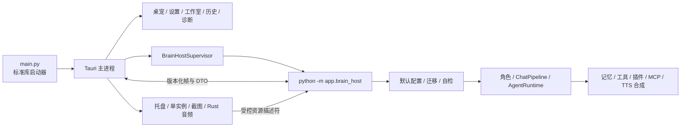

# Sakura 技术讲解 README

本文面向想深入了解 Sakura 架构、运行链路、配置方式或二次开发的用户。只想安装和使用桌宠的话，看 [主 README](../README.md) 即可。

## 设计思路

Sakura 第一阶段采用“Tauri 桌面外壳 + Python Brain Host”的双进程结构。Tauri 是唯一生产桌面入口，负责所有用户可见窗口、托盘、单实例、屏幕捕获、音频播放、受控资源 URL 和 Brain Host 生命周期；WebView 只通过版本化 Tauri command/event 与 Rust 通信，不直接持有 Python 标准输入输出或本地文件路径。

长期运行的 Python Brain Host 不导入 PySide6，负责加载现有角色与配置，组装 `AssistantApplication`、`ChatPipeline`、`AgentRuntime`、记忆、工具、插件、MCP、TTS 合成和主动调度。Rust 与 Brain 通过长度前缀 JSON 帧通信，每个请求都带协议版本、session、sequence 和 request ID；聊天、确认、TTS、截图与主动事件都使用可序列化 DTO。

`AgentRuntime` 直接使用 OpenAI 兼容接口的原生 `tool_calls` 协议。模型可以在同一轮对话里决定是否调用工具，工具结果会以 tool role 回填给模型，再由模型产出最终角色回复。这样不再需要额外的路由拆分模块，链路更短，也更容易保证提醒、主动关怀、工具确认后的回复都进入同一套字幕和语音播放流程。

最终回复统一按分段 JSON 组织：每段包含日文原文、中文字幕、语气和立绘标识。Brain 产出统一事件，Tauri 前端据此驱动字幕与立绘，Rust 音频线程负责顺序播放；如果模型输出格式不合格，运行时会尝试一次格式修复。退出时 Tauri 先停止接收新请求，再关闭 Brain、MCP、插件、TTS/音频和临时资源。

## 启动流程

运行 `runtime/python.exe main.py` 后：

1. 标准库启动器解析发布包根目录或 `desktop/src-tauri/target/{release,debug}` 中的 `sakura-desktop`，把当前 Python 路径写入 `SAKURA_PYTHON_EXE`。
2. Tauri 取得单实例所有权并立即创建透明桌宠窗口；重复启动只聚焦已有实例。
3. Rust 监管器启动 `python -m app.brain_host`，生成新的 session 和进程凭据，并等待协议握手。
4. Brain Host 生成缺失默认配置、执行版本化迁移与自检，加载 `data/config/*.yaml` 和当前角色包。
5. Brain 组装无 Qt 的聊天、记忆、工具、插件、MCP、TTS 合成与主动调度服务，通过事件通知前端就绪。
6. Tauri 持续监管 Brain，在有限次数内处理异常重启；应用退出时按顺序清理 Python、MCP、音频和临时资源。



## 项目结构

```text
.
├── main.py                             # 生产启动器，只启动 Tauri
├── legacy_qt_main.py                   # 显式旧 Qt 开发回退，不自动使用
├── desktop/                            # 生产 Tauri 桌面应用
│   ├── frontend/                       # 桌宠、聊天、设置、工作室、历史和诊断前端
│   └── src-tauri/                      # Rust 窗口、监管、IPC、截图、音频与托盘
├── app/
│   ├── brain_host/                     # 长期运行的无 Qt Python Host 与帧协议
│   ├── agent/                          # Agent 决策层
│   │   ├── actions.py                  # 动作/事件/待确认数据结构
│   │   ├── builtin_tools.py            # 内置工具（待办/提醒/笔记/记忆等）
│   │   ├── context_orchestrator.py      # 上下文收集与选择
│   │   ├── session_state_context.py     # 最近会话续接上下文
│   │   ├── memory.py / memory_recall.py # 分层长期记忆与相关召回
│   │   ├── memory_curator.py            # 自动记忆整理
│   │   ├── runtime.py                  # AgentRuntime（决策/工具循环）
│   │   ├── runtime_limits.py           # 可配置工具循环限制
│   │   ├── screen_awareness.py         # 主动屏幕感知策略
│   │   ├── screen_tools.py             # 屏幕观察工具
│   │   ├── screen_observation.py       # 屏幕观察入口
│   │   ├── tool_policy.py              # 工具路由策略
│   │   ├── tool_routing.py             # 浏览器/屏幕工具路由纯函数
│   │   ├── tools/                      # 统一工具注册系统
│   │   │   ├── registry.py             # ToolRegistry / Tool / ToolMetadata
│   │   │   ├── permission_policy.py    # ToolPermissionPolicy
│   │   │   └── builtin/provider.py     # BuiltinToolProvider
│   │   └── mcp/                        # MCP 工具（桥接/配置/Provider）
│   ├── core/                           # 应用核心
│   │   ├── app_context.py              # AppContext 依赖容器
│   │   ├── assistant_service.py         # 无 Qt 助手业务服务
│   │   ├── bootstrap.py                # 启动装配
│   │   ├── chat_pipeline.py            # ChatPipeline 对话编排
│   │   ├── chat_worker.py              # 旧 Qt 回退适配器
│   │   ├── instance.py                 # 单实例锁
│   │   ├── resource_manager.py          # 线程、进程与服务生命周期
│   │   ├── selfcheck.py                 # 启动环境自检
│   │   ├── debug_log.py                # 调试日志（自动脱敏）
│   │   └── extensions.py               # 扩展注册表
│   ├── backchannel/                     # 等待期本地快速接话
│   ├── config/                         # 配置管理
│   │   ├── app_version.py               # 应用版本记录
│   │   ├── default_configs.py           # 缺失配置生成
│   │   ├── migration_runner.py          # 版本化迁移执行器
│   │   ├── models.py                   # 配置数据模型
│   │   ├── defaults.py                 # 默认值
│   │   ├── settings_service.py         # YAML 配置读写
│   │   ├── migrations.py               # .env → YAML 迁移
│   │   ├── character_loader.py         # 角色包加载
│   │   └── yaml_config.py              # YAML 通用工具
│   ├── llm/                            # LLM 客户端
│   │   ├── api_client.py               # OpenAI 兼容客户端
│   │   ├── chat_reply.py               # 分段回复解析
│   │   ├── context_trimming.py         # 上下文修剪
│   │   ├── prompt_templates.py         # 提示词模板
│   │   └── prompts/                    # 提示词块/渲染
│   ├── plugins/                        # 插件系统（原生）
│   │   ├── models.py                   # PluginManifest / PluginSpec / Contribution
│   │   ├── base.py                     # PluginBase / PluginContext
│   │   ├── discovery.py                # PluginDiscovery
│   │   ├── capabilities.py             # PluginCapabilityRegistry
│   │   ├── events.py / services.py      # 事件与受限服务门面
│   │   └── manager.py                  # PluginManager
│   ├── renderers/                       # 可扩展角色渲染器
│   ├── storage/                        # 存储层
│   │   ├── paths.py                    # StoragePaths 统一路径
│   │   ├── chat_history.py             # 聊天历史（JSONL）
│   │   └── visual_observation.py       # 视觉观察记录（JSONL）
│   ├── ui/                             # 旧 Qt 显式回退 UI，不进入生产启动图
│   │   ├── pet_window.py               # 桌宠主窗口
│   │   ├── tauri_settings.py           # Tauri 设置页桥接与请求构建
│   │   ├── history_window.py           # 历史回看
│   │   ├── portrait_controller.py      # 立绘控制器
│   │   ├── subtitle_controller.py      # 字幕控制器
│   │   ├── tool_confirmation_panel.py  # 工具确认面板
│   │   ├── portrait_utils.py           # 立绘工具函数
│   │   └── ...（其余 UI 组件）
│   └── voice/                          # TTS 服务、合成与旧 Qt 播放适配
│       ├── tts.py / tts_settings.py     # Provider 与配置
│       ├── tts_service.py               # 服务监管
│       ├── tts_synthesis.py             # 合成队列
│       └── tts_playback.py              # 播放端点
├── plugins/                            # 本地插件
│   └── playwright_browser/             # Playwright 浏览器插件
├── characters/sakura/                  # 角色资源
├── assets/backchannels/                # 角色接话清单与开发说明
├── data/                               # 本地数据
│   ├── config/                         # YAML 配置（api.yaml / system_config.yaml 等）
│   ├── chat_history/                   # 聊天记录
│   ├── memory/                         # 长期记忆
│   └── visual_observations/            # 视觉观察记录
├── tests/                              # pytest 与跨进程契约测试
│   ├── unit/                           # 单元测试（配置 / LLM / 工具 / 运行时等）
│   ├── integration/                    # 集成测试（AgentRuntime / ChatPipeline 等）
│   └── ui/                             # 旧 Qt 回退行为测试
├── docs/                               # 文档
│   ├── TECHNICAL_README.md             # 技术讲解 README
│   └── SAKURA_PLUGIN_SDK.md            # 插件开发指南
├── tools/settings-tauri/               # 迁移期独立设置工具兼容构建
├── tools/studio-tauri/                 # 迁移期独立工作室兼容构建
├── tools/cleanup.py                    # 安全清理工具（默认 dry-run）
└── tools/mcp/                          # MCP Server 运行时
```

## 运行与测试

Release 完整包包含 `runtime/` 和根目录下的 `sakura-desktop` 可执行文件。源码开发应使用仓库内置 runtime，并先构建生产 Tauri crate。

构建生产桌面应用：

```powershell
cargo build --manifest-path desktop/src-tauri/Cargo.toml
```

启动应用：

```powershell
.\runtime\python.exe main.py
```

运行全部测试：

```powershell
.\runtime\python.exe -m pytest
```

运行单元测试：

```powershell
.\runtime\python.exe -m pytest tests/unit
```

验证生产 Tauri crate：

```powershell
cargo fmt --manifest-path desktop/src-tauri/Cargo.toml --check
cargo test --manifest-path desktop/src-tauri/Cargo.toml
cargo build --release --manifest-path desktop/src-tauri/Cargo.toml
```

旧 Qt 入口只用于一个开发版本内的显式回退和兼容测试：

```powershell
.\runtime\python.exe -m pip install -r requirements-legacy-qt.txt
.\runtime\python.exe legacy_qt_main.py
```

## 配置项

所有配置集中在 `data/config/` 下的 YAML 文件中。

| YAML 路径 | 说明 | 默认值 |
|---|---|---|
| `api.yaml: llm.base_url` | API 地址 | `https://api.openai.com/v1` |
| `api.yaml: llm.api_key` | API Key | 空 |
| `api.yaml: llm.model` | 模型名称 | `gpt-4.1-mini` |
| `api.yaml: llm.timeout_seconds` | 超时时间 | `60` |
| `api.yaml: tts.enabled` | 启用 TTS | `false` |
| `api.yaml: tts.gpt_sovits.api_url` | TTS 接口 | `http://127.0.0.1:9880/tts` |
| `api.yaml: tts.gpt_sovits.python_path` | 自定义 GPT-SoVITS Python | 空 |
| `api.yaml: tts.gpt_sovits.tts_config_path` | 自定义 GPT-SoVITS 推理配置 | 空 |
| `system_config.yaml: ui.subtitle_language` | 气泡语言 `ja`/`zh` | `zh` |
| `system_config.yaml: ui.portrait_scale_percent` | 立绘缩放 | `100` |
| `system_config.yaml: screen_awareness.enabled` | 主动屏幕感知 | `true` |
| `system_config.yaml: screen_awareness.check_interval_minutes` | 检查间隔 | `20` |
| `system_config.yaml: screen_awareness.cooldown_minutes` | 发言冷却 | `10` |
| `system_config.yaml: tool_loop.*` | Agent 步数和工具调用上限 | `4 / 3 / 8` |
| `system_config.yaml: backchannel.enabled` | 本地快速接话 | `false` |
| `system_config.yaml: memory_curation.enabled` | 自动记忆整理 | `true` |
| `system_config.yaml: mcp.windows_enabled` | Windows MCP | `false` |
| `system_config.yaml: debug.enabled` | 调试日志 | `false` |
| `characters.yaml: current_character_id` | 当前角色 | `sakura` |

## TTS 技术配置

语音默认关闭。需要自行启动兼容以下接口的本地 GPT-SoVITS API：

- `POST /tts`
- `GET /set_gpt_weights`
- `GET /set_sovits_weights`

在 `data/config/api.yaml` 或设置窗口中启用：

```yaml
tts:
  provider: gpt-sovits
  enabled: true
  gpt_sovits:
    api_url: http://127.0.0.1:9880/tts
    ref_lang: ja
    text_lang: ja
    timeout_seconds: 60
```

Windows 用户可以在设置窗口的 TTS 页点击“一键下载 TTS 整合包”安装当前内置的 Windows 整合包。macOS 用户会看到“GPT-SoVITS macOS 源码安装包”，点击后会在 `data/tts_bundles/installed/gpt_sovits_macos/` 下自动安装 Miniforge、创建 Python 3.10 环境、拉取 GPT-SoVITS 源码并生成 macOS 可用的推理配置。

脚本会下载固定版本的 Miniforge 并校验 SHA256；GPT-SoVITS 官方安装脚本默认按 MPS 依赖安装，推理配置默认使用 CPU 与关闭半精度以保持兼容，可通过 `GPT_SOVITS_INSTALL_DEVICE` 和 `GPT_SOVITS_INFER_DEVICE` 覆盖。这个 macOS 安装项只负责 GPT-SoVITS 源码、Python 环境和官方预训练基础模型；Sakura 等角色声线权重仍来自角色包的 `voice/models/`，由 `character.json` 读取后在启动 TTS 时切换。

下载窗口会按当前系统过滤整合包：Windows 只显示 Windows 版，macOS 只显示 macOS 版。

设置页新增的 `TTS Python` 和 `推理配置` 字段只用于自定义或 macOS 源码版 GPT-SoVITS；Windows 内置整合包无需填写。

如果已经在 macOS / Linux 上自行安装了 GPT-SoVITS 源码版，也可以在设置窗口把 TTS 提供器切到“自定义 GPT-SoVITS（macOS/Linux）”，并配置本地源码目录、Python 解释器和可选推理配置：

```yaml
tts:
  provider: custom-gpt-sovits
  enabled: true
  gpt_sovits:
    api_url: http://127.0.0.1:9880/tts
    work_dir: /path/to/GPT-SoVITS
    python_path: /path/to/miniforge3/envs/gpt-sovits/bin/python
    tts_config_path: /path/to/GPT-SoVITS/GPT_SoVITS/configs/tts_infer.yaml
    ref_lang: ja
    text_lang: ja
```

自定义 GPT-SoVITS 启动时会使用配置的 `python_path` 运行工作目录下的 `api_v2.py`；如果配置了 `tts_config_path`，会追加 `-c` 参数，并根据 `api_url` 追加监听地址和端口。

macOS 一键安装完成后会自动回填这些字段。内置整合包如果只包含其他平台的运行时，Sakura 会提示运行时不兼容，而不会直接执行到系统级 `Exec format error`。

## 插件开发

插件相关代码位于 `plugins/` 和 `app/plugins/`；插件只通过 `app.plugins.*` 公开 API 接入。插件开发说明请看 [Sakura 插件 SDK 文档](SAKURA_PLUGIN_SDK.md)。

## 第一阶段安全与兼容边界

- 第一阶段继续由 Python `ToolRegistry`、现有工具确认策略和插件 capability 声明执行权限判断；前端确认时只回传 action ID，工具参数留在当前 Brain session。
- 无 UI 插件、MCP 工具和声明式插件设置继续兼容；请求原生 Qt widget、renderer 或 chat UI 的插件会在导入前标记为不兼容。
- WebView 不能获得任意文件路径、Shell 或 Brain 管道；截图、音频和角色资源都通过受控、限时、会话绑定的资源描述符传递。
- 本阶段没有实现最终 Capability Broker、Permission Manager、插件沙箱、Credential Broker 或新的更新体系。这些仍属于后续阶段，当前实现不宣称提供最终插件安全边界。
