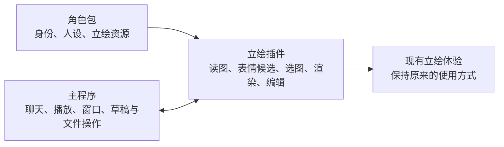

# 角色能力插件化：先拆出完整立绘链路

## 目标与当前状态

后端改造尚未实施。源码核对基线为 `07285a99`（2026-09-10 本地 HEAD）。
当前先验收[设置 demo](../../desktop/frontend/prototypes/settings-demo/README.md)：完整复用现有设置页面，
加入角色与表现形式选择，用可操作的外壳判断普通用户能否看懂。交互方案确认后，再启动立绘拆分。
首个后端目标仍是把已有立绘能力及其配套链路拆成可替换插件，保持旧角色包和现有使用行为。
架构方向见 [ADR-0046（提案）](../adr/0046-composable-character-resources-and-renderer-host.md)。

“配套链路”包括立绘资源解释与校验、提示词中的表情候选、回复到图片的映射、渲染和交互、
相关设置、工坊编辑、草稿保存、发布，以及完整角色和立绘组件的导入导出。只把图片控制器移进插件目录不算完成。

Live2D、3D 和多种音色自由组合仍是后续方向，但不要求提前实现真实模型。
其他形态如何让模型选择表情或动作尚未确定；第一阶段继续使用现有 `portrait` 语义，
不提前固定通用 `performance/expression/motion` 协议，也不把它们作为立绘拆分的前置条件。

| 范围 | 第一阶段 | 后续再设计 |
|---|---|---|
| 旧包兼容 | 旧目录包、`.char`、`.voice`、草稿和历史继续可读 | 新形态的版本化格式与跨版本导出范围 |
| 表现能力 | 完整立绘插件，包含加载、表情选择、显示和编辑 | Live2D、VRM 或其他模型插件 |
| 提示词与回复 | 保持 `portrait`；把候选来源和图片映射交给立绘能力 | 表情/动作是否统一、如何提示及持久化 |
| 资源标识与插件识别 | 分开资源 ID、类型和插件 ID；识别立绘所需插件 | 多表现列表、回退和用户组合策略 |
| 工坊 | 公共外壳保留，立绘编辑与校验迁入插件 | 其他类型编辑器、完整资源组合 UI |
| 导入导出 | 旧完整包往返；立绘组件跨角色导入导出 | 任意新表现、音色组件的组合归档 |
| 语音 | 保持现有 GPT-SoVITS/Genie、配置和播放行为 | 多音色实例、作者默认/用户覆盖的语音改造 |

第一阶段不包含新 TTS 引擎、语音协议重构、任意模型转换、无中断热切换、任意页面插件平台或全程序插件化。
完成时只能说明“立绘能力已经拆出”，不能据此宣称 Live2D/3D 的扩展边界已通过真实验证。

## 用简单的方式理解

角色保留名字、人设、历史和记忆。立绘插件负责理解“有哪些图片、怎么选图、怎么显示和编辑这些图”。
主程序负责把聊天片段、播放时机、窗口和文件操作接起来。



例如，“开心”现在对应 `happy.png`：插件把“开心”提供给提示词，模型仍返回 `portrait: 开心`，
插件再把它映射为图片。主程序不需要自行检查图片列表或决定该用哪张图。

工坊中的立绘编辑页也由同一插件提供。把一套立绘导出，再导入另一个角色，只更换该角色草稿中的立绘资源，
不覆盖其人设、语音、历史或记忆。以后再接入 Live2D 时，单独讨论其表情和动作合同。

## 一、当前耦合与迁移入口

| 链路 | 核对到的现状 | 第一阶段的改动落点 |
|---|---|---|
| 角色加载 | `CharacterProfile` 必须有默认图，直接持有表情图和选图方法 | 公共角色描述改为资源引用；图片字段和选图移到立绘能力 |
| 提示词 | `assistant_adapter` 从 `profile.portrait_choices` 取得候选 | 从已绑定立绘能力取得同一份标签快照 |
| 回复与历史 | ChatSegment、Timeline、IPC 和前端传递 `portrait` | 保持字段与兼容读取；消费时交立绘插件解释 |
| 表现资源 | Core、Rust、前端表现 DTO 强依赖图片列表、尺寸和 URL | 分开公共实例信息与立绘专属载荷，同步更新跨层校验 |
| 渲染与窗口 | `app.js` 直接创建立绘控制器，命中结构携带图片遮罩 | 使用渲染宿主挂载；插件提交布局与命中数据，原生机制保留 |
| 工坊 | `CharacterStudioDoc`、页面、导入类型和清理集合绑定立绘 | 立绘草稿区、编辑器、校验和资源引用交由插件描述 |
| 归档 | 导入要求 portrait，导出按 Profile 重建立绘字段 | 宿主负责容器/文件操作；立绘适配器负责类型解释与旧字段投影 |

现有工坊 `_merge_character_manifest` 已保留未知字段，不应将现状描述为“保存就丢所有扩展”。
真正要扩展的是类型专属草稿、资源引用和导出边界。TTS Hub 也已有 Provider 分发能力，
其配置仍会经 `PluginCharacterStore.update` 写包；这一语音数据归属问题留到后续，不混入本阶段重做。

相关源码：

- [角色加载](../../app/config/character_loader.py)、[旧包兼容](../../app/config/character_packages.py)、[角色归档](../../app/config/character_archive.py)。
- [Assistant 接线](../../app/core_host/assistant_adapter.py)、[提示词协议](../../app/llm/prompts/blocks.py)、[回复结构](../../app/llm/chat_reply.py)、[Timeline](../../app/storage/timeline.py)。
- [Core 表现投影](../../app/core_host/character_presentation.py)、[Rust 表现资源](../../desktop/src-tauri/src/character_presentation.rs)、[前端表现校验](../../desktop/frontend/pet/character-presentation.js)。
- [桌宠接线](../../desktop/frontend/app.js)、[立绘控制器](../../desktop/frontend/pet/portrait-controller.js)、[原生窗口命中](../../desktop/src-tauri/src/window_interaction.rs)。
- [工坊模型与发布](../../app/config/character_studio.py)、[工坊 IPC](../../app/core_host/character_studio.py)、[工坊页面](../../desktop/frontend/studio/studio.js)。
- [插件发现](../../app/plugins/discovery.py)、[Inventory](../../app/plugins/inventory.py)、[TTS Hub](../../plugins/builtin/sakura_tts_hub/plugin.py)。

## 二、宿主与立绘插件的职责

| 能力 | 宿主保留 | 立绘插件接管 |
|---|---|---|
| 角色数据 | ID、人设、开场白、主题、历史与记忆归属 | 默认图片、表情标签、图片资源配置 |
| 包读取 | 版本入口、通用字段、路径与文件边界 | 立绘格式解释、图片有效性、类型配置校验 |
| 聊天 | 分段、语言规则、语音语气、历史和播放调度 | 立绘标签候选、默认选择、语气到图片的回退 |
| 显示 | 挂载点、实例生命周期、视口、原生窗口、资源授权 | 图片读取与缓存、预加载、切图、过渡、图片布局数据 |
| 交互 | 原生拖拽、鼠标穿透与坐标校验 | 可见范围、气泡锚点、图片命中数据 |
| 设置 | 草稿、应用、角色切换、公共外观参数 | 现有立绘专属选项的描述与解释 |
| 工坊 | 公共表单、工作区、文件复制、自动保存、发布和恢复 | 立绘编辑模块、导入描述、表情/默认图校验、引用集合 |
| 归档 | ZIP、安全检查、复制、取消、目标分配与事务 | 立绘载荷、可导出文件集合、旧 portrait 字段转换 |

保留现有 Plugin Runtime v4 的安装、Service 和生命周期。一个立绘插件安装包可以同时携带 Python 注册与
数据适配部分、预构建前端渲染模块和工坊编辑模块。不再额外增加表现 Hub、提示词插件或另一套插件管理器。

宿主可以保留明确命名的旧包兼容入口，但普通角色业务不继续拥有图片选择与处理逻辑。
不以删除所有 `portrait` 字符串作为验收目标；旧历史字段与兼容适配器中的名称可以保留。
要求拆走的是类型业务和数据所有权，而不是为了改名引入新的聊天迁移。

## 三、资源与插件的最小合同

### 1. 身份与资源引用分开

角色身份保持不变。公共角色模型持有表现资源描述，立绘私有数据由插件解释。
第一阶段的正式实现只需要绑定一套立绘，不预建“表现 × 音色”组合配置。
设置 demo 可以展示多形态选项，用于评审信息层级，不表示这些形态已能运行。

以下仅表示待实现的内部资源边界，不是当前可导入的 `character.json` 新协议：

```json
{
  "id": "portrait-default",
  "type": "sakura.visual.portrait@1",
  "root": "portraits",
  "entry": "portrait.json"
}
```

`id` 标识资源实例，`type` 标识资源描述格式，插件 ID 标识能力提供者，三者不能合并。
同一插件以后可以读取多套立绘，这不要求第一阶段就实现多套组合管理。
宿主检查 ID、版本、目录和引用边界，插件解释入口中的默认图、标签和配置。

新独立组件使用自包含目录，`root` 相对包根、`entry` 相对资源根。旧包没有 `portrait.json`，
兼容读取器在内存中把已有 `portrait.default/expressions` 解释为立绘配置，保留原路径，
不能为了这个示例在启动时批量改写或搬迁用户文件。外置描述只在显式新建或组件导出时生成。

旧共享文件在组件导出时复制为自包含文件，不建立全局资源库、依赖图或内容寻址仓库。
使用已有 ID、必要的新随机 ID 与修订计数；不新增整包哈希、fingerprint 或内容摘要缓存标记。

### 2. 静态发现和运行绑定分开

扩展现有 `plugin.yaml`、PluginSpec 和 Inventory，让清单能静态描述支持的资源类型、Provider/Service、
领域合同版本、渲染模块与可选工坊模块入口，以及宿主版本和平台要求。字段形状随实现冻结。

未启动或未启用插件时也能识别“这个角色需要立绘能力”，不能必须先调用插件才知道依赖。
静态声明只表示能力候选；实际启用、注册成功和资源校验完成后才能标为可运行。
现有 `presentation: {kind, category, icon}` 继续只管插件列表展示，不用来识别角色类型。

预装立绘插件随发行包离线可用，遵守普通启停、替换与撤销规则。包内类型用于匹配声明兼容的插件，
不把所有用户角色硬编码到某个插件 ID。推荐插件只帮助定位；用户明确选择的提供者不可用时显示原因，
多个候选无法确定时要求选择，不随意切换。角色选择不自动联网安装或启用插件。

缺失、停用、不兼容、资源损坏和启动失败分别显示。结构合法但缺插件的包仍留在角色列表，可打开公共信息
和保留资源；无可运行表现时保留宿主占位与设置入口。不要把包里过去未生效的 `renderer` 字段突然激活为
强制依赖，也不允许未知类型绕过路径安全检查。

### 3. 三种数据归属

作者的默认图、表情映射和图片文件由工坊写入草稿后发布。个人显示偏好归用户设置，
运行时实际插件、资源和失败原因归运行快照，不能把失败结果写回作者配置。

设置 demo 先比较角色选择、表现选择和插件设置的衔接。多表现组合的正式数据协议仍留待后续；
确需迁出的现有立绘专属设置继续纳入原有 dirty、应用与取消机制。
公共缩放、位置和主题归宿主。参数失败不激活未保存结果，一次应用最多一次受控重启；
待切换角色时避免把 A 的草稿保存到 B。

## 四、提示词与表情选择保持现状

第一阶段沿用现有 `portrait` 字段，以及日语朗读、中文翻译和 `tone` 语义。

```text
当前绑定的立绘资源
→ 插件输出可选标签快照
→ 宿主拼接现有提示词
→ 模型返回 portrait
→ 聊天/历史传递该字段
→ 插件选择图片
```

插件提供当前资源的标签与缺省信息，宿主继续构建整体提示词、分段 JSON 和语言规则。
普通聊天与主动回复都使用同一份绑定快照，不让插件任意覆盖人格、语言约束或整个系统提示词。
本阶段无需为了移动一条立绘候选规则引入通用提示词插件框架。

立绘的现有回退顺序保持为“有效显式 portrait → tone 对应的图片 → 默认图”。
空值、未知标签和旧回复沿用可兼容处理，不因选图失败丢弃有效回复文字。
绑定失效后旧候选和旧回调一起失效，不能让新角色继续使用上一角色的标签。

ChatSegment、Timeline 与公开事件继续读写现有 `portrait`；只在接入层把片段交给插件解释。
需要调整表现资源 DTO 时同步更新 Core、Rust、前端的严格校验，但不顺带更换聊天字段。
旧历史无需批量重写，静态历史查看不触发新的渲染副作用。

Live2D 表情参数、动作触发、持续状态与一次性事件怎样区分，等具体需求确定后再演进领域合同。
现阶段既不假设它们都能映射成一张图，也不先宣布所有形态都必须使用一套 `expression/motion` 枚举。

## 五、渲染、资源和原生窗口

增加一个小的 RendererHost，按已解析的插件模块入口挂载实例。`app.js` 只连接宿主，
不直接创建具体立绘实现；现有控制器的预加载、图片缓存、过渡和 generation 隔离迁入插件，复用成熟行为。

首版合同只覆盖立绘已有需求：挂载、就绪、销毁，接收聊天片段和现有运行/播放事件，
接收视口变化，上报布局锚点、可见范围和命中信息。模块名和方法签名在落地时确定，
没有当前消费者的骨骼、物理、音素、动作 API 暂不加入。

公共实例信息与立绘专属资源载荷分开。图片尺寸、透明度处理归立绘适配，
宿主通过受控资源协议提供访问，Rust 负责通用验证和原生应用。
可复用当前 Rust 图片处理作为宿主工具，不为了迁到 Python/JS 重写成熟原生路径；
其结果只被立绘适配消费，通用角色加载不再强制所有表现都有图片元数据。

命中合同声明坐标系、缩放关系、尺寸与区域边界，立绘可继续使用现有 alpha mask 适配。
保留 macOS 表面裁剪、Windows 窗口与拖拽逻辑，不能用整个透明矩形吃鼠标来替代现有体验。
不逐帧跨进程传整张遮罩；未实现动态模型几何时不宣称已支持。

继续以实际音频播放开始驱动分段同步，关闭 TTS 时按现有文字分段推进。
渲染准备有界，失败不无限阻塞字幕或 TTS。首版沿用受控重载，不要求无中断热切换。

资源与回调绑定 generation、插件实例和资源范围。切换、取消、停用与退出时撤销 URL、
订阅、计时器、异步回调和图片缓存引用，旧实例不再影响布局或播放。预览使用独立实例与资源作用域，
不切换正式聊天、TTS、记忆或命中区域。

前端模块由插件安装目录提供，按用户明确安装的可信代码处理。Python 进程隔离不等于同一 WebView
JavaScript 的沙箱。保留 CSP，不执行角色包中的 JS，不从运行时 CDN 加载实现，
正常桥接接口不开放任意路径和原生命令；不能把这些 API 约束描述为能防御恶意同页插件。

## 六、工坊与立绘资源编辑

保留 [ADR-0044](../adr/0044-character-studio-same-app-window.md) 的同应用 `studio` 窗口和 Core 唯一写入者。
角色信息、人设、主题、语音编辑、工作区与发布流程保留；立绘编辑器迁为立绘插件提供的模块。

迁移内容包含默认图选择、图片/文件夹导入、表情标签、预览、重复标签和图片校验、草稿序列化、
引用文件集合与相关清理。插件负责类型逻辑，宿主负责原生文件选择、安全复制、取消和事务。
不能只把页面改名为“表现”而继续让公共 `CharacterStudioDoc` 必填 `default_portrait/expressions`。

公共草稿存放资源描述与插件私有数据。编辑请求绑定 `workspaceId + resourceId + draftRevision`，
只修改对应草稿区域，不能调用运行时 `character.update` 直接写已安装包。
不先建立任意页面扩展平台，只提供立绘编辑所需的挂载、读写、资源选择、校验与释放接口。

旧草稿经兼容读取恢复；确需升级写入时使用副本和现有备份。
插件缺失时立绘区只读，仍能修改公共信息，原有立绘与未知扩展文件保留。
对未经类型校验的原样保存如实标明状态；不能把“已保存”当成“可运行”。

自动保存、发布和导出都使用同一份立绘配置及资源引用。宿主不再从旧固定字段猜哪些图片可删，
未知扩展按保留处理，语音资源不因立绘编辑被清理。
发布继续复用 staging、journal、停止旧 generation 读取、目录替换和恢复机制；
直接比较实际内容，无变化不重载，运行重载失败不撤销已经提交的包。

## 七、完整包与立绘组件导入导出

### 1. 现有格式继续可用

旧目录包和 `.char` 仍可加载、编辑、导出和回导入。宿主负责归档外层和通用安全，
立绘适配器负责旧 `portrait` 字段与内部资源描述之间的转换，业务运行只消费归一化结果。
旧能力的导出保持兼容表示，不同时维护两份独立默认图。

现有 `.voice` 保持读取与既有产品行为，不在这一阶段改成通用音色容器。
完整包导出中的包含/不包含语音语义继续正确，立绘迁移不能改变已有 TTS 选择、共享继承或参考音频。

### 2. 立绘组件证明配套链路已拆出

第一阶段支持把一套立绘作为单独组件导出，再导入目标角色草稿。
复用 `.char` 容器，外层拟增 `version: 2` 和 `kind: resource`，
用资源类型识别立绘载荷；版本 1 的完整角色归档继续走原读取器。
具体字段和文件布局在实现归档切片时写入合同，不预设未来音色或模型的私有格式。

组件包括资源描述、默认/表情配置和全部引用图片。新组件自包含，旧共享图片复制进导出副本；
导出不修改源角色，也不混入人设、语音、历史、记忆、用户覆盖或凭据。
宿主按插件声明且经路径校验的资源集合复制，不能在通用归档器维护图片后缀名单。

第一阶段每个角色仍只有一套当前立绘。导入在草稿中明确替换该套立绘，沿用保存/放弃草稿流程，
提示实际替换范围；不在安装目录直接替换，不覆盖其他角色内容。
导入组件的源资源 ID 不覆盖目标角色 ID；目标资源身份由宿主管理，不按插件 ID 合并文件。
发布前取消或复制失败保留此前内容，发布失败使用已有恢复机制。

完成路径是“A 导出立绘 → B 草稿导入 → 编辑标签/默认图 → 发布 → 导出完整角色 → 回导入”，
期间 B 的人设、语音和其他扩展不变。这一步验证资源与编辑、归档已经脱离原角色固定字段，
不要求先实现多资源组合管理。

未知配置与已有资源保持完整往返。无法确认未知扩展的独立导出范围时保留完整导出并说明限制，
不按猜测静默漏文件。继续执行成员数、大小、压缩比、路径穿越、符号链接、取消和恢复检查。

## 八、兼容与分阶段发布

| 旧数据或状态 | 第一阶段要求 |
|---|---|
| 无新版本字段的目录包/`.char` | 读取时绑定默认立绘能力，不要求重做包 |
| 默认图、多表情、中文标签 | 保留原标签与选图回退 |
| 旧 `voice`、TTS extensions、Genie、静音 | 保留当前有效状态，不因立绘拆分改回 GPT-SoVITS |
| 实验性 `renderer` 字段 | 原样保留，不自动变成新渲染要求 |
| 旧草稿与未知扩展 | 可恢复、可原样保存；不清理不理解的配置或文件 |
| 旧聊天和 Timeline `portrait` | 字段保持可读，不批量重写历史 |
| 旧资源路径和持久化文件名 | 保留路径兼容，不因新布局批量搬迁或重命名 |

现有包修复可能带备份补写 manifest，本阶段不增加启动即批量重写。
插件未启用时只做通用包检查与静态依赖展示，不偷偷运行被停用的插件完成类型校验。

长期保留旧读取器，临时双接线在迁移完成后删除，不能留下一个永远运行的 Core 立绘后门。
同时保留恢复入口，停用唯一渲染能力时界面准确显示不可用。
旧字段名称留在协议兼容边界不等于保留双运行时。

各阶段写入的新数据必须能被同版本的工坊与归档器完整保留；尚不能保全时不开放相应写入入口。
切换默认启动路径前验证真实立绘窗口，回退使用上一可运行实现并保留用户包和设置。
不承诺任意旧程序能读取未来格式，也不删除新数据来制造兼容。

## 九、实施顺序与验收

先完成 D0 的界面评审，再开始 P0–P4。demo 中的 Live2D、3D 仅用于检验设置复杂度；
不因此提前开发模型、表情提示词、动作协议或资源格式。

| 切片 | 主要工作 | 完成条件 |
|---|---|---|
| D0 设置 demo 评审 | 复用原有全部设置分类和控件，加入表现选择；提供原版对照、单立绘、多种表现和缺少插件场景 | 用户能找到角色和表现选项，理解插件缺失时的处理，并判断设置是否过于复杂；交互方案得到用户确认 |
| P0 记录现有行为 | 旧包/草稿/历史样本，梳理所有图片消费者与原生边界 | 默认、表情、语气回退、播放、编辑和归档有可复现基线 |
| P1 资源与能力绑定 | 通用资源引用、静态清单、立绘类型适配、缺失状态 | 图片语义脱离公共 Profile；旧包有效行为保持 |
| P2 提示词与渲染迁移 | 标签快照、片段委派、RendererHost、资源和命中适配 | 现有 portrait 不改语义，完整立绘运行于可替换插件 |
| P3 设置与工坊迁移 | 相关设置、立绘编辑器、通用草稿区、引用和发布 | 修改、关闭恢复、预览、发布都走插件配套能力 |
| P4 归档与全流程收口 | 旧完整包适配、独立立绘组件、删除临时业务接线 | 跨角色立绘导入导出与旧包回归成立，完成真实桌面验收 |

### D0 的评审入口与边界

本地 demo 位于 `desktop/frontend/prototypes/settings-demo/`。它直接载入生产设置 HTML、样式和控制器，
保留角色与布局、外观、模型服务、模型、语音、记忆、交互、工具、插件、系统、打开帮助和关于页面。
数据桥接替换为页面内存；应用、取消、关闭和插件设置继续使用原有前端流程。

新增交互暂定为“角色 → 表现形式 → 对应插件设置”。只有一套立绘时不增加多余选项；
多种表现时下拉选择角色已有资源，插件私有参数仍在插件设置里。缺少插件时才展示原因和处理入口。
用户的表现选择按角色分别记录，切换表现不更换人设或自动切换语音引擎。

评审时重点看三件事：只用立绘是否仍然简单，多种表现能否找到并切换，缺少插件是否知道下一步怎么做。
“跟随角色包”、入口名称和控件是否需要收起均可据此调整，不作为已经接受的产品合同。
demo 刷新页面会恢复模拟数据；不会读取真实配置、安装插件、下载模型或执行角色归档。
完整工坊、真实渲染、原生窗口与后端兼容性仍按后续切片验收。

P0–P4 构成当前第一目标。不是等写完渲染插件后就算完成，也不要求插入真实 Live2D/VRM 阶段。
后续新形态可能要求演进宿主合同；这属于届时有真实消费者的设计工作，不提前冻结所有扩展接口。

| 用户旅程或风险 | 主要证据 |
|---|---|
| 旧包直接使用 | 默认图、多表情、中文标签、旧 TTS 与静音均保持 |
| 聊天选图 | 普通聊天/主动回复使用相同标签；显式 portrait、tone 回退和未知标签行为正确 |
| 播放与切换 | 按实际播放同步，关闭 TTS 仍可显示；快速切换后旧图/回调不影响新角色 |
| 插件启停与替换 | 缺失/停用/失败准确呈现，兼容实现可接管，主程序没有隐藏立绘后门 |
| 工坊编辑恢复 | 默认图/标签/导入/预览有效；关闭重开和发布保留草稿，未知资源与语音不丢失 |
| 完整归档与组件 | 旧包、无语音导出、A→B 立绘组件、取消/失败均保持数据边界 |
| 窗口与生命周期 | 过渡、尺寸/DPI、气泡、拖拽、透明区穿透、预览撤销与停用清理实测 |

优先扩展已有 packages/archive/studio、portrait controller、character switch 和设置工坊测试。
使用隔离临时根，直接比较相关样本内容，不读取真实聊天或对用户目录制作摘要清单。
同一风险选择最接近用户行为的主要证据；资源、IPC 与原生窗口有不同风险时分别验证。
不以 CSS 数值、完整文案或目录搬迁证明插件化完成。

真实桌面验收记录实际测试平台。保护已有 Windows 路径；macOS 的表面裁剪、穿透和多屏/DPI 按原生窗口检查。
未执行的平台明确记录，自动测试不能代替原生体验。替代插件测试可使用窄夹具验证挂载和撤销合同，
但不能宣称由此已验证 Live2D/3D。

相关入口：[角色切换 journey](../../tests/integration/test_wp_5_03_character_switch_journey.py)、
[工坊 journey](../../tests/integration/test_character_studio_journey.py)、
[设置工坊集成](../../desktop/frontend/tests/settings-studio-integration.test.js)、
[立绘控制器](../../desktop/frontend/tests/portrait-controller.test.js)。Profile 以实施时 `harness list` 为准。

## 十、后续设计与文档维护

后续按实际需求讨论多套表现与音色的资源列表、作者默认/用户覆盖、组合解析、
新形态的表情/动作协议、类型编辑器和组件归档。保留“身份不随组合变化、资源 ID 独立于插件 ID、
包内字段匹配能力、缺少未选资源的插件不阻断当前使用”的方向，不把完整格式提前作为第一阶段契约。

当前只维护计划与架构提案，不把未实现内容写成现行产品能力。随代码落地更新：

- [角色可见能力](../specs/runtime-v2/WP-3U-02-character-visible-capabilities.md)和相关表现/IPC 合同：公共实例、立绘载荷与兼容适配。
- [Plugin Runtime v4](../specs/runtime-v2/sakura-plugin-runtime-v4.md)、[Plugin SDK](../devdocs/SAKURA_PLUGIN_SDK.md)：静态能力、渲染与工坊入口。
- [角色工坊](../specs/runtime-v2/character-studio.md)：插件草稿、资源引用、立绘组件导入导出及发布。
- [安全角色切换](../specs/runtime-v2/WP-5-03-safe-character-switch.md)：绑定、撤销与失败状态。
- 立绘资源格式与组件归档合同：随 P1/P4 建立并加入 [Runtime v2 Spec 索引](../specs/runtime-v2/README.md)。

Chat/Timeline 的 `portrait` 字段本阶段保持；如果接线变化涉及公共语义，再更新相应合同。
原有 Mem0、ASR、手机、浏览器和 TTS 插件只在共同合同确有变化时调整，不顺带重写。
文档职责见[维护规范](../devdocs/DOCUMENTATION_STANDARD.md)；文档变更运行 `docs` profile。
