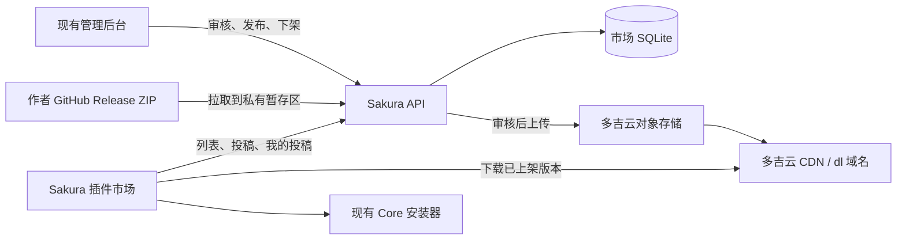

# 插件市场：客户端、服务端与多吉云实施计划

本计划尚未实施，架构仍在比较。目标保留 Sakura 内的插件浏览、下载安装、投稿和“我的投稿”。
插件不建设公开网站。角色包另做展示与外链下载网站，不加入桌面端检索或在线安装。
调研后的建议是优先复用 Shinsekai 的 Registry 与 CI 发布方式，自建服务只补软件内投稿与归属查询。
维护者首版可以在 GitHub 审核，不必同时建设完整的 Admin 市场后台。本文后半保留完整自建方案作为工作量对照，
并不表示两套方案需要同时实现。

## 1. 调研依据与当前基础

2026-09-16 读取了以下公开源码，结论限于这些版本，未运行 Shinsekai，也未核验其线上服务：

- Shinsekai：`f09263b7ad9bc66240014f7a2506d228c3070c32`。
- Shinsekai-Plugin-Registry：`b4b7f19cee9deedb6a5c41d006d3ea1f373fef43`。

### Shinsekai 实际怎样工作

| 环节 | 已核实实现 | Sakura 需要考虑的差异 |
|---|---|---|
| 客户端市场 | 读取 `downloads.shinsekai.studio/registry/plugin_cache_original.json`；支持回退到 GitHub 的旧目录 | 参考列表、详情与安装流程；由 Sakura API 返回统一目录 |
| 投稿 | 软件生成 JSON，打开预填 GitHub Issue；Actions 解析 Issue、修改 `plugins.json`、创建 PR | 软件内直接投稿和本机查询需要额外服务，不能照搬后声称已经支持 |
| 审核 | 收录审核与后续 verified 认证分开，维护者合并 PR | 可沿用 GitHub 审核；不必首期重建审核后台 |
| 包分发 | Actions 解析版本/源码引用，下载源码、清理打包、扫描后上传 R2，再生成目录 | 优先参考 CI 发布；结合现有 `plugin.yaml` 打包，上传目标可换多吉云 |
| 更新发现 | 当前工作流每 4 小时选择有变化的源码版本重新打包；verified 版本变化会降级为待复核 | 首版作者手动提交新版本，逐版本审核；自动发现和客户端更新后续再做 |
| 安装 | 优先安装目录中的包，检查大小和 SHA-256；部分网络故障允许回退 GitHub 源码安装 | 复用 Sakura 本地安装器，不自动改装未经此次审核的源码 |

特别注意：Registry README 把定时流程概括为更新仓库元数据，但当前 workflow 的 schedule 分支还会调用
`select_outdated_packages.py`，检测源码提交变化并进入打包。不能据此认为它的每个新版都先经过人工批准。
在已查阅的投稿路径中，没有实现 Sakura 所需的本机投稿凭据和跨会话“我的投稿”。

源码证据：

- [目录读取](https://github.com/RachelForster/Shinsekai/blob/f09263b7ad9bc66240014f7a2506d228c3070c32/plugin_system/registry/catalog.py#L17)
- [生成投稿 Issue](https://github.com/RachelForster/Shinsekai/blob/f09263b7ad9bc66240014f7a2506d228c3070c32/plugin_system/publisher/submission.py#L35)
- [投稿界面打开浏览器](https://github.com/RachelForster/Shinsekai/blob/f09263b7ad9bc66240014f7a2506d228c3070c32/frontend/src/features/plugin-manager/PluginPublisherDialog.tsx#L191)
- [Registry 收录与认证](https://github.com/RachelForster/Shinsekai-Plugin-Registry/blob/b4b7f19cee9deedb6a5c41d006d3ea1f373fef43/README.md#L21)
- [打包与发布工作流](https://github.com/RachelForster/Shinsekai-Plugin-Registry/blob/b4b7f19cee9deedb6a5c41d006d3ea1f373fef43/.github/workflows/publish-plugin-packages.yml#L75)
- [安装与源码回退](https://github.com/RachelForster/Shinsekai/blob/f09263b7ad9bc66240014f7a2506d228c3070c32/application/plugins/install_plugin.py#L410)

### Sakura 已有的可复用部分

本次只核实当前 worktree，未登录生产服务器或多吉云账号。下面的路径是当前代码落点，不代表服务器已经完成整合：

| 层 | 现有入口 | 需要增加的能力 |
|---|---|---|
| 桌面界面 | `desktop/frontend/settings/plugin-settings.js` | 市场列表、详情、安装任务、投稿表单和我的投稿 |
| Rust 桥接 | `desktop/src-tauri/src/plugin_settings.rs` | 独立市场模块，负责 API 请求、下载任务、凭据持久化与桥接 |
| Core 安装 | `app/core_host/plugin_settings.py`、`app/plugins/installer.py` | 网络下载交接、预期插件 ID/版本核对、市场安装来源记录 |
| 插件打包 | `tools/release/package_optional_plugin.py` | 作者打包指南与样板；继续使用 `plugin.yaml` 和 Plugin API v4 |
| 服务端 | `tools/telemetry_server/app.py` | 目录读取和投稿查询；自建方案才承担完整目录数据库与发布逻辑 |
| 管理后台 | `tools/telemetry_server/dashboard/src/` | 可后续展示投稿；使用 GitHub 审核时无需先增加完整编辑和发布功能 |

开始实现时先对齐服务控制台实际整合后的分支。若代码已迁移，沿用其模块结构，不再建立第二套管理后台，
也不把市场重命名工程与服务整合工作混在同一次改动里。

## 2. 优先考虑的方案：Registry 与 CI 发布，API 补充本机投稿

### 为什么更适合个人维护

GitHub 已有审核、修改历史、差异查看和任务日志；Actions 已有任务执行环境。把这些保留在 GitHub，
可以省去自建审核页面、服务器发布任务和公开目录编辑后台。Registry 也可以是 Sakura 仓库里的一个目录，
是否拆独立仓库取决于投稿协作和权限需求，不需要因为参考项目拆了仓库就立即照做。

“目录是 JSON”不妨碍软件通过 API 获取列表。API 可以读取已发布的目录快照，而不在数据库里维护第二套
可独立编辑的插件目录。插件列表的运行时下载仍走国内 API/CDN，客户端不必直接访问 GitHub。

### 保留原始需求的跨层分工

| 层 | 要做的工作 | 可省下的工作 |
|---|---|---|
| Registry/CI | 目录 schema、包结构验证、固定源码版本、干净 ZIP、上传多吉云、最后发布目录快照；PR 审核 | 自建服务器上的打包任务执行器与发布控制台 |
| 软件 | 市场列表/详情、下载安装、原生投稿、我的投稿；复用现有 Core 安装器 | 插件公开网站 |
| API/服务器 | 对外提供目录读取；持久化投稿所有者和 Issue/PR 对应关系；服务端代交投稿并映射审核/发布状态 | 完整可编辑目录数据库；重新实现 GitHub 的审核历史 |
| 管理入口 | 维护者在 GitHub 审查 PR、反馈和合并；现有后台后续可加链接与摘要 | 首版完整 Admin 审核页面 |
| 多吉云 | 包和图标存储、公开目录快照、`dl` 域名/HTTPS、缓存、流量控制 | 业务审核、投稿身份和用户账号 |

原生投稿额外增加的服务不能省略：客户端提交 API，API 保存私有归属并以机器人身份创建 Issue；
workflow 再转成目录 PR，维护者审核。软件查询自己的记录时，API 读取对应 Issue/PR 和发布结果，
返回统一状态。将 GitHub 账号与令牌放在服务端，用户不需要登录 GitHub。
仓库 Issue 只包含拟公开的插件资料，不写 installationId、投稿凭据或私人联系方式。

身份仍沿用本文第 4 节的安装 ID 关联与独立投稿凭据规则。机器人请求失败、限流、重复提交、PR 关联和状态
更新都需要处理，所以这种“保留原生投稿”的版本比 Shinsekai 原样多一层集成，初期不保证比 SQLite 自建方案
代码更少。它的收益主要是复用审核与发布工具，减少长期维护的业务后台。

审核和发布事实以 GitHub/发布结果为准，本地只保存投稿归属与对应关系，不允许两边各自改审核结论。
PR 合并不等于已上架；Actions 成功发布的目录中包含该具体版本后，才能显示已上架。
状态同步首版在查询时按需刷新并短暂缓存，暂不要求 webhook 或高频全量轮询。GitHub 不可用时保留上次已知
状态并明确刷新失败，不能把未知变成审核通过。

### 建议执行顺序

| 阶段 | 软件代码 | 服务器/API | Registry/CI | 多吉云 | 完成条件 |
|---|---|---|---|---|---|
| R1 一个正式样板 | 验证现有本地安装器 | 隔离目录读取接口 | 手工录入一个插件；固定源码提交；验证、打包、发布 | 测试空间、域名、上传凭据、预算配置 | 发布一个可安装包和对应目录快照 |
| R2 软件内安装 | 列表、详情、Rust 下载、安装交接与失败处理 | 读取已发布快照，返回稳定 API 合同 | 发布包成功后才更新目录 | 正式缓存与下载规则 | 软件中找到并安装该版本 |
| R3 原生投稿和记录 | 投稿表单、凭据保存、我的投稿与反馈 | 归属存储、代交 Issue、查询映射与去重 | Issue 转 PR、人工反馈与合并、发布结果关联 | 无新业务能力 | 不登录 GitHub的用户可投稿并跨会话查询 |
| R4 生产闭环 | Windows/macOS 原生验收 | 备份、精确路由、缓存、限流及凭据配置 | 发布失败与下架验证 | 封顶、告警、删除/禁用对象与缓存刷新 | 投稿到另一台客户端安装全流程通过 |

R1—R2 可以先交付浏览与安装，R3—R4 补齐用户要求的第一期；不能因为前两步完成就宣称完整需求已交付。
其中源码清理打包复用 Sakura 已有工具，读取固定 commit 对应的文件；不执行投稿者脚本，不在持有云密钥的
任务中运行未经信任的插件代码。自动跟踪作者最新分支留到后续，首版发布明确审核过的版本。
审核与发布应绑定同一份暂存产物；GitHub 临时构建产物过期则重新准备并确认，不能静默换成另一个文件。
也可以要求作者提供 Release ZIP，但两种打包输入首版选一种即可。

如果以后用户愿意接受跳转 GitHub 投稿和在 GitHub 查进度，R3 的服务端代交与身份存储还能进一步省掉。
当前用户尚未取消原生投稿要求，因此这里仅作工作量对照，不把它作为默认交付方式。

## 3. 对照方案：完整自建服务的各层职责

以下第 3—7 节细化原先的自建方案，供比较服务器与后台工作量。只有最终选择完整自建时才按 A—F 执行；
采用前述 Registry 方案时，复用其中安装、身份、基础设施和验收要求，不再实现第二套可编辑目录与审核后台。

| 层 | 本期要做 | 不承担的职责 |
|---|---|---|
| 软件代码 | 浏览、下载、安装、提交资料、查询本人记录 | 不包含云存储密钥，不直接写目录或设置审核结果 |
| API 与数据库 | 投稿归属、审核数据、公开目录、版本和发布记录 | 不执行投稿插件代码，不运行作者构建脚本 |
| 管理后台 | 审查具体投稿及暂存包、反馈、批准、发布、下架 | 不把收录写成完整安全认证 |
| 服务器运维 | 进程、反向代理、TLS、目录权限、备份、发布配置 | 不经 API 进程转发每次用户 ZIP 下载 |
| 多吉云 | 保存发布包和图片，通过独立域名分发；缓存和流量控制 | 不保存私密投稿、不决定审核、不维护业务数据库 |
| 作者仓库 | 源码、许可证、版本说明和可安装 Release ZIP | 不自动决定 Sakura 市场当前发布版本 |

域名规划沿用用户提出的 `api.sakura.cialloo.cn`、`adm.sakura.cialloo.cn` 和
`dl.sakura.cialloo.cn`；这里只表示目标职责，DNS、证书及现有路由需要部署前核实。
`hub.sakura.cialloo.cn` 留给后续角色包网站，不是插件市场上线的前置条件。

## 4. 自建方案的数据与接口

### 最小数据

- 插件：稳定 `pluginId`、名称、简介、作者、仓库、许可证、分类/标签、可选图标和公开状态。
- 版本：`versionId`、版本号、插件 API、Sakura 兼容范围、支持平台、发布说明、包大小和发布产物路径。
- 投稿：`submissionId`、投稿所有者、提交时的 `installationId`、资料、版本/Release 地址、修改序号、状态、反馈和时间。
- 发布记录：随机 `artifactId`、审核对应的投稿修改序号、暂存/发布状态、对象路径、错误原因和操作时间。

这些是需要存储的信息，不强制每项对应一张表。市场数据放独立 SQLite 文件，由现有服务模块访问，
避免被遥测 90 天清理任务删除；复用现有部署和备份方式。

首版建议只支持 GitHub 仓库与明确 Release 资产，减少适配工作。GitCode 可按相同投稿合同后续增加。
提交者填写仓库、Release/资产链接和必要介绍；可以读取本地 `plugin.yaml` 填充已有字段，缺失项由用户补齐。
名称、ID、版本、平台等最终以审核通过的包及发布资料为准，不信任表单自报兼容性。

### 本机身份与跨会话查询

沿用现有 `installationId` 作为来源关联；它是随机安装实例 ID，不是硬件指纹或作者身份。
增加一个随机投稿凭据，由 Rust 保存在当前用户配置根，服务器据凭据确定投稿所有者。
不能通过提交另一个 installationId 认领其历史记录，后续编辑同一投稿也必须验证归属。

关闭遥测不影响投稿；没有诊断 ID 时可按现有 UUID 规则创建并持久化 ID，但不启用遥测发送。
重置诊断 ID 不删除投稿凭据，旧投稿保持可查；新投稿记录新的来源 ID。清空用户配置后不保证找回，
首版不提供跨设备账号同步。客户端安装包内不能放通用投稿密钥。

投稿凭据只证明对这些投稿的访问权，不证明拥有作者仓库。首次收录与后续他人提交同名插件时，维护者仍需核实
源码、许可证和投稿授权；同名 ID 不能自动覆盖已经上架的插件。

### API 草案

路径在阶段 A 随现有服务命名统一，下表表示接口职责：

| 入口 | 用途 | 缓存与身份 |
|---|---|---|
| `GET /market/v1/plugins` | 已上架插件列表，小规模先完整返回并本地搜索 | 公开短缓存 |
| `GET /market/v1/plugins/{id}` | 详情和已发布版本信息 | 公开短缓存 |
| `GET /market/v1/plugins/{id}/versions/{versionId}/download` | 重新核对发布状态，返回下载信息 | 首版不缓存；禁用下载时直接拒绝 |
| `POST /market/v1/submitters` | 创建匿名投稿身份并领取凭据 | 限流、不缓存 |
| `POST /market/v1/submissions` | 提交插件资料；携带客户端生成的请求 ID 避免重复投稿 | 投稿凭据、不缓存 |
| `GET /market/v1/submissions/mine` | 查询自己的记录和反馈 | 投稿凭据、`private, no-store` |
| `PATCH /market/v1/submissions/{id}` | 按反馈修改并重新提交 | 归属检查；修改后原审核失效 |
| 现有 Admin 下的市场路由 | 暂存包、审核、发布、下架、查询发布失败 | 沿用管理端认证，不走公共缓存 |

投稿状态使用待审核、需修改、已拒绝、处理中、已上架。内部发布阶段保留“暂存完成/上传中/上传失败”等实际状态；
不要让“审核通过”直接等同于“可安装”。对已上架内容的修改创建新审核记录，不原地修改已批准包。

## 5. 自建方案分阶段执行

### A. 契约和一个可安装样板

目的：先确定真实可交付的包，以及各层互相交接的信息。暂不依赖生产云服务。

- 软件：选现有可选插件作为样板，验证本地 ZIP 安装、依赖准备、启用与卸载；核对元数据和平台兼容字段缺口。
- 服务代码：定义请求/响应、投稿状态、版本发布条件及 ID/凭据规则，准备隔离数据库和样例目录。
- 服务器：只读核实当前服务整合版本、域名、Python、进程管理和可用磁盘，明确后续部署落点。
- 多吉云：核实账号是否已有对象存储、下载域名、所需备案/证书条件与预算；暂不上传正式资源。
- 文档：新增市场 Spec，必要时以 ADR 记录服务与分发边界；同步现有诊断 ID 的多用途规则。

完成条件：一个真实包本地可用，桌面/API/后台使用同一组字段；待确认的基础设施项目有明确清单。

### B. 目录 API 和客户端市场

- 服务代码：市场 SQLite 初始化、公开列表/详情/版本接口、仅返回已发布内容；用本地维护入口录入样板。
- 桌面前端：插件页增加市场入口；显示名称、作者、简介、版本、兼容情况，提供搜索、详情、加载和失败状态。
- Rust：增加市场 API 客户端与命令；网络调用离开 WebView，设置合理的响应大小和超时；不上传用户已安装清单。
- Core：读取现有 inventory，区分已安装、同 ID 冲突和不兼容；此阶段不改本地安装行为。
- 服务器：隔离实例验证迁移和路由；准备公开 API 的精确 Nginx location。生产上线不属于此阶段的必要条件。
- 多吉云：无需依赖正式存储，使用隔离测试下载源。

完成条件：客户端从真实测试 API 列出样板；未发布、已下架和不兼容条目按约定处理；断网不影响已有插件运行。

### C. 多吉云分发和页面内安装

- 多吉云：创建专用存储空间或明确插件前缀，绑定独立 `dl` 域名并配置 HTTPS、缓存、封顶、告警和访问规则。
- 服务代码：加入上传模块；使用多吉云 API 获取短期 S3 凭据，再调用 S3 SDK。长期密钥只保留在服务端。
- 发布：先手动把样板作为已审核包交给发布模块。使用随机产物 ID 组成新路径，例如
  `plugins/{pluginId}/{version}/{artifactId}/plugin.zip`，不覆盖已发布路径。
- Rust：点击安装时重新获取版本下载信息；流式下载到临时目录，限制大小，提供进度和取消，清理不完整文件。
  只允许批准的 HTTPS 下载目标；重定向不能绕开目标校验，投稿凭据不能带到 CDN。
- Core：复用现有安装入口，解包后、准备依赖前核对预期插件 ID/版本；保持路径、文件数、大小和符号链接检查。
  安装成功后才记录市场来源。不能直接向用户插件目录解压，也不能跳过原有回滚路径。
- 界面：下载、安装、完成和失败分别显示。安装成功沿用现有启用规则，不能把文件下载完成当成插件已运行。
- 并发与取消：同一插件避免重复安装；下载期可取消，进入安装提交阶段沿用安装器保证，不承诺任意时刻强制中断。

完成条件：一台隔离 Sakura 从真实下载域名安装成功；取消、损坏 ZIP、ID/版本不符、重复安装和依赖失败均不会
留下被误认作成功的安装。同阶段至少完成目标 Windows/macOS 的相关原生调用链验证，不能用浏览器 mock 代替。

### D. 投稿与“我的投稿”

- 服务代码：匿名投稿凭据、创建/修改/本人列表接口、请求 ID 去重、字段与体积限制、投稿频率限制。
- 桌面：市场内增加提交表单和我的投稿列表；记录审核反馈，支持需修改后重新提交，退出重启后仍能查询。
- 身份：凭据持久化由 Rust 管理，不通过可公开的 ID 查询私有内容；不把凭据写入 URL、日志或前端持久化存储。
- 服务器：明确开放 POST/PATCH 精确路由；配置 body 上限、限流、凭据日志处理和私有接口禁缓存。
- 多吉云：若 API 域名经过 CDN，为投稿/本人记录绕过缓存。此阶段不允许客户端直接上传插件包到存储空间。

完成条件：甲乙两个隔离安装实例不能互查或修改投稿；重启后可查，关闭遥测和重置诊断 ID 后仍可查；
同一请求重发不会创建两份投稿。

### E. 后台审核与正式上架

- 后台：增加待审核列表、详情、源码/Release 链接、包检查结果、反馈、需修改/拒绝/批准、发布失败和下架操作。
- 服务代码：维护者操作后拉取指定 Release 资产到私有暂存区，记录来源版本与实际包信息。限制来源、下载体积
  和重定向；不能让投稿 URL 请求任意内网地址。
- 审核对象：审核绑定已经暂存的文件和投稿修改序号；查看源码与包内容，核对许可证、ID、版本和支持环境。
  服务端只做静态结构检查，不导入插件模块、不安装其 Python 依赖；运行验证使用隔离开发/验收环境。
- 发布顺序：暂存包审核通过 → 上传同一份文件 → 检查公开下载可用 → 数据库事务发布版本 → 刷新目录缓存。
  禁止审核后重新从上游下载另一份文件。上传失败保持不可见，维护者可明确重试并保留错误。
- 服务器：后台写接口继续受原认证保护，公网 API 不能访问管理路由；备份市场数据库和必要私有暂存文件，
  配置未完成暂存的保留期。上传任务不能长时间阻塞公开列表查询，可先用简单受管理任务，不建设通用队列平台。
- 多吉云：已发布路径不覆盖；下架时停止 API 发放下载，并按下架性质禁用/移除对象、刷新 CDN 缓存。
  只从目录移除不能撤销已传播的直链，完整下架需要验证边缘缓存失效；不远程删除用户已安装插件。

完成条件：用户提交 → 重启查询 → 后台反馈/重新提交 → 审核暂存包 → 多吉云发布 → 另一台客户端下载安装。
模拟上传失败与发布进程中断，不能出现“列表已上架但没有可用包”；下架后新安装请求被拒绝。
发布中断后人工核对已上传对象及数据库状态即可，不增加无限自动重试。

### F. 生产部署与小范围验收

- 对齐已整合服务的实际代码版本；先备份、部署服务/API/后台和数据库，再发布带市场入口的客户端。
- 核对 DNS、TLS、Nginx 路由、Admin 认证、私有请求禁缓存、存储权限和流量策略；生产仅使用明确的验收投稿。
- 用一个样板完成公网全流程及下架演练，保存版本、部署路径和验证结果；清楚区分本地通过与公网通过。
- 故障回退：关闭市场写入/下载入口或回退模块，保留投稿与新版本数据，不拿旧数据库覆盖新记录；本地插件继续可用。

完成条件：以上 A—E 的功能可在生产边界内完成，并有 Windows/macOS 客户端验证结果。未验证的平台单独说明。

## 6. 两种方案共用的多吉云配置

| 项目 | 具体操作 | 验收 |
|---|---|---|
| 存储空间 | 为发布包和公开图片划分存储空间/前缀；待审核包留在服务器私有暂存区 | 客户端不能写对象，私有投稿资料不在公开空间 |
| 上传接入 | CI 或服务端调用临时密钥 API，按控制台 SDK 参数使用 Endpoint/Bucket | 上传一个测试 ZIP，可读且大小正确；密钥不进入客户端 |
| 下载域名 | 配置 `dl`、DNS、证书及存储回源 | HTTPS 下载成功；独立域名停用不影响 API/后台 |
| 缓存 | 不可覆盖的版本包长缓存；公开目录短缓存；私有 API 和下载分配入口禁缓存 | 审核进度不串用户，上架/下架在约定时间内可见 |
| 费用控制 | 依据预算设置小时/当天流量阈值，触发后停用域名并通知；必要时配置 IP QPS 和单链接限速 | 记录实际阈值、生效延迟和恢复操作，不假定“达到预算立刻停费” |
| 访问控制 | 规则兼容原生下载器，不要求网页 Referer；检查源站/默认域名能否绕开控制 | 原生客户端下载正常，绕过路径不会形成未计入预算的分发入口 |
| 下架 | 停止下载分配，并禁用/删除对应公开对象、刷新相关缓存 | 原直链在缓存刷新完成后不可继续下载 |

首版可以使用公开只读下载 URL，配合上述费用控制；不把 URL 保密当作保护。若预算要求增加临时 URL 鉴权，
由服务器按多吉云官方协议签发，客户端只使用结果。具体签名算法遵循官方鉴权协议，不自创包摘要或签名系统。
鉴权链接也不能代替流量封顶，匿名下载入口本身仍可能被滥用。

已查阅官方资料：

- [云存储 SDK 概览](https://docs.dogecloud.com/oss/sdk-introduction)：服务端 API 获取支持 S3 的临时密钥，
  使用控制台给出的 Endpoint/Bucket，通过相应 S3 SDK 上传。
- [避免恶意攻击产生高额账单](https://docs.dogecloud.com/cdn/practice-attack-risk)：支持小时/当天流量封顶和停用域名，
  明确说明统计与触发约有 5 分钟延迟；因此封顶减少损失，不能承诺绝对费用上限。

本次没有核对用户账号套餐、额度、余额或现有配置，不采用粘贴方案中的单价计算预算。部署前同时核对存储、
请求、回源和 CDN 的实际计费项目。插件 ZIP 经 CDN 加速不等于 Python 依赖、浏览器组件或模型下载也已加速；
这些继续走现有依赖和资源链路，首版不复制整个依赖生态。

## 7. 自建方案工作量对照与共同后续

建议每次只推进一个阶段，阶段结束时留下可验收结果。下面是拆分建议，不是工期承诺：

| 阶段 | 建议代码交付单元 | 外部操作 | 主要风险 |
|---|---|---|---|
| A | 契约、样板与缺口整理 | 只读核实环境 | 服务整合分支、插件元数据差异 |
| B | API/数据库；客户端列表 | 测试实例路由 | 目录与本地安装状态一致 |
| C | 发布上传模块；Rust 下载与 Core 安装交接 | 对象存储、下载域名和费用策略 | 下载取消、安装失败、平台依赖 |
| D | 投稿归属/API；客户端表单和记录 | 私有路由及缓存规则 | 跨会话、越权、重复提交 |
| E | 后台审核；暂存发布与下架 | 备份和发布权限 | 审核文件与发布文件一致、失败恢复 |
| F | 必要部署修正和验收 | 正式发布与小范围验证 | 公网认证、缓存和真实客户端差异 |

第一期约为 8—10 个可独立审阅的实现单元，另有基础设施配置与原生验收；A 完成后再估算工期更可靠。
其中 C 和 E 的跨层失败处理最容易占用时间。写完列表与安装按钮不代表安装交付完成。

后续顺序：先做用户主动检查/确认的插件更新，保证旧代码、依赖和配置可保留；再考虑上游新版自动发现。
角色包网站独立安排，只收录展示资料、版本、多个外链和提取码，后台可复用，角色文件由作者托管。
账户、评分、收藏、自动审核、源码构建服务和角色文件托管不进入首期。

不照搬 Shinsekai 的 MD5 目录标记、SHA-256 包字段、多种旧格式兼容解析和源码自动回退。
遵循当前仓库约定，以实际字段、版本、随机产物 ID、独立发布路径和包结构验证完成首版。
这不构成密码学上的发布者认证；若以后需要验证发布者签名，单独选用标准认证协议并更新契约。

建议先按 R1 准备一个样板与目录/包发布链路，同时确定 Registry 的代码归属；软件内匿名投稿继续保留在 R3，
不把是否建设完整审核后台作为浏览与安装的前置条件。本次只完成调研和计划，未创建仓库、投稿或执行发布。
