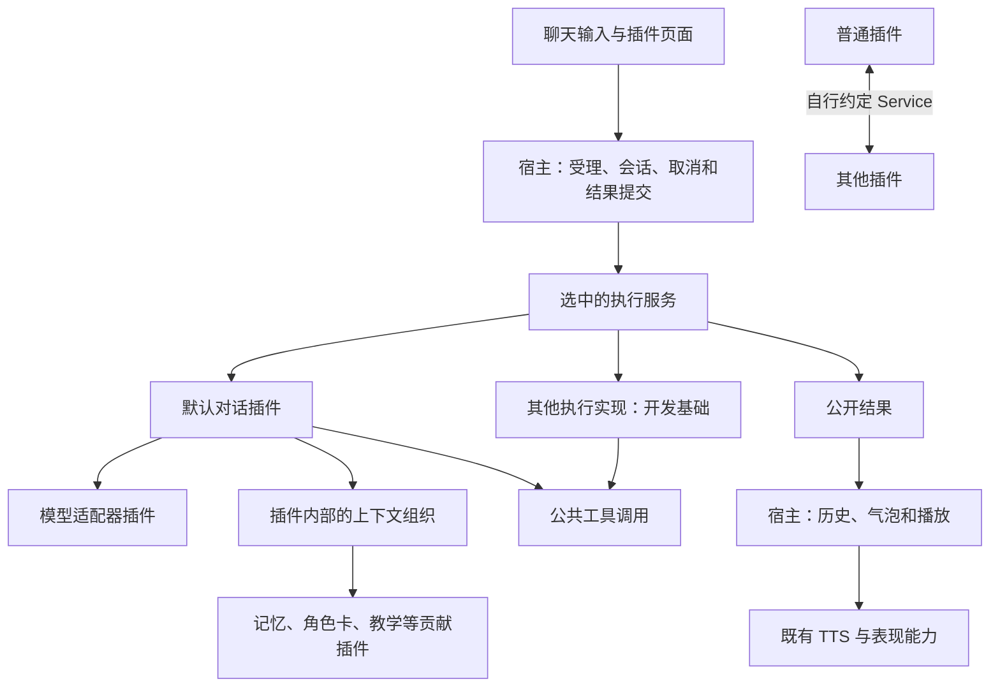

# 开放插件生态总计划：薄宿主与可替换的默认能力

本计划依据 2026-09-14 的方向讨论修订，以 `d2118925` 为初版基线，替代原先 A–E 的推进顺序。
M1 已修正 Context 用途分类及宿主裁剪。M2 在 `f9fde091` 引入的主设置“互动方式”现按用户要求撤回，
底层执行合同与“专注陪伴”开发样例保留。当前日常入口使用已有数据和默认 Assistant，插件通过自己的设置增强对话。
本轮从 M5 选取两个实际消费者推进：普通服务显式绑定供 TTS Hub 隔离旧任务，以及可选“便签记忆”的管理与召回。
M3/M4 保留为长期方向，尚未实施，也不自动成为下一轮产品改造。

现阶段不新增或改造主设置。插件自己的配置优先使用已有插件设置入口；不同插件需要怎样的复杂呈现，
等待实际需求和用户方案明确后再处理。底层能力的存在本身不决定它必须占用哪个主界面入口。

目标是让 Sakura 由一个简单、开放的宿主和一组可组合、可替换的默认插件组成。用户沿用现成的默认组合即可使用；
开发者可以添加能力，也可以更换实现。新增业务主要发生在插件里，宿主不需要不断增加对应概念。

默认产品形态继续是使用受限工具集的桌面 Assistant。Agent 只是检查公共边界时考虑的未来场景，
本轮不实现它，也不预定模式切换、选择器或命令执行入口。

简单插件和复杂插件使用同一个框架。复杂 Agent 可以拥有自己的任务系统、工具执行、授权策略和完整界面，
主程序不需要认识这些内部结构。默认 Assistant 也是一组默认实现；宿主不能因插件复杂而扩张成业务平台。

## 1. 方向与判断标准

记忆、TTS 和表现形式的拆分已经在朝这个目标前进。后续沿用这些成果，扩大真实消费者所使用的公共边界，
而不是重新建立一套插件框架。架构基础继续遵循 [ADR-0037](../../adr/0037-replaceable-default-plugins-and-isolated-python-runtimes.md)。

“简单”指宿主承担的业务判断少。上下文怎么写、记忆怎么选、工具何时调用、模型怎样推理，都可以由插件实现。
进程隔离、取消、资源回收和用户数据保护仍有实际作用，不能通过删掉这些机制来减少代码量。

未来某个插件需要复杂功能时，先由该插件或它依赖的其他插件实现。只有现有公共边界无法提供必要的运行、通信、
资源或界面接入时，才扩充宿主对应的基础机制。插件可以内部拆模块、调用多个服务或管理子进程，不要求每个内部模块
都变成宿主认识的新能力类别。独立功能也不必接入聊天或模型。

每项改动都回答：

- 谁会调用这项能力，已有调用者为何不能通过当前接口完成？
- 宿主新增的是连接与运行机制，还是替插件解释业务？
- 默认实现和第三方能否使用相同接口？更换后，正常产品入口是否真正调用新实现？
- 停用目标插件时，无关功能是否继续运行？用户已有数据是否保持可读？

Cosplay 只作为一个例子。当前角色信息和插件补充的“请以当前角色身份扮演另一个角色”可以同时存在。
文本关系由插件组织或由模型理解；宿主不检查角色卡冲突，不自动关闭默认角色信息，也不建立专用扮演入口。

## 2. 当前基础与真正的缺口

| 范围 | 当前已经具备 | 后续需要解决 |
|---|---|---|
| 插件运行 | API v4、独立进程与依赖根、具名 Service、配置、资源和生命周期 | 本轮为普通插件增加 `context.bind()`，固定一次操作的服务进程 |
| Memory | Mem0 自己拥有存储、检索、整理、Context、工具与管理页贡献；普通聊天不直接调用 Mem0 数据库 | 本轮增加独立 SQLite 的可选便签记忆，用 Collection、Context 和只读工具验证第二实现 |
| TTS | Core 消费公共 `sakura.tts`；Hub 可替换，Provider 以公开合同接入不同引擎 | 本轮用显式绑定修复 crash→reload 后旧 job 落到新进程的问题 |
| 表现形式 | 插件自有资源类型、renderer、editor、控制描述和解析，支持选择实现 | 开放现有能力的查询与操作；多表面或叠加渲染由实际消费者推动 |
| Context | M1 已删除用途分类，Host 完整传递原始贡献；默认消费者处理兼容、预算及复用 | M4 将默认消费实现迁到插件 |
| 默认聊天与执行基础 | 正常入口使用默认 Assistant；执行服务与进程绑定保留供开发消费者验证 | 模型与默认对话拆分仍为长期方向，待真实需求和用户方案明确 |
| 工具与权限 | 有工具发现、可见性过滤、调用来源及进程隔离 | 默认 Assistant 的工具选择需要与新增 Agent 能力分开；授权设计由未来实际消费者推动，进程隔离不等于 OS 权限隔离 |
| 插件界面 | 结构化设置、Collection、表现渲染器与工坊编辑器已有接入 | 普通插件仍缺完整的独立页面/窗口与命令入口 |

Memory 不必统一成唯一的 `sakura.memory`：多个插件可以分别贡献检索、工具和 Timeline 消费。
TTS 的“Hub＋Provider”适合多引擎选择；表现使用资源与渲染器。保留这些领域差异，不把所有能力套成一种注册框架。

替换记忆实现也不等于自动转换它的数据库。新插件可以使用自己的存储；需要继承旧记忆时，提供明确的导出和导入。
既有旧版本导入器的格式适配属于数据兼容，不能因整理正常运行链而直接删除。

## 3. 宿主、默认插件与其他插件的职责

| 责任 | 归属 |
|---|---|
| 发现、安装、启停、服务路由、调用身份、进程与依赖隔离 | 插件运行底座 |
| 配置与凭据的受控访问、资源引用、基础界面容器、日志传输 | 宿主公共服务 |
| 当前会话和操作身份、输入受理、忙碌、取消、结果提交、实际播放授权 | 应用边界 |
| 调用者身份、绑定有效期与宿主管理资源的访问检查 | 公共调用边界；工具选择与业务授权策略归消费插件或能力提供者 |
| Agent 循环、上下文组合与预算、工具选择、提示词和模型回复解析 | 默认对话插件或替代执行器 |
| 模型协议、能力说明、模型列表、推理请求及其依赖 | 模型适配器 |
| 记忆结构、整理、检索、学习进度和业务筛选 | 对应记忆插件 |
| 合成、声线与模型资源；外观资源、控制含义、编辑和渲染 | 对应 TTS/表现能力 |
| 教学、角色扮演、游戏、日历等业务内容和协作规则 | 业务插件 |

“Python Core 进程”是部署位置，不等于其中所有代码都应该永久由宿主拥有。迁移阶段允许当前管线先包装在公共契约后面；
只有默认实现迁出并清理私有直连后，才算完成该能力的插件化。

Timeline 写入、历史读取和输出链当前保留在应用边界，供多个执行器共用。先让这些接口支持实际替换；
暂不建设可替换数据库后端或另一套历史存储。公开结果格式表达宿主实际能显示和提交的内容；
要求模型输出何种提示词格式、怎样解析成公开结果，属于执行器。

以下展示长期目标中的责任关系，不代表已决定新增产品入口。其中模型是执行实现按需使用的能力：

插件底座只理解服务和生命周期。应用中的播放器、编辑器等消费者可以理解稳定的 TTS、资源或渲染合同，
不需要把这些合同也收进通用 Runtime。官方插件只有预装和分发便利，运行时不获得第三方没有的私有接口。

文中“Agent 循环”也指现有代码内部的执行机制，不代表默认产品已经具备未来高级 Agent 的能力或权限。

## 4. Context 初版如何修正

目标接口只表达插件提供的内容，不要求插件把角色卡、资料和行为要求分成不同类别。
插件可以返回一段文本，也可以返回少量片段；插件自行决定内容、组织方式和需要调用的其他服务。

M1 已完成的修正范围：

1. 移除 `instruction/data` 用途分类、由此派生的信任等级、规则/事实分区和按用途决定的预算分支。
   不把统一内容改成“全部是事实”或“全部是最高优先级指令”；默认对话实现按自己的方式组织模型消息。
2. Host 保留来源、Provider 身份、登记有效性、取消和有界 JSON 传输检查，交付可承载的原始贡献。
   旧可选内容最多 16 项、每项 8192 字符及截断行为，移到默认消费者的兼容处理处；
   Host 不先裁剪再交给所有执行器。IPC 总大小或结构超限时明确拒绝，不伪装为完整传输。
3. 已有 `scope/order/required/failurePolicy` 暂作为默认对话能力的消费约定保留，避免这一步顺便重写所有行为。
   其执行代码随默认对话迁出；其他执行器不必使用同一套排序、预算、缓存或错误策略。
4. 沿用旧可选内容的预算行为；要求完整内容时仍可声明 `required`，默认执行器放不下就明确失败。
   预算数值和裁剪方式属于默认实现，不成为所有插件必须接受的宿主政策。
5. 示例从“行为规则＋参考资料”改为一个上下文输入框，保留既有插件 ID 和用户配置。
   旧两个字段通过确定顺序合并为初始内容，不丢弃用户文本，也不要求重新安装。
6. 同步 SDK、能力说明、Spec、相关测试和 ADR；检查模型兼容降级与 Trace，避免残留用途判断。
   已提供的能力查询要反映实际语义，删除分类后不再公布旧 `fragmentKinds`；依赖旧分类的开发版插件应收到明确的
   不兼容结果。回归覆盖实际 `describe()` 响应、完整原始贡献传递，以及默认消费者的旧可选内容兼容行为。

单次 IPC 的大小限制属于传输保护，超过时明确报错；一个模型窗口里选多少记忆、哪些片段值得保留则属于对话策略。
两者分别说明，不能把插件内容静默截掉后当作成功传输。
M1 已在现有进程内完成上述责任迁移，M4 再把默认消费者代码迁到插件。`required` 原文不受旧可选内容的
16 项/8192 字符限制，能否完整纳入模型窗口仍由默认消费者预算判断。

本计划不增加“角色提供者切换”、角色冲突检测或必装的上下文管理插件。默认角色信息可以继续与额外上下文一起使用。
默认对话插件内部先保留自己的 Context 模块；有第二个真正需要复用的消费者后，再决定是否独立提供组装服务。

## 5. M2 的保留基础与撤回入口

提交 `f9fde091` 曾把独立执行服务接到正常聊天，并在主设置增加“互动方式”。用户随后明确要求撤掉这个产品入口，
不要预定 Agent 模式或执行器选择的呈现。当前正常聊天回到默认 Assistant，保留既有角色、模型、工具和输出链。
`chat_executor` 的旧值被忽略，`settings.executor.get/save` 已移除；不把选择器平移成隐藏配置或插件开关。

M2 的执行服务、`PluginExecutor`、进程绑定、取消和提交保护继续作为开发基础。
[专注陪伴](../../../plugins/optional/focus_companion/README.md)保留为无副作用的开发样例，暂不能从原聊天框选择。
合同见 [Plugin Runtime v4 §6.5](../../specs/runtime-v2/sakura-plugin-runtime-v4.md#65-可替换互动执行器)，
支持 `text` 及可选 `event`，尚不接受截图或其他图片输入。登记服务不会增加用户界面，也不会更换默认聊天实现。

开发消费者显式绑定服务时，继续遵守以下边界：

| 边界 | 保留约定 |
|---|---|
| 服务与进程 | 登记归属于真实插件进程；加载、登记与业务就绪分别表达。后续调用固定使用原实例，同服务名的新进程不接管旧操作。 |
| 后台身份 | 受理时验证真实调用者，并保存操作、generation、角色和输入；`context.caller_id` 仅属于当前 RPC，不自动传入线程。请求中的身份字符串不授予权限。 |
| 受理与超时 | 同一 operation 不重复启动工作，相同身份对应不同输入应拒绝。调用超时不等于任务停止，不重新发送 begin；继续查询原操作。 |
| 取消与故障 | 取消传到实际工作，终态只在工作退出后报告。协议或非超时调用故障先回收原进程与依赖消费者；正常业务失败只结束当前任务，不自动重启。 |
| 清理失败 | 停止无法确认时明确报错并保留占用，拒绝新工作或重新绑定，不能伪称取消成功；由既有 Core 生命周期完成最终进程回收。 |
| 进度与提交 | 进度是临时状态，不写助手历史或触发播放。最终结果校验取消、来源、实例与格式后只提交一次；NOOP 不写助手条目，迟到结果不能重新成功。 |

这些机制已由隔离进程、事件/屏障和提交回归验证，保留它们不等于确认新的产品模式。
正常应用的初始化仍创建默认 Assistant；模型、Context 与工具的进一步迁移需要实际消费者和明确方案。
公共工具消费及默认对话内部策略迁移仍属于 M4 的长期设想，本轮没有开放这条消费链。

### 5.1 Agent 只是未来可能的插件场景

复杂插件可以拥有自己的规划、任务、工具和业务状态，也可以依赖其他插件。宿主不需要按插件名称或 `isAgent`
开放特权，不要求所有插件采用同一种执行循环。安装、启用或公开 Service 不自动把其方法暴露成默认 Assistant 的模型工具。

目前不实现 Agent，也不预定“安装后选择 Agent 模式、结束后切回”的用户流程。未来确有这类需求时，先明确用户要完成的工作、
入口和能力范围，再决定是否使用已有执行服务、增加插件自有界面或补足其他公共机制。
模型和默认能力拆分、独立窗口及选择方式均待真实需求和用户方案明确，不因计划中的里程碑编号自动进入产品改造。

若未来能力需要授权，检查应由实际执行入口落实；Prompt、界面隐藏或插件自报 `risk` 都不能替代它。
通用调用提供身份与生命周期，插件负责停止自己启动的任务和子进程；取消不回滚已发生的外部效果。
本轮不预建通用权限、持久任务、恢复或逐条工具审批平台，未来具体设计遵循
[ADR-0031](../../adr/0031-retire-runtime-v2-tool-confirmation.md)。

### 5.2 产品工具范围与系统权限

当前插件是可信本地代码，运行在当前用户的系统权限下，可以自行使用 Python、文件与子进程。
[SDK](../../devdocs/SAKURA_PLUGIN_SDK.md) 中的 `permissions` 只是遗留元数据；依赖隔离和禁止导入 `app.*` 不构成 OS 沙箱。
因此，工具选择说明 Assistant 使用哪些能力，不能声称会阻止任意本地插件直接访问系统；
operation 身份也不自动构成操作授权。需要保护的操作仍由实际能力入口定义并落实其访问规则。

目前“默认 Assistant 权限较低”按产品可调用工具范围理解。执行命令通常也可在普通用户权限下完成；
不通过让整个 Sakura 以管理员身份运行来实现升级。如果未来要求系统层面强制限制文件、网络或进程访问，
需在 Agent 落地时明确采用的 OS 隔离或独立受控执行环境，并在相应平台验证。本轮不选择或搭建这套环境。

## 6. 默认模型和对话策略如何迁出

M3/M4 的技术设想继续保留，但以下两条链路尚未实施、未排定为下一轮工作。
只有实际消费者需要这些能力，且用户要采用的方案明确后，才确定本次范围、入口和是否进行拆分。
以下验收条件用于判断未来方案是否成立，不预先要求用户接受新的模型页、模式选择或默认能力组合。

**模型能力。** 现有 HTTP 客户端先置于公开模型合同后，再迁为默认适配器插件。正常聊天、模型列表、连接测试及就绪检查
都消费同一提供者。现有 API 地址、Key 和模型选择继续由默认适配器解释，不要求用户重填。

M3 同时调整 `model_slots` 的公共选择合同。当前 `resolve()` 返回 `baseUrl/apiKey/timeoutSeconds` 等 HTTP 配置；
新的调用路径表达选中的模型能力、提供者与模型引用，不要求本地推理或其他协议伪装成 URL 和 Key。
槽位继续负责用户选择及默认继承，实际请求通过公共模型能力执行。新路径的模型引用不携带凭据，
凭据由实际适配器受控取得；旧 `resolve()` 在兼容期保留既有访问行为。

新路径使用独立的公开入口，旧 `resolve()` 保留原字段和 HTTP 语义，避免破坏现有消费者的严格字段校验。
旧入口对无法表达的新提供者明确报告不兼容，不构造假 URL、不偷偷退回旧模型。第一版不要求立即删除旧入口，
但必须列清剩余调用者及迁移节点。
M3 除主聊天外，至少让一个现有辅助消费者（优先 Mem0 整理）通过新槽位路径使用同一个非 HTTP 提供者；
保留可选槽位继承及用户显式选择的行为。Mem0 整理还需保留取消、失败不推进游标及已有请求次数限制；
整理内容和修复策略仍由 Mem0 拥有。仅主聊天可切换不能算此节点完成。

用协议不同的第二实现验证边界，不能只换一个 OpenAI-compatible 地址。请求需表达实际消费者使用的文本、图片、工具、
用量和错误；大资源沿用引用。提供者不支持图片或工具时明确报告，普通文字可用性单独判断。精确字段由真实样例驱动，
不提前完整复制所有模型厂商的参数。核对记忆整理、观察分析等其他模型调用者，避免默认客户端直连长期残留。
其余默认消费者的迁移与失效直连清理由 M4 收尾，私有客户端不能作为未列明的永久后门。

**默认对话能力。** Agent 循环、提示词、模型回复解析、上下文收集与预算、工具选择迁成同一个默认对话插件的内部模块。
先保持可理解的一个实现，不把每个类都拆成独立进程。多个插件有复用需求时才拆分内部模块的公开服务。

M4 还要证明默认对话能被小插件增强：保持默认执行器、模型和现有工具，安装一个上下文增强插件与一个输出转换插件，
通过默认执行器拥有的少量公共入口同时生效。转换后的结果一致进入历史、气泡和 TTS；移除任一增强插件，另一个继续工作。
这两个真实消费者随迁移交付，不把组合能力全部推迟到 M5。第三方无需复制默认对话插件，Core 也不建立中央 Hook 平台。

默认执行器通过公开入口调用既有插件工具和 MCP；通过宿主现有登记桥获取原始 Context 贡献及其真实来源。
旧 callback 仍由原 Host 桥调用，不把 callback handle 转交给其他插件。迁移必须验证
“执行器插件 → 模型插件 → 工具入口 → 工具插件”整条调用、取消和退出，不能持有生命周期锁等待业务回调。

最终删除 Session 私有对象依赖、具体客户端热更新和隐式备用 Agent。默认插件只能依赖公共 SDK/Service、
自己的模块和私有依赖；在独立安装目录运行，不能通过重新导出 `app.*` 伪装完成迁移。
Trace 继续覆盖真实请求，日志与诊断不因默认实现迁出而失去来源，也不为插件引入第二套跟踪存储。

**公共 Trace 接入。** 复用 [WP-4L-02](../../specs/runtime-v2/WP-4L-02-human-readable-runtime-log-agent-trace.md)
的所有者、文件与 operation 生命周期。M3 的模型适配器迁出时就提供所需的最小 SDK/Host 桥；M4 补齐执行器的
上下文选择、步骤和回复解析关联。默认与第三方使用相同入口，不能私下导入 `app.agent.trace`。

真实传输者在完成协议适配后记录实际请求及对应响应/错误；执行器提供自己的组装与选择信息，两者关联同一模型调用，
不各自重复记录完整请求。新增的真实请求分别记录调用及 attempt，重复上报不生成新调用。
沿用 operation 和 model-call 序号，桥接层验证调用来源、关联有效期和载荷边界，
后台辅助调用可关联独立 operation，不冒充聊天操作。具体导出方法随实际消费者确定，不开放任意文件写入或读取其他 Trace。

普通 `sakura.host.logging` 继续禁止聊天正文、Prompt 和模型输出。私密 Trace 桥执行现有凭据清洗、静态人设正文省略、
图片/资源凭据处理及文件保护规则；Trace 故障仍不得改变产品结果。同步修订 SDK 中“Trace 仅供宿主使用”的当前说明，
不会因此把普通日志变成私密内容通道。验收捕获实际模型请求，与 Trace 按允许记录的字段核对；覆盖成功、兼容回退、
取消及后台整理，检查请求数与调用记录数一致、无凭据泄漏及记录失败不影响回复。

## 7. 现有能力怎样继续开放

这些工作与主线配合，用真实消费者决定先后，不作为默认执行器拆分的全部前置条件。

- **Memory：**本轮实现可选 `fact_memory`，由用户通过插件自己的 Collection 维护便签，用独立 SQLite 按角色保存。
  Context 和只读 `fact_memory_search` 按关键词或轻量文本匹配，最多召回 5 条、正文合计不超过 2000 字符。
  不调用额外模型，不自动整理，也不读写 Mem0 数据库。详见[便签记忆规范](../../specs/runtime-v2/fact-memory.md)。
  需要跨插件搜索、写入或筛选时，由记忆提供者公开服务；格式、学习规则和进度由它拥有。
  现有管理页若限制不同记忆形态，应改为插件可提供的展示或通用界面，不强制所有插件适配 Mem0 层次。
- **TTS：**沿用现有 Hub/Provider 和播放边界。本轮通过普通 `context.bind()` 固定 Provider 的实际进程，
  `begin/poll/cancel` 不跨重载接到新 job；新任务再显式绑定。声线查询、选择和资源适配由 TTS 能力完成，
  工作室的厂商资源适配随资源消费者逐项开放。
- **表现：**复用现有 renderer/editor 及进程绑定，开放已有资源的查询、选择和操作。
  是否需要多表面、叠加或组合渲染，以第二种实际场景判断，不在本计划先建场景引擎。
- **临时操作：**由对应能力拥有者保存有来源、有生命周期的请求；退出时撤销请求并使用用户当前选择。
  用户期间改了选择，旧请求不得恢复过期配置。借用外观或声线不改变会话和历史归属。

这些领域可以公开不同合同。运行底座负责服务路由和必要的有效性验证，不维护所有业务操作的总目录。

## 8. 插件协作、处理入口与界面

普通插件已经可以提供自有 Service。本轮由 TTS Hub/Provider 的旧 job 隔离需求补足显式进程绑定，
不要求主程序预先认识服务方法和内容。耗时处理通过显式调用得到结果，通知事件只说明已发生的事实。

跨进程发布、通用互动提交、独立窗口和命令入口按具体样例交付：

| 样例 | 需要开放的能力 | 能力归属 |
|---|---|---|
| 日历或番茄钟请求角色提醒 | 正式互动提交、状态和取消；无需伪装用户发言 | 复用第 5 节应用边界，插件决定何时提交和提交什么 |
| 两个插件共享活动进度 | 有界跨进程通知及真实来源 | Runtime 路由；业务事件名称和订阅行为由插件约定 |
| 输出翻译或格式处理 | 在公开结果提交前转换 | 对话实现开放并调用处理服务，处理完再进入历史、气泡和 TTS |
| 外发内容处理 | 在完整模型请求交给实际传输者前处理 | 执行器与模型能力约定；不能只处理用户输入而遗漏历史、Context 和工具结果 |
| 日历、棋盘或记忆图谱 | 独立界面容器、资源加载、服务桥和可触达命令 | 宿主管理窗口，插件实现界面和交互 |

外发处理和禁止本地保存有不同的位置要求；后者必须在落盘之前执行。两者由声明该功能的实际调用链落实，
不能仅添加一个 Hook 就声称完成。必须成功的处理失败时停止受影响操作；普通通知失败不决定业务提交。

插件自己的回合数据确需跨重启使用时，再贯穿请求、结果和 Timeline 的命名空间扩展。
宿主验证身份、大小和 JSON 格式，记忆插件解释业务含义；不增加“扮演回合”等宿主枚举。
继承或补读旧历史、筛选缺失时怎么处理，由消费插件明确规定，不能静默忽略已承诺的学习限制。
现有 `chat.completed` 简短通知保持兼容，正文和扩展数据优先从 Timeline 读取。

复杂 UI 的入口与形态待实际需求确定，不因保留执行服务自动新增独立窗口。若方案采用插件窗口，沿用现有 renderer/editor 的加载与清理经验；
窗口关闭只销毁视图，停用插件才结束其后台工作。独立页面不依赖模型和 Assistant 就绪。
页面桥绑定实际插件与服务，只提供已开放的操作；继续采用可信本地插件模型，不宣称为恶意代码沙箱。

## 9. 里程碑与当前范围

| 节点 | 保留范围 | 状态 |
|---|---|---|
| M0：方向归档 | 薄宿主、插件拥有内容与策略的目标 | 方向保留 |
| M1：Context 去语义分类 | Host 传原始贡献，默认消费者承接兼容裁剪；单输入示例及规范 | 已完成，提交 `2097b739` |
| M2：执行服务基础 | 服务合同、真实进程与操作绑定、取消、终态去重、专注开发样例 | `f9fde091` 为历史实现；主设置和正常聊天的选择入口已撤回，基础代码保留 |
| M3：模型适配器可替换 | 不同协议、中立模型槽、辅助消费者及公共 Trace 的设想 | 长期方向，未实施；待真实需求和方案明确 |
| M4：默认对话能力拆分 | Agent/Context 策略、工具消费、小插件增强及 Trace 关联的设想 | 长期方向，未实施；不自动推进产品改造 |
| M5：通过真实插件补能力 | 普通服务显式绑定与 TTS 旧 job 隔离；可选便签记忆的 Collection、Context 和工具 | 本轮两个里程碑已实现并通过相关回归；后续按实际消费者继续 |
| M6：插件界面 | 窗口、服务桥、命令及页面等可能形式 | 待具体用户需求与界面方案，不预定入口 |

当前工作保留默认 Assistant 的正常入口，推进 M5 中的服务绑定与便签记忆。日常验收使用已有角色包、模型配置，
由用户安装、启用可选插件并在插件自身设置中操作。
M3/M4 的编号保留讨论脉络，不构成自动执行顺序。后续能力是否拆分、用户怎样访问以及默认组合怎样变化，
都应由真实需求和明确方案推动。

已有提交与聚焦回归保留为可审阅的工程证据；不为了撤掉选择器删除仍有价值的进程绑定和取消保护。
提交和推送按用户授权范围执行，发布单独处理。未来 Agent 不在当前实现范围内，也不据本计划预设模式切换。

## 10. 当前验收与未来方案的判断标准

当前验收检查正常聊天仍使用默认 Assistant、历史选择字段不接管入口、插件上下文从自身设置生效，
以及进程绑定和取消的开发回归继续成立。M5 分别验证普通服务的旧绑定拒绝重载进程、TTS 的同名 job 隔离，
以及便签的新增、查询、修改、重启保留、删除、停用和角色分区。真实日常数据里的角色、模型、插件开关和上下文文本不为验收自动改写。

下面是未来方案提出时的判断标准，不是本轮已承诺的界面或拆分工作。替换能力应有真实消费者，
组合能力应主要通过插件代码完成，避免宿主增加业务名称、枚举或提示词分类。

- 任意上下文样例：Host 在传输边界内保留原始贡献，不按旧 16 项/8192 字符政策截断；默认消费者继续处理旧可选内容。
  `describe()` 不再声明已删除的分类；预算和调用策略归实际执行器，宿主没有角色卡关系判断。
- 无模型执行器开发合同：缺少 API 配置仍可由开发消费者调用；事件或屏障证明取消使实际后台工作退出。
  重复受理、重复读终态、取消及同 ID 重载不会重复执行、写助手历史或播放；迟到结果不产生伪成功。
- 不同模型协议：聊天、模型列表、连接测试和就绪检查使用同一选中提供者；停用默认适配器后仍使用替代实现。
  主聊天和至少一个现有辅助消费者经新模型槽路径使用同一非 HTTP 提供者，保留继承与独立选择；旧入口明确兼容范围。
- 替代执行器：通过公开入口使用其选择的工具和 MCP；默认实现也通过相同接口；插件不能导入宿主私有类。
- 默认对话增强：保留默认执行器、模型和工具，上下文增强与输出转换同时生效；历史、气泡和 TTS 使用同一转换结果。
  移除任一增强插件后其余功能继续工作，第三方无需复制默认对话实现。
- 公共 Trace：默认与第三方经同一公开桥接入现有存储；实际请求数与模型调用记录数一致，执行器信息关联到相应调用。
  覆盖后台辅助调用、脱敏、普通日志不含正文，以及 Trace 写入故障不影响产品结果。
- Assistant/Agent 边界夹具：两个无副作用执行器使用不同工具集合，新增工具不自动暴露给默认 Assistant；
  切换、停用与取消后，旧调用不能重新取得提交资格。未来真正的高级操作授权验收随 Agent 实现，不以可见性代替授权。
- 第二记忆实现：关闭、切换、重启、修改和删除都在正常入口生效；切回原插件数据仍在，转换需显式导入。
- 插件协作及临时输出：普通服务互调、同 ID 重载、停用和用户手动选择都不复用旧进程结果或覆盖新选择。
- 独立页面：没有模型配置也能打开；关闭、重开、停用和资源回收经真实桌面验证。

自动验证使用隔离用户根及真实插件进程；模型接口使用独立受控端点验证请求，不能用主进程 Mock 冒充进程边界。
需要验证取消和竞态时用事件或屏障控制时序。原生窗口、设备与真实模型体验单独报告。
M1 已通过真实插件到受控 HTTP 模型的调用链、兼容和相关预算回归；这些结果不替代后续里程碑的验收。
M2 的历史验证范围见第 12 节；当前保留底层开发基础，不据历史结果宣称选择入口仍存在或 M3/M4 已迁出默认实现。

## 11. 兼容与维护范围

- 沿用 API v4、现有安装器、ServiceProxy 和独立依赖机制，不重新建设插件内核。
- `f9fde091` 引入的 `chat_executor` 字段直接忽略，不要求改写用户文件；`settings.executor.get/save` 已移除。
  保留开发服务不形成隐藏的聊天选择机制，启用插件不更换默认 Assistant。
- `d2118925` 和此前打包的示例属于原 Context 初版；M1 已将当前合同升级为 schema 2，旧 `kind` 明确报不兼容。
  [ADR-0049](../../adr/0049-unified-context-instructions.md) 已注明部分替代，示例 0.2.0 保留旧 ID 与配置文本。
- [ADR-0033](../../adr/0033-host-typed-timeline-and-lightweight-context-building.md) 的 Timeline 唯一写入、真实来源、完整 generation、
  资源不入库及旧数据保护继续有效；Timeline 的 `human/observation/system` 来源语义不随 Context 用途分类一起删除。
  M4 默认对话迁出并验收后，才部分替代其中“Host 组装最终 Prompt”和上下文选择的宿主职责；M2 接通执行入口不算完成该迁移。
  届时在 ADR-0033 对应条款注明后继决策，并将 [WP-4-07R](../../specs/runtime-v2/WP-4-07R-typed-timeline-adaptive-context.md)
  中的宿主数据约束、默认对话的窗口/预算策略、Memory 独立消费行为分别归属，不整份归档 ADR-0033。
- 对未发布的开发版能力做明确调整；已使用的 Context 贡献入口和用户配置尽量保留。
  不引入哈希迁移记录、自动重装或整目录改写。
- TTS、表现、记忆的配置及私有存储由相应实现继续解释。替换能力不保证不同实现自动共享私有格式。
- 不把插件化等同于每个模块一个进程，也不提前建设通用策略引擎、中央扩展点注册中心、自动恢复平台或完整插件市场。
- 后续实现涉及公共行为时更新 Spec；重要取舍用 ADR 说明与既有决策的关系，细节留在对应能力文档。
  分阶段采用的决策见 [ADR-0050](../../adr/0050-thin-host-and-plugin-owned-policies.md)。

## 12. 讨论来源、历史实现与本次调整

本计划采用任务“制定插件生态解耦方案 (2)”（`01a09b79-97d6-7a33-bcd1-d2d937c14e2f`）分叉后的讨论，
重点保留薄宿主、插件拥有上下文策略、不检查角色卡冲突，以及 Memory、TTS、表现可替换的目标。
用户进一步明确，框架要能承载复杂插件，但复杂度由插件承担，不能因此提前建设宿主任务或权限平台。

`abc5420d` 记录了 review 后的方向修订；M1 在 `2097b739` 完成 Context 代码、示例与规范同步。
M2 在 `f9fde091` 实现了执行器选择、设置、独立插件计时与相关生命周期保护。该提交的历史验证覆盖：

- 真实 Core 独立进程 IPC、插件进程、取消、重载、清理失败与提交保护的 Python 回归。
- Rust Core/聊天桥、JavaScript 设置与进度回归，以及开发版构建。
- Edge 实际设置页 HTML/控制器与模拟原生 IPC 联接；进度另经静态复核和自动测试。
- 空白数据环境中的无模型执行器和立绘就绪。以上不包含原生窗口视觉或音频的人工验收。

用户随后要求撤掉主设置新增的“互动方式”，不预定 Agent 模式或执行器选择的产品呈现。
本次据此恢复默认 Assistant 的正常聊天，忽略历史 `chat_executor`，移除 `settings.executor` 端点，
不以隐藏字段或插件开关替代原选择器。执行合同、`PluginExecutor`、进程绑定、取消及专注开发样例继续保留。

本轮日常验收使用已有数据目录、原角色和模型配置，查看插件自己的“对话规则”上下文设置；其中的文本默认保持原值。
隔离环境只验证默认 Assistant 缺少模型时需要配置、插件加载及立绘资源，不再预选无模型计时模式。
步骤见[初版验收说明](../../devdocs/PLUGIN_ECOSYSTEM_ACCEPTANCE.md)。

此前计时聊天和模式切换的通过记录属于 `f9fde091` 的历史实现，不证明当前产品仍有这些入口。
M3/M4 保留长期目标，进一步拆分或界面改动等待真实需求与用户方案明确；这次撤回不表示放弃薄宿主与开放插件生态。

## 13. M5 本轮交付范围

第一个里程碑公开 `context.bind(service_key)`，让普通插件也能固定提供者进程；`get()` 保持动态调用语义。
TTS Hub 是首个实际消费者：Provider 崩溃、没有注销而又由用户重载后，旧任务不能查询或取消新进程的同名 job。
绑定粒度、稳定错误和无自动重放的合同见 [Runtime Spec §5.1](../../specs/runtime-v2/sakura-plugin-runtime-v4.md#51-显式绑定插件进程)。

第二个里程碑提供可选[便签记忆](../../../plugins/optional/fact_memory/README.md)。它沿用插件自己的设置窗口，
以 Collection 管理 `content/keywords`，独立存储和匹配策略由插件承担。验收通过正常 Assistant 的实际模型请求
检查 Context、只读工具及生命周期，入口为 `tests/integration/test_fact_memory_core_protocol.py`；
交付包路径为 `dist/fact_memory-0.1.0.sakplugin.zip`。不把包的准备或本文范围视为测试和人工验收通过。

两个里程碑分别审阅和存档，不增加主设置、执行器选择或 Agent 模式，也不顺带推进 M3/M4。
原生体验使用已有数据启动器，安装、启用、修改便签由用户执行，具体步骤见[验收指南](../../devdocs/PLUGIN_ECOSYSTEM_ACCEPTANCE.md)。

本轮验证：服务绑定与 TTS 相关 91 项通过，修复前真实进程测试已复现旧取消被重载后的新任务接受；
该里程碑提交为 `b6412008`。Mem0 与便签记忆相关 45 项通过，其中便签聚焦测试 12 项、真实 Core IPC 测试 2 项。
实际 ZIP 已生成，文档检查通过。隔离测试确认原角色、模型配置、Mem0 数据和其他插件配置未被便签操作改写；
这不替代日常数据中的原生窗口、声卡和真实模型人工验收。
