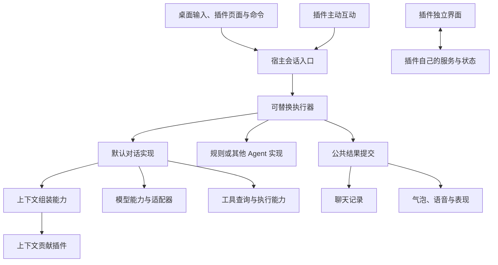

# 开放插件生态：能力组合、默认实现替换与界面扩展

本文依据 2026-09-13 的讨论和 Sakura `d24a3e73` 源码制定。状态为待实施；本文中的新接口名称、字段和页面行为均为设计建议，不代表当前版本已经支持。本次工作只形成方案。

目标是让第三方通过公开契约增加能力、参与现有处理、组合其他插件，并替换默认实现。判断是否达到目标，要看正常产品入口是否使用这些契约，以及两个新插件能否自行协作，无需给 Core 添加业务分支。

## 1. 对讨论的判断

采用最后一版讨论中的统一 Context、能力公开、事件与处理链分离、命名空间数据方向。撤回早期按 Cosplay 单独设计行为入口的思路。外观、语音、模型各自需要领域契约，但角色扮演、教学、翻译、游戏等用途不应各有一套 Core 接口。

还需要补齐四件事：

- 把默认聊天链真正接到可替换能力上；包括模型配置检查、工具调用和会话绑定，不能只改对象构造。
- 扩展点可以属于普通插件。Kernel 不维护所有扩展点，也不按“贡献、转换、筛选、替换”建设四套引擎。
- 独立页面、窗口和命令入口进入设计范围，覆盖有自身操作流程的插件。
- 定义流式结果、取消、历史提交和插件失效的先后关系，避免新功能绕开已有的数据与播放保护。

[DeepSeek Harness 官方架构](https://github.com/deepseek-ai/deepseek-harness/blob/master/docs/architecture.md)明确将模型适配器、工具注册表、会话日志、Agent Loop 作为插件，并要求能力同时具有接口定义、提供者和消费者。Sakura 借鉴这种可替换关系，采用自己的 Python 多进程与 Tauri 实现。其 Profile、Bundle、配置叠加、Remote stream 和持久事件体系不列为本次前置依赖。

## 2. 已核实的基础与缺口

| 范围 | 当前证据 | 对改造的影响 |
|---|---|---|
| 插件底座 | [Runtime v4](../../specs/runtime-v2/sakura-plugin-runtime-v4.md)已有具名 Service、独立进程、依赖根、JSON RPC、生命周期；普通 Service 不要求 Core 认识业务 | 继续复用，无须重建安装器或更换插件框架 |
| 默认执行链 | [assistant_adapter.py](../../../app/core_host/assistant_adapter.py)直接构造 `OpenAICompatibleClient → AgentRuntime → ChatPipeline` | 抽出模型与执行器契约，桌面真实聊天消费契约 |
| 初始化 | 同一 Adapter 要求 `provider_selection`；[core_config_reader.py](../../../app/config/core_config_reader.py)按现有 API 配置判断就绪 | 按选中执行器和模型提供者检查依赖；规则执行器不要求云端模型配置 |
| 应用绑定 | [plugin_application.py](../../../app/core_host/plugin_application.py)要求 Session 持有 `runtime`；[plugin_runtime_application.py](../../../app/core_host/plugin_runtime_application.py)直接调用 `set_context_providers`、`set_visual_binding` | 会话身份、表现绑定与具体 Agent 对象解开，避免替代执行器仍须伪装原来的类 |
| Context | [plugin_host_services.py](../../../app/core_host/plugin_host_services.py)的 `_context_fragment()` 与 [context_orchestrator.py](../../../app/agent/context_orchestrator.py)都会强制 `untrusted/required=False`；[提示词渲染](../../../app/llm/prompts/runtime.py)统一包成“事实非指令” | 修改入口、二次归一化、预算和最终渲染整条路径；只加一个字段不会生效 |
| 插件事件 | [SDK](../../../app/plugins/sakura_plugin_sdk.py)的 `PluginContext.emit()`只派发本进程监听器；[Runtime](../../../app/plugins/runtime_v4.py)与 [Runner](../../../app/plugins/plugin_runner_v4.py)的宿主广播限制 `sakura.host.*` | 增加跨进程发布路径，不能直接把现有本地 emit 宣称为跨插件广播 |
| 主动互动 | [AgentRuntime.handle_event()](../../../app/agent/runtime.py)限定三种事件；[RealChatBoundary](../../../app/core_host/real_chat.py)也有专门的更新事件校验 | 需要从公开提交入口一路接入执行器、历史和桌面播放，单独移除枚举不够 |
| 工具使用 | `_ToolsHostService`目前只导出 `register/unregister`，原 Agent 直接消费 Core 的工具注册表 | 给替代执行器补齐工具查询与受控执行入口，才能继续使用已安装工具和 MCP |
| 表现 | [表现规范](../../specs/runtime-v2/visual-plugin-boundary.md)已经允许插件自有资源、控制载荷、渲染器与编辑器；`bind_visual_character()`仍从个人设置选资源 | 保留表现协议，补查询、选择和临时控制入口 |
| 语音、记忆 | TTS 已有 Hub/Provider；Mem0 已是普通贡献插件，并通过 Timeline 整理内容 | 改进这些插件自己的协作契约，避免搬回 Core |
| 持久数据 | [timeline.py](../../../app/storage/timeline.py)对 human、assistant payload 使用精确字段校验；[Mem0](../../../plugins/builtin/sakura_mem0/plugin.py)也精确校验 `chat.completed`字段 | 扩展字段要通过写入、读取、投影全过程；优先随 Timeline 读取，避免破坏旧通知合同 |
| 普通插件界面 | [SDK 指南](../../devdocs/SAKURA_PLUGIN_SDK.md)与 [开发提示词](../../devdocs/SAKURA_PLUGIN_AI_PROMPT.md)主要开放结构化设置；自有前端限于表现和工坊区域 | 增加通用插件界面容器与桥接，复杂界面可以由插件实现 |

## 3. 目标结构与职责



宿主保留进程树、路由、配置与凭据存取、资源访问、窗口管理，以及会话身份、取消、提交和实际播放的所有权。默认推理策略、模型协议适配、上下文选择、记忆策略由对应能力实现拥有。

“宿主”按责任划分，不能等同于现有 `core_host/` 整个目录。Timeline 的提交规则与 UI 读取路径本期继续稳定；先通过公开读写边界隔离 SQLite，实现自定义存储后端需有实际消费者时再增加提供者接口。无需为了目录归属马上重写历史系统。

Service 继续保持一个 key 只有一个 active 提供者。多个上下文贡献、工具和模型适配器可以并存，由能力自己的登记机制组合；多个替代实现争用同一个公共 Service 时明确冲突。界面可以帮助用户显式切换，Runtime 不按优先级、安装顺序或健康状态决定赢家。

## 4. 统一 Context 与必要的处理入口

继续使用 `sakura.host.context.register()`。建议在同一贡献结果中增加内容用途与生效范围：

```json
{
  "id": "language-rule",
  "kind": "instruction",
  "content": "本轮以日语交流，先纠正明显语法错误，再继续回答。",
  "scope": "turn",
  "required": true
}
```

旧插件缺少字段时按目前的可选参考资料处理。来源身份由宿主绑定；插件声明用途，不能自行冒充宿主或其他插件。`instruction`表示用户启用的行为贡献，`data`表示参考资料；这与代码是否可信是不同问题。网页、OCR 和导入文档仍应作为资料进入模型。

默认组装器需要明确这些行为：

- 保留会话身份、公共回复协议及工具执行边界。行为贡献可以改变角色的说话方式和活动规则；默认人格中的可变风格与必须稳定的协议分别组装。
- 本轮开始固定启用集合、顺序和行为配置。动态检索资料可以按 step 更新，不能把一次回复的行为配置更新成前后两套。
- 注册描述中声明贡献是否必需，以及失败时中止还是跳过。否则贡献回调直接失败时，宿主无从知道它原本打算返回 `required=true`。
- 必需规则不被当作可选资料截断。预算不够或必需贡献失败时明确终止这次互动；可选资料允许丢弃并记录原因。
- 排序稳定且可检查。规则的语义冲突无法靠数字顺序自动解决；用户可停用冲突插件，互斥活动可由活动插件自身管理。

输入和输出转换由默认对话能力提供扩展点，以“目标 Service＋导出方法＋顺序＋配置”登记。先实现输入受理后、外发请求前、公共回复提交前这几个有消费者的位置；工具执行前后与记忆候选筛选由各自能力拥有者提供。

处理器返回新结果，不原地修改宿主对象。必须完成才能继续的处理采用显式调用；通知事件不参与结果裁决。内容脱敏失败应阻止外发，不能跳过处理后继续发送原文。若声明的是“禁止落盘”，处理位置也必须在写入之前；单纯外发脱敏不承诺清除本地记录。

输出转换在进入历史、气泡和 TTS 之前完成。如果以后支持边生成边展示，须明确处理器需要整段还是可以处理增量；需要整段转换时先缓冲，不能先播出原文再修改最终历史。显示文字、朗读文字和翻译允许有明确分工，但不能在不同入口各改一次。

实际体验：安装语言练习、翻译、写作风格插件后，启用的规则能进入正式对话链；需要严格遵守的规则失败时会显示具体原因。模型是否完全遵从自然语言规则仍取决于所用模型；需要确定行为时由转换器或规则执行器完成。

## 5. 跨插件事件与通用会话提交

这两条路径分别实现。

**事件路径**用于通知已经发生的事实。建议保留已有 `emit()`的本地语义，新增跨进程 `publish()`，并为订阅增加路由登记；Runner 内部派发使用单独函数，避免收到广播后再次发布形成回环。

插件发布自己的命名空间事件，Runtime 添加真实插件身份与进程作用域；`sakura.host.*`继续由宿主发布。第一版采用有界内存通知，不提供持久重放、自动重试或业务去重。慢订阅者不能阻塞发布者、取消和退出；队列溢出及消费失败进入既有诊断。单个订阅者的投递顺序有定义，不承诺不同插件处理完成的全局顺序。

需要可靠完成的操作走 Service 调用；需要重启后继续读取的事实写入所属存储。下载进度事件不会自动触发模型。

**会话提交路径**建议新增 `sakura.host.conversation`，对外提供 `submit/status/cancel`。桌面输入、插件页面、主动事件和移动端通过同一个会话边界受理，各入口保留真实来源与显示目标。旧 Mobile Service 暂作薄适配，不能因此改变它原有的远端回复与桌面播放行为。

提交参数表达本次输入、附件引用、目标会话、扩展数据和输出目标。主动事件进入 system/事件记录，不伪装成 human 消息；事件内容也不自动升级为行为指令。需要怎样回复，由执行器和已启用贡献决定。

沿用单轮活动交互限制：返回已受理和 operation ID，或明确的忙碌、会话不可用结果。宿主绑定调用者身份；插件只能查询或取消自己提交的操作，用户的全局取消仍由宿主掌握。任务以成功、失败或取消之一结束；取消后迟到结果不能写成成功或启动播放。

实际体验：番茄钟结束时，插件可以让角色通过日常气泡和语音提醒；用户按现有停止按钮即可中止。插件也可以只更新自己的面板，不让角色开口。

## 6. 模型调用与会话执行真正可替换

### 模型能力

采用与 TTS 相近的组合方式：默认模型路由能力对接多个适配器 Service，每个适配器负责自己的协议、依赖和配置。模型选择保存提供者与模型引用，调用方消费公共模型合同；不再要求每一种模型都能转换成 API 地址、API Key 和模型名。

建议合同包括能力说明、模型列表、就绪检查、`begin/poll/cancel`。请求和结果用有界 JSON；图片、音频等大内容使用现有资源描述符。耗时工作在提供者进程后台执行，`begin`快速受理，`poll`返回有序批次与游标，终态明确。普通 RPC 不传生成器，也不逐 token 发一条 RPC。

连接测试、模型列表和实际聊天要消费同一提供者合同；核对其他模型消费者，避免设置页测试的是默认客户端，实际回复却使用另一条路径。执行器调用工具时也要验证跨进程往返：后台执行不能占住 Runner 的控制入口，宿主不能持有生命周期锁等待插件回调，使取消和退出仍可响应。

公共数据表达消息、工具调用及关联 ID、可用的多模态内容、用量和错误。特定模型的参数放到提供者命名空间。提供者如不支持工具或图片，在开始请求前报告不支持；保留纯文字可用场景，不猜测能力、不偷偷降级。

`model_slots`继续负责模型选择与凭据复用，但扩展为可解析提供者引用。原有 HTTP 配置由默认适配器读取，旧用户不必重新输入配置。本地模型按自己的依赖与资源检查就绪。

现有客户端先封装到契约后面，真实聊天改为消费契约；待跨进程链路验证通过，再迁入默认插件。最终默认适配器遵守和第三方相同的 SDK 边界，不能留在插件中继续导入 `app.*`。

实际体验：可以为正常聊天选择本地模型插件，同时保留原来的模型服务配置。新增厂商协议由适配器实现。离线与否、所需下载和硬件支持取决于具体插件；本次底座改造本身不承诺所有模型都能本地运行。

### 执行器能力

建议使用一个可替换的会话执行 Service。宿主提交输入，执行器提供就绪状态和 `begin/poll/cancel`，返回统一的文字片段、附件引用、表现控制及命名空间结果。

默认执行器拥有 Agent 步骤、工具选择、上下文调用和模型请求策略；替代执行器可以实现状态机、游戏规则或其他 Agent 策略。它可以不调用模型，也可以使用自己的工具与上下文组织方式。所有执行器复用宿主的取消、历史提交和输出路径。

为避免替换只停留在类型声明，还要同步完成：

1. `AssistantSession`保留角色和会话身份，持有执行器绑定，不要求具体 `provider/runtime/pipeline`对象。
2. `RealChatBoundary`通过公共请求和结果调用执行器，去掉读取原 Agent 私有状态和固定 action 白名单的依赖。公共状态仍验证；插件业务动作通过公开服务执行或返回自己的界面数据，不把任意 action 交给宿主解释。
3. 现有 Tools Host 增加面向活动 operation 的查询与受控执行入口，沿用取消、期限和结果处理；默认 Agent 移出 Core 后仍能使用插件工具和 MCP。
4. 现有 Context 注册入口保留为贡献接入与生命周期适配，并提供面向活动 operation 的片段收集入口。旧 callback 仍由 Host 调用，向新的上下文组装能力返回 JSON 片段；选择、预算和渲染由组装能力负责。新插件之间的扩展登记使用 Service 描述，不把旧 callback handle 转交给另一个插件。
5. 现有 `bind_runtime()`改为会话信息与能力绑定；表现控制描述、工具目录、上下文状态通过公开数据提供，去掉 `set_context_providers`之类对具体 Runtime 的设置调用。
6. 将模型检查移到实际需要模型的执行器/适配器。独立插件页面也不以 Assistant 成功初始化为前置条件。

执行器切换先在空闲边界应用；有在途回复时显示下轮生效，或由用户取消后切换。第一版一个会话使用一个选中执行器，不建设多执行器竞争与自动路由调度。用户选择新提供者后发生的启停有明确结果，失败时保留选择与原因，不在后台改回默认实现。

实际体验：用户选择“普通对话”时保持现有使用方式；选择规则游戏时，可以没有 API Key 也能互动。关闭模型提供者不会导致日历或其他独立插件界面一起失效。

## 7. 已有表现与语音能力的共享操作

把角色设置中已经存在的形态查询、候选验证和绑定操作整理到表现能力的公开入口。设置页、内置功能和插件使用同一条应用路径。

选择分为用户保存的基础值和插件临时请求。临时请求绑定插件进程与会话，由能力拥有者保管；释放时移除请求并读取当前基础值。插件不保存一个旧配置再在退出时写回，这会覆盖用户期间的新选择。

第一版允许一个有效临时控制者；多个插件争用时报告冲突。用户手动选择可撤销临时控制，旧 token 随即失效。已有候选就绪后切换、旧绑定控制失效的机制继续复用。

TTS 的临时声线选择放到 Hub/Provider 合同，Core 只转交已确认的语音选择。历史归属、表现资源来源、语音资源来源分别表达；同一份外观或声线被借用时，不改变当前角色的历史归属。跨角色引用复用已安装角色包和资源 ID；资源是否兼容由提供者校验，不复制隐藏角色包，不要求不同语音引擎互相解释私有模型。

每次回复绑定具体语音选择。配置更新在下一轮生效；停用提供者时终止受影响任务。表现控制继续在实际播放或静音段展示时执行，历史浏览不执行控制。

实际体验：场景、节日主题、教学或游戏插件可以组合已安装外观与语音；停用临时模式后使用用户当前选择，聊天仍留在原角色名下。

## 8. 扩展数据、历史与记忆协作

在会话请求与对应 Timeline payload 中增加可选 `extensions`字典，按插件身份分命名空间。宿主保持 operation、turn、entry、character 等公共身份的所有权，插件只能写自己的扩展数据。

扩展对象需要通过 JSON、尺寸和结构检查，总记录继续受现有 256 KiB 限制。未知命名空间可以保存、读取和传递，宿主不解释其业务，不把它们整体注入 Prompt。长期事实记录与只在当前请求有效的数据要明确区分，临时凭据和资源使用权不能随历史固化。

实现须覆盖 `submit → 执行器 → 结果转换 → Timeline 写入 → read_recent/read_since → 历史投影/记忆消费`。更新精确字段校验；旧记录缺少扩展时等价于空字典。现有 `chat.completed`通知保留其三字段合同，消费者通过 cursor 读取持久数据，避免给旧 Mem0 塞入它会拒绝的新通知字段。

记忆插件拥有学习策略。以 Mem0 为首个实际消费者，开放候选筛选登记，输入包含回合与扩展元数据；其他插件通过 Service 描述提供筛选，不增加 Core 的“扮演、教学、测试”枚举。存在必要筛选器而它不可用时暂停该轮自动学习，不能在重启后因为筛选插件没启动就把记录当成普通事实。

插件停用与长期记忆删除是不同操作。关闭活动模式只影响后续互动，不自动删除已提取内容。旧插件不会自动理解新增标记；只有实现该协作合同的记忆插件才承诺对应效果。

实际体验：游戏剧情、练习句子保留在聊天记录里，同时可由已适配的记忆策略排除出长期事实。重启后整理历史仍使用当时回合的标记，不读取“插件现在开着没有”来猜测。

## 9. 插件拥有自己的界面与命令

保留声明式设置，新增通用界面挂载合同。首版选择一种宿主管理的独立插件窗口，复用现有 WebView、主题、资源加载和销毁设施；容器稳定后再按真实需求扩展到侧栏或其他位置。

建议插件声明 `viewId/title/entry/serviceKey`等描述。前端模块来自已安装插件目录，提供 `mount({container, host, signal})`与清理结果；具体字段在实现时与现有表现/编辑器接口对齐。插件承担界面内容与交互，宿主承担窗口和桥接。

页面通过绑定插件身份的窄桥调用已导出的 Service。跨插件协作仍走 Service 路由；模块不能借 UI 桥拿到任意 Tauri 命令、其他插件凭据或宿主私有对象。脚本来自插件代码，文档与角色包只作为资料；这些是现有可信本地插件模型下的宿主边界，不宣称为恶意插件沙箱。

窗口打开、关闭、重复打开、插件停用、进程重载、Core generation 变化都需要明确生命周期。关闭界面只销毁视图，不默认停止插件的后台任务；停用插件才结束它拥有的工作。资源 URL 和迟到界面请求随原绑定失效。

增加一个通用插件命令登记入口，让“打开面板”等操作可从插件详情和现有菜单触达；复杂页面内按钮可以直接调用插件自己的服务。后续需要全局快捷键时复用同一命令描述并处理冲突，不为每种插件新增主程序按钮。

模型提供者和执行器选择显示在实际使用它们的设置位置。只有状态改变或需要决定时才显示“下轮生效”“需要配置”“由某插件控制”等信息，服务 key、RPC、进程 scope 留在开发文档和诊断详情。

实际体验：日历有日历网格，游戏有棋盘或选项面板，工作流有自己的操作区。插件页面可以调用角色互动，也可以只完成自身工作，无需把所有操作挤进设置表单。

## 10. 插件自定义扩展点及生命周期

例如剧情引擎提供 `example.story`服务，战斗插件登记 `{serviceKey, method, config}`，剧情引擎按自己的规则调用，界面插件读取剧情状态。Core 不增加剧情或战斗接口。

登记者返回 registration ID，正常退出通过 `effect()`注销。异常退出不能依赖插件执行 cleanup：登记所属身份和进程有效期由宿主可验证的作用域标识关联。已有 `service_identity()`仅供 Host 使用，实施时需把必要的绑定/有效性检查以窄合同提供给普通 Service 消费者。

登记后不能按相同插件 ID 自动接到重载后的新进程。调用前后核对登记目标的作用域；旧 scope 的结果一律失效。生命周期通知可用于及时清缓存，正确性还要依赖绑定验证，不能只依赖可能丢失的普通业务事件。

登记收集、稳定排序和幂等撤销可提取小型 SDK 工具。Kernel 仍只理解服务和生命周期；筛选失败后怎么办、如何合并规则等由能力拥有者定义。不要引入通用远端 Python 对象、CallbackRef、中央 Slot Registry 或后台自动恢复平台。

## 11. 实施顺序与每阶段交付

| 阶段 | 改动范围 | 可以直接体验到的结果 | 完成条件 |
|---|---|---|---|
| A：统一贡献与数据 | Context 全链路、默认输入/输出处理入口、回合扩展存取、Mem0 首个筛选消费者 | 语言练习等模式正式生效；练习内容可以保留历史而排除自动学习 | 正常聊天实际消费；关闭模式与重启读取均通过验证 |
| B：公开互动与组合 | 事件发布、通用会话提交、表现共享操作、TTS 临时选择、进程作用域登记 | 番茄钟会通过角色提醒；活动插件可以组合现有形态和声线 | 正常结束、忙碌、取消、停用、崩溃均有明确结果；无业务专用 Core 分支 |
| C：模型替换 | 模型合同、默认适配器、模型槽位和就绪检查 | 同一聊天入口可以选择本地适配器或原 API 服务 | 两种不同接入方式走真实消费者；不支持能力时明确报错；旧配置保持可用 |
| D：执行器替换 | Session、RealChatBoundary、工具消费与 Context 组装边界、默认执行器插件化 | 不调用模型的互动可使用现有输入、取消、气泡和历史 | 无模型配置也能运行规则执行器；替换后仍能调用安装的工具；默认实现无需私有导入 |
| E：通用界面 | 插件窗口、Service 桥、命令入口、前端包安装校验、诊断与 SDK 示例 | 日历、游戏和控制台可以提供自己的完整操作页面 | 与 Assistant 就绪解耦；真实桌面打开、关闭、重载、停用与资源回收通过验证 |

每阶段可以拆成若干小改动，但至少交付一条正常产品入口的完整链路。接口定义、默认提供者、实际消费者、兼容处理与验证属于同一交付范围，不先堆出一批没有消费者的接口。

阶段 E 的容器原型可以在 B 后开始验证，正式接入依赖已稳定的服务桥与生命周期。C、D 是主要架构成本；不要把它们作为遥远的可选项，否则目标仍会停在扩展默认聊天行为。

不在方案阶段给出精确工期。C 的跨进程模型切片和 E 的原生容器验证完成后，才能根据实际缺口估算工作量。本次交付是计划，五阶段的产品能力均未据此标为实现。

## 12. 验证方式

| 场景 | 主要证据 |
|---|---|
| 行为规则与资料共存 | 捕获正常模型请求，规则进入指令区域，检索资料保持数据语义；旧贡献行为一致 |
| 必需处理失败 | 注入回调失败和预算不足，确认未发送未处理的输入，错误能归因到实际插件 |
| 跨进程协作 | 两个独立插件进程发布/消费自定义事件、调用未知业务 Service；用接收通知建立时序 |
| 主动互动 | 插件提交正常请求，验证来源、忙碌、停止、唯一终态、历史和桌面输出 |
| 停用与同 ID 重载 | 在操作中暂停提供者，重载后释放旧结果，确认旧登记、旧资源和旧结果不被新实例使用 |
| 手动选择覆盖临时控制 | 插件申请临时表现后用户更改选择，再释放旧请求，确认最终仍是用户的新选择 |
| 本地模型与替代执行器 | 安装独立测试提供者，经正常设置和聊天入口使用；规则执行器在没有模型配置时工作 |
| 历史与记忆 | 写入有标记回合、重启、读取并整理；标记仍在，筛选缺失不会默默学习；旧记录可读 |
| 独立插件窗口 | 在 Assistant 未就绪时打开；反复开关、插件重载、停用后资源与请求失效，其他页面可用 |

使用多个差异明显的小型样例：语言练习、番茄钟、模型适配器、规则小游戏、独立日历，以及两个第三方插件自行约定服务的组合。Cosplay 可作为额外真实适配案例，不作为唯一验收样例，也不假定其旧版私有补丁会自动兼容。

自动回归在隔离数据上运行。异步测试使用事件、屏障或任务完成通知控制时序。每个风险优先选择一个最接近真实链路的证据层；跨 Python/Rust/WebView 的部分再覆盖相应边界。

相关入口以 `runtime/python.exe -m harness list`为准，可复用 `journey-plugins`、`journey-visuals`、`journey-tts`及对应窄测试。实施时补充模型/执行器实际替换场景，不为一次改动叠加全部 profile。原生窗口和设备行为单独记录，浏览器夹具不能代替原生验证。

## 13. 兼容、回退与文档更新

- 沿用 API v4；对可选字段采用旧值默认语义。新增接口要求在包兼容说明与安装/启用诊断中可检查，不能在旧宿主上忽略字段后显示成功。不引入通用 Service 版本协商。
- 原有模型配置、TTS 配置与角色资源由默认提供者继续解释。新的模型引用读取旧配置时采用显式映射，不要求用户重新配置全部插件。
- Timeline 扩展优先采用可选字段，不批量重写旧聊天记录。回退默认插件可以恢复功能选择；任意旧版二进制能否读取新记录需验证后声明，不能直接承诺安全降级。确需升级存储格式时另行确定迁移与回退合同。
- 默认实现迁移前先让新边界承载原行为，验证成功再迁移归属。阶段完成后删除失效直连，避免同时维护两条完整执行链。
- 修改当前长期行为时，同步更新 Plugin Runtime、Timeline/Context、模型设置、表现和语音 Spec，更新 SDK、插件开发提示词与用户使用文档。默认策略迁出 Core、通用插件界面与边界取舍需记录新 ADR，并说明与 ADR-0037、ADR-0033 的关系。
- 本文只提出计划，不把未实现行为写入当前规范；实施顺序用于说明依赖，不是开发权限或审批门槛。

## 14. 用户预期与边界

普通用户继续使用预装默认组合。新增插件时，主要操作是安装、启用，并在需要替代实现时选择提供者；复杂插件能打开自己的页面。插件问题应显示到具体提供者，能够明确停用或重新加载。

生态底座不会自动生成这些业务插件，也不会保证旧插件的私有修改可直接使用。体验需要底座和实际消费者共同交付。架构开放也不会自动让回复更快或更聪明；跨进程调用有成本，应按批次、实际任务和界面需求控制。

以后新增教学规则、游戏逻辑、记忆策略、模型协议或插件间组合，通常只需修改插件。新的原生窗口能力、尚未开放的设备功能，或现有公共协议无法表达的数据种类，仍可能需要扩展宿主。每次这样的变更应能说明新增的通用能力及消费者，而不以某个业务插件名称增加 Core 分支。

## 15. 本次方案核对

已阅读关联任务“评估插件形态接口适配”及用户粘贴的讨论，对照上述源码和当前规范；外部参考为 DeepSeek Harness 官方 README 与架构文档。当前工作树基于 `d24a3e73`，未修改产品代码，未运行或宣称通过这些规划能力的产品验收。
