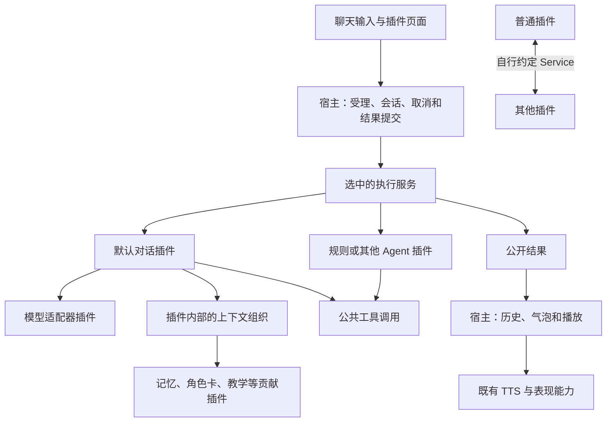

# 开放插件生态总计划：薄宿主与可替换的默认能力

本计划依据 2026-09-14 的方向讨论修订，代码基线为 `d2118925`。它替代本文件原先 A–E 的推进顺序：
下一条主线是打通可替换的执行入口，再迁出默认模型和对话策略。Context 初版已经提交，但其中的用途分类与本次方向不符，列为待修正；本文没有把这些修正表述为已实现。

目标是让 Sakura 由一个简单、开放的宿主和一组可组合、可替换的默认插件组成。用户沿用现成的默认组合即可使用；
开发者可以添加能力，也可以更换实现。新增业务主要发生在插件里，宿主不需要不断增加对应概念。

默认产品形态继续是使用受限工具集的桌面 Assistant。未来用户可以安装并选用 Agent 插件，增加命令执行等高级能力；
这项需求用于检查公共边界是否足够，本轮及下一轮基础改造不实现该 Agent，也不默认提高 Assistant 的能力范围。

简单插件和复杂插件使用同一个框架。复杂 Agent 可以拥有自己的任务系统、工具执行、授权策略和完整界面，
主程序不需要认识这些内部结构。默认 Assistant 也是一组默认实现；宿主不能因插件复杂而扩张成业务平台。

## 1. 方向与判断标准

记忆、TTS 和表现形式的拆分已经在朝这个目标前进。后续沿用这些成果，扩大真实消费者所使用的公共边界，
而不是重新建立一套插件框架。架构基础继续遵循 [ADR-0037](../../adr/0037-replaceable-default-plugins-and-isolated-python-runtimes.md)。

“简单”指宿主承担的业务判断少。上下文怎么写、记忆怎么选、工具何时调用、模型怎样推理，都可以由插件实现。
进程隔离、取消、资源回收和用户数据保护仍有实际作用，不能通过删掉这些机制来减少代码量。

未来某个插件需要复杂功能时，先由该插件或它依赖的其他插件实现。只有现有公共边界无法提供必要的运行、通信、
资源或界面接入时，才扩充宿主对应的基础机制。插件可以内部拆模块、调用多个服务或管理子进程，不要求每个内部模块
都变成宿主认识的新能力类别。独立功能也不必接入聊天或模型。

每项改动都回答：

- 谁会调用这项能力，已有调用者为何不能通过当前接口完成？
- 宿主新增的是连接与运行机制，还是替插件解释业务？
- 默认实现和第三方能否使用相同接口？更换后，正常产品入口是否真正调用新实现？
- 停用目标插件时，无关功能是否继续运行？用户已有数据是否保持可读？

Cosplay 只作为一个例子。当前角色信息和插件补充的“请以当前角色身份扮演另一个角色”可以同时存在。
文本关系由插件组织或由模型理解；宿主不检查角色卡冲突，不自动关闭默认角色信息，也不建立专用扮演入口。

## 2. 当前基础与真正的缺口

| 范围 | 当前已经具备 | 后续需要解决 |
|---|---|---|
| 插件运行 | API v4、独立进程与依赖根、具名 Service、配置、资源和生命周期 | 复用底座；仅为真实消费者补齐必要的公开调用与绑定 |
| Memory | Mem0 自己拥有存储、检索、整理、Context、工具与管理页贡献；普通聊天不直接调用 Mem0 数据库 | 用不同实现验证替换；按实际需求补记忆服务、数据导入导出及管理界面 |
| TTS | Core 消费公共 `sakura.tts`；Hub 可替换，Provider 以公开合同接入不同引擎 | 完善资源、声线和跨插件操作；核实重载中的旧任务隔离，不让通用 Runtime 理解引擎 |
| 表现形式 | 插件自有资源类型、renderer、editor、控制描述和解析，支持选择实现 | 开放现有能力的查询与操作；多表面或叠加渲染由实际消费者推动 |
| Context 初版 | 内容贡献能进入真实模型请求；支持来源、失败处理和活动互动内复用 | 删除宿主内容分类；组织、预算和复用策略归默认对话实现 |
| 默认聊天 | 现有模型客户端、Agent 和聊天管线可用 | 正常入口仍依赖具体类；需要变为选中的执行服务 |
| 工具与权限 | 有工具发现、可见性过滤、调用来源及进程隔离 | 默认 Assistant 的工具选择需要与新增 Agent 能力分开；授权设计由未来实际消费者推动，进程隔离不等于 OS 权限隔离 |
| 插件界面 | 结构化设置、Collection、表现渲染器与工坊编辑器已有接入 | 普通插件仍缺完整的独立页面/窗口与命令入口 |

Memory 不必统一成唯一的 `sakura.memory`：多个插件可以分别贡献检索、工具和 Timeline 消费。
TTS 的“Hub＋Provider”适合多引擎选择；表现使用资源与渲染器。保留这些领域差异，不把所有能力套成一种注册框架。

替换记忆实现也不等于自动转换它的数据库。新插件可以使用自己的存储；需要继承旧记忆时，提供明确的导出和导入。
既有旧版本导入器的格式适配属于数据兼容，不能因整理正常运行链而直接删除。

## 3. 宿主、默认插件与其他插件的职责

| 责任 | 归属 |
|---|---|
| 发现、安装、启停、服务路由、调用身份、进程与依赖隔离 | 插件运行底座 |
| 配置与凭据的受控访问、资源引用、基础界面容器、日志传输 | 宿主公共服务 |
| 当前会话和操作身份、输入受理、忙碌、取消、结果提交、实际播放授权 | 应用边界 |
| 调用者身份、绑定有效期与宿主管理资源的访问检查 | 公共调用边界；工具选择与业务授权策略归消费插件或能力提供者 |
| Agent 循环、上下文组合与预算、工具选择、提示词和模型回复解析 | 默认对话插件或替代执行器 |
| 模型协议、能力说明、模型列表、推理请求及其依赖 | 模型适配器 |
| 记忆结构、整理、检索、学习进度和业务筛选 | 对应记忆插件 |
| 合成、声线与模型资源；外观资源、控制含义、编辑和渲染 | 对应 TTS/表现能力 |
| 教学、角色扮演、游戏、日历等业务内容和协作规则 | 业务插件 |

“Python Core 进程”是部署位置，不等于其中所有代码都应该永久由宿主拥有。迁移阶段允许当前管线先包装在公共契约后面；
只有默认实现迁出并清理私有直连后，才算完成该能力的插件化。

Timeline 写入、历史读取和输出链当前保留在应用边界，供多个执行器共用。先让这些接口支持实际替换；
暂不建设可替换数据库后端或另一套历史存储。公开结果格式表达宿主实际能显示和提交的内容；
要求模型输出何种提示词格式、怎样解析成公开结果，属于执行器。

目标关系如下，其中模型是执行器按需使用的能力：

插件底座只理解服务和生命周期。应用中的播放器、编辑器等消费者可以理解稳定的 TTS、资源或渲染合同，
不需要把这些合同也收进通用 Runtime。官方插件只有预装和分发便利，运行时不获得第三方没有的私有接口。

文中“Agent 循环”也指现有代码内部的执行机制，不代表默认产品已经具备未来高级 Agent 的能力或权限。

## 4. Context 初版如何修正

目标接口只表达插件提供的内容，不要求插件把角色卡、资料和行为要求分成不同类别。
插件可以返回一段文本，也可以返回少量片段；插件自行决定内容、组织方式和需要调用的其他服务。

下一步修正范围：

1. 移除 `instruction/data` 用途分类、由此派生的信任等级、规则/事实分区和按用途决定的预算分支。
   不把统一内容改成“全部是事实”或“全部是最高优先级指令”；默认对话实现按自己的方式组织模型消息。
2. 来源、Provider 身份、跨进程大小边界、取消与登记有效期保留。它们定位和约束调用，不解释内容含义。
3. 已有 `scope/order/required/failurePolicy` 暂作为默认对话能力的消费约定保留，避免这一步顺便重写所有行为。
   其执行代码随默认对话迁出；其他执行器不必使用同一套排序、预算、缓存或错误策略。
4. 沿用旧可选内容的预算行为；要求完整内容时仍可声明 `required`，默认执行器放不下就明确失败。
   预算数值和裁剪方式属于默认实现，不成为所有插件必须接受的宿主政策。
5. 示例从“行为规则＋参考资料”改为一个上下文输入框，保留既有插件 ID 和用户配置。
   旧两个字段通过确定顺序合并为初始内容，不丢弃用户文本，也不要求重新安装。
6. 同步 SDK、能力说明、Spec、相关测试和 ADR；检查模型兼容降级与 Trace，避免残留用途判断。
   已提供的能力查询要反映实际语义，依赖旧分类的开发版插件应收到明确的不兼容结果，不能继续宣称支持它。

单次 IPC 的大小限制属于传输保护，超过时明确报错；一个模型窗口里选多少记忆、哪些片段值得保留则属于对话策略。
两者分别说明，不能把插件内容静默截掉后当作成功传输。

本计划不增加“角色提供者切换”、角色冲突检测或必装的上下文管理插件。默认角色信息可以继续与额外上下文一起使用。
默认对话插件内部先保留自己的 Context 模块；有第二个真正需要复用的消费者后，再决定是否独立提供组装服务。

## 5. 下一条主线：让真实执行入口可替换

下一项主要里程碑是：没有模型配置、默认对话实现未被选用时，一个独立插件仍能通过原输入框完成正常互动。
它同时验证设置、初始化、受理、取消、历史和输出，不能用直接调用插件方法代替。

当前需要沿链路整理的固定点：

| 位置 | 当前依赖 | 改动方向 |
|---|---|---|
| [assistant_adapter.py](../../../app/core_host/assistant_adapter.py) | Session 持有具体 provider/runtime/pipeline，初始化直接创建三者 | Session 保留身份与选中执行器的绑定；默认管线先由适配器承接 |
| [core_config_reader.py](../../../app/config/core_config_reader.py)、[server.py](../../../app/core_host/server.py) | 初始化及热更新把模型配置作为整个 Session 的前提 | 由选中的执行器声明和检查所需依赖，模型无效不关闭无模型执行器 |
| [real_chat.py](../../../app/core_host/real_chat.py) | 直接运行 pipeline，读取固定 Agent action 与 Trace 状态 | 只消费公开请求、进度和结果；执行器内部动作不交宿主解释 |
| [plugin_application.py](../../../app/core_host/plugin_application.py)、[plugin_runtime_application.py](../../../app/core_host/plugin_runtime_application.py) | 按 runtime 对象绑定 Context、表现和会话 | 按会话身份及公共能力绑定，不要求第三方伪装 AgentRuntime |
| [plugin_host_services.py](../../../app/core_host/plugin_host_services.py) | 工具和 Context 主要只开放登记 | 随真实消费者迁移，补当前操作内的工具查询/执行和原始贡献收集 |

第一版执行合同只覆盖就绪、受理、读取进度/结果和取消。采用已有跨进程服务机制，长任务快速受理并后台执行，
结果通过有界批次读取；不跨进程传 Python 对象、生成器或任意动作对象。具体方法和字段随第一条实现链冻结。

宿主拥有 operation、会话与提交资格；执行器拥有内部步骤和任务。取消或插件退出后，迟到结果不能提交成功或启动播放。
切换执行器在空闲边界应用，在途操作保持原绑定或由用户取消；出错明确显示，不自动改回默认实现。
已有单轮忙碌限制继续复用，不把这个节点扩张为任务排队和恢复平台。

候选执行器按实际服务引用选择，沿用一个服务 key 只有一个活动提供者的规则。
新增的候选登记只服务于真实设置和调用入口，不建立中央 Slot Registry，也不为所有未来能力统一设计选择器。

### 5.1 默认 Assistant 与未来可选 Agent

未来 Agent 可以作为另一种执行器，自己提供规划、多步执行、命令工具和任务状态；简单的工具扩展也可以单独提供。
执行器选择与插件自己消费哪些工具分别表达。宿主不按插件名称或 `isAgent` 分支开放特权，不要求所有执行器实现同一种规划循环。

面向用户的预期流程是：日常使用默认 Assistant；安装 Agent 后，用户选择它并明确使用相应能力；任务结束后可切回 Assistant。
同一角色可以复用已有历史、外观和语音。安装、启用或公开一个 Service，本身不等于把其全部方法暴露成默认 Assistant 的模型工具。

当前基础改造只保证这条路径有可接入的位置：

- M2 绑定实际执行器及其进程，允许有界进度、结果与取消。宿主无需知道任务是在聊天、执行命令还是计算。
  M4 让各执行器查询并调用所需工具，默认 Assistant 按自身配置选择；不能因为使用全局 `plugin/mcp` 分组就把
  新增命令工具自动提供给它。Agent 私有工具可留在插件内部，确有共享需求时再公开服务。
- Agent 负责规划、任务状态、命令、工具选择和业务授权，可以自己实现，也可以依赖配套插件。
  若某项操作需要授权检查，由该能力的真实执行入口落实；不能只靠 Prompt、界面隐藏或自报 `risk` 获得保证。
  宿主提供真实调用身份、有效绑定和所管理资源的必要检查，不预建针对所有服务、任务与插件的权限策略引擎。
- 通用调用传递取消，插件负责停止实际工作与回收自建子进程，运行底座负责停用时的进程树回收。
  详细输出和生成文件通过结果或资源引用交付，哪些摘要进入气泡和 TTS 由执行器决定。
  取消不自动回滚已发生的外部效果，关闭界面也不自动等同于停止任务。

M2 先以无副作用的独立执行器验证选择、进度和取消；M4 以无副作用工具证明两个执行器可以选择不同工具，
新增插件不自动扩张默认 Assistant 的工具列表。完整的高级操作授权与撤销，不列为 M2/M4 的提前建设任务。
未来 Agent 开发时再确定其授权方式、任务持久化、恢复和界面；需要公共机制时，以实际消费者为依据，遵循
[ADR-0031](../../adr/0031-retire-runtime-v2-tool-confirmation.md) 对未来权限消费者重新设计的要求。

### 5.2 产品工具范围与系统权限

当前插件是可信本地代码，运行在当前用户的系统权限下，可以自行使用 Python、文件与子进程。
[SDK](../../devdocs/SAKURA_PLUGIN_SDK.md) 中的 `permissions` 只是遗留元数据；依赖隔离和禁止导入 `app.*` 不构成 OS 沙箱。
因此，工具选择说明 Assistant 使用哪些能力，不能声称会阻止任意本地插件直接访问系统；
operation 身份也不自动构成操作授权。需要保护的操作仍由实际能力入口定义并落实其访问规则。

目前“默认 Assistant 权限较低”按产品可调用工具范围理解。执行命令通常也可在普通用户权限下完成；
不通过让整个 Sakura 以管理员身份运行来实现升级。如果未来要求系统层面强制限制文件、网络或进程访问，
需在 Agent 落地时明确采用的 OS 隔离或独立受控执行环境，并在相应平台验证。本轮不选择或搭建这套环境。

## 6. 默认模型和对话策略如何迁出

执行入口接通后，按两条完整链路推进。

**模型能力。** 现有 HTTP 客户端先置于公开模型合同后，再迁为默认适配器插件。正常聊天、模型列表、连接测试及就绪检查
都消费同一提供者。现有 API 地址、Key 和模型选择继续由默认适配器解释，不要求用户重填。

用协议不同的第二实现验证边界，不能只换一个 OpenAI-compatible 地址。请求需表达实际消费者使用的文本、图片、工具、
用量和错误；大资源沿用引用。提供者不支持图片或工具时明确报告，普通文字可用性单独判断。精确字段由真实样例驱动，
不提前完整复制所有模型厂商的参数。核对记忆整理、观察分析等其他模型调用者，避免默认客户端直连长期残留。

**默认对话能力。** Agent 循环、提示词、模型回复解析、上下文收集与预算、工具选择迁成同一个默认对话插件的内部模块。
先保持可理解的一个实现，不把每个类都拆成独立进程。多个插件有复用需求时才拆分内部模块的公开服务。

默认执行器通过公开入口调用既有插件工具和 MCP；通过宿主现有登记桥获取原始 Context 贡献及其真实来源。
旧 callback 仍由原 Host 桥调用，不把 callback handle 转交给其他插件。迁移必须验证
“执行器插件 → 模型插件 → 工具入口 → 工具插件”整条调用、取消和退出，不能持有生命周期锁等待业务回调。

最终删除 Session 私有对象依赖、具体客户端热更新和隐式备用 Agent。默认插件只能依赖公共 SDK/Service、
自己的模块和私有依赖；在独立安装目录运行，不能通过重新导出 `app.*` 伪装完成迁移。
Trace 继续覆盖真实请求，日志与诊断不因默认实现迁出而失去来源，也不为插件引入第二套跟踪存储。

## 7. 现有能力怎样继续开放

这些工作与主线配合，用真实消费者决定先后，不作为默认执行器拆分的全部前置条件。

- **Memory：**先做一个不依赖 Mem0 或 embedding 的显式事实记忆样例，验证关闭 Mem0 后的召回、工具和管理。
  需要跨插件搜索、写入或筛选时，由记忆提供者公开服务；格式、学习规则和进度由它拥有。
  现有管理页若限制不同记忆形态，应改为插件可提供的展示或通用界面，不强制所有插件适配 Mem0 层次。
- **TTS：**沿用现有 Hub/Provider 和播放边界。声线查询、选择和资源适配由 TTS 能力完成；
  核实 Provider 重载与在途 job 的进程绑定；工作室的厂商资源适配随资源消费者逐项开放。
- **表现：**复用现有 renderer/editor 及进程绑定，开放已有资源的查询、选择和操作。
  是否需要多表面、叠加或组合渲染，以第二种实际场景判断，不在本计划先建场景引擎。
- **临时操作：**由对应能力拥有者保存有来源、有生命周期的请求；退出时撤销请求并使用用户当前选择。
  用户期间改了选择，旧请求不得恢复过期配置。借用外观或声线不改变会话和历史归属。

这些领域可以公开不同合同。运行底座负责服务路由和必要的有效性验证，不维护所有业务操作的总目录。

## 8. 插件协作、处理入口与界面

普通插件已经可以提供自有 Service。下一步用两个独立插件实际组合业务，补足有效绑定或注销等必要缺口，
不要求主程序预先认识服务方法和内容。耗时处理通过显式调用得到结果，通知事件只说明已发生的事实。

跨进程发布、通用互动提交、独立窗口和命令入口按具体样例交付：

| 样例 | 需要开放的能力 | 能力归属 |
|---|---|---|
| 日历或番茄钟请求角色提醒 | 正式互动提交、状态和取消；无需伪装用户发言 | 复用第 5 节应用边界，插件决定何时提交和提交什么 |
| 两个插件共享活动进度 | 有界跨进程通知及真实来源 | Runtime 路由；业务事件名称和订阅行为由插件约定 |
| 输出翻译或格式处理 | 在公开结果提交前转换 | 对话实现开放并调用处理服务，处理完再进入历史、气泡和 TTS |
| 外发内容处理 | 在完整模型请求交给实际传输者前处理 | 执行器与模型能力约定；不能只处理用户输入而遗漏历史、Context 和工具结果 |
| 日历、棋盘或记忆图谱 | 独立界面容器、资源加载、服务桥和可触达命令 | 宿主管理窗口，插件实现界面和交互 |

外发处理和禁止本地保存有不同的位置要求；后者必须在落盘之前执行。两者由声明该功能的实际调用链落实，
不能仅添加一个 Hook 就声称完成。必须成功的处理失败时停止受影响操作；普通通知失败不决定业务提交。

插件自己的回合数据确需跨重启使用时，再贯穿请求、结果和 Timeline 的命名空间扩展。
宿主验证身份、大小和 JSON 格式，记忆插件解释业务含义；不增加“扮演回合”等宿主枚举。
继承或补读旧历史、筛选缺失时怎么处理，由消费插件明确规定，不能静默忽略已承诺的学习限制。
现有 `chat.completed` 简短通知保持兼容，正文和扩展数据优先从 Timeline 读取。

复杂 UI 从一种通用独立插件窗口开始，可在执行入口稳定后提前做原型。沿用现有 renderer/editor 的加载与清理经验；
窗口关闭只销毁视图，停用插件才结束其后台工作。独立页面不依赖模型和 Assistant 就绪。
页面桥绑定实际插件与服务，只提供已开放的操作；继续采用可信本地插件模型，不宣称为恶意代码沙箱。

## 9. 里程碑、顺序与交付

| 节点 | 交付范围 | 用户可以检查的结果 | 状态 |
|---|---|---|---|
| M0：方向归档 | 本计划、当前实现与目标的区分 | 清楚后续哪些继续、哪些修正 | 本次文档交付 |
| M1：Context 去语义分类 | 删除用途分类；单输入示例；兼容、规范和回归一起调整 | 任意插件自行组织上下文，原角色信息可共存 | 待实施 |
| M2：执行入口可替换 | 公共执行合同、选择、会话与就绪解耦；绑定活动执行器；独立无模型执行器 | 没有 API 配置也能互动、查看进度和停止；选择不串到其他实现 | 下一主里程碑 |
| M3：模型适配器可替换 | 默认适配器与不同协议实现；聊天和设置同路 | 正式聊天实际使用选中的提供者，旧配置继续可用 | 待实施 |
| M4：默认对话真正插件化 | Agent、Context 策略迁出；公开工具消费；各执行器自行选择工具；清理私有直连 | 替代执行器使用所需工具、历史及输出；默认 Assistant 不自动获得新增高级工具 | 待实施 |
| M5：通过真实插件补能力 | 第二记忆实现、普通插件协作、互动、TTS/表现共享操作 | 插件之间能组合现成功能，数据及用户选择连续 | 按消费者分批实施 |
| M6：通用界面 | 插件窗口、服务桥、命令；首个完整页面 | 独立日历、游戏或不同形态的记忆管理 | 原型可提前，正式交付待实施 |

M1 是对现有初版的纠偏，不应扩张为长期 Context 框架工程。M2 先用简单执行器证明边界；
M3 再开放模型；M4 把当前复杂默认实现完整迁过去。M2 完成只说明执行入口可替换，不能提前宣称默认策略已经迁出。

M5/M6 的独立小样例可与主线并行，但不能把它们全部堆到 M2 前面。未验证某项操作是否可表达时，
先完成小型真实链路，再冻结合同。计划不承诺精确工期；每个节点在开始时明确本次消费者和验收范围。

建议下一轮实现覆盖 M1 和 M2，分两个完整节点提交。每次代码归档包含实现、默认消费者、兼容、必要测试和对应文档，
单独可审阅；不要先提交大量无消费者的接口。用户已授权在关键节点提交 Git，不自动推送或发布。

未来命令执行 Agent 单独开发，不加入本轮交付或下一轮 M1/M2 的实现范围。当前仅按第 5.1 节检查接口，
避免日后只能通过提高默认 Assistant 权限或修改 Core 业务分支接入它。

## 10. 什么算完成

替换能力的主要验收是：关闭默认实现，安装并选择普通第三方插件后，原产品入口仍完成对应工作。
组合能力的主要验收是：新增插件主要只需插件代码，宿主没有增加它的名称、业务枚举或提示词分类。

- 任意上下文样例：内容按插件原意传递，宿主没有角色卡关系判断；预算和调用策略能定位到实际执行器。
- 无模型执行器：缺少 API 配置仍可运行；模型配置热更新不注销它；取消、失败和迟到结果不产生伪成功。
- 不同模型协议：聊天、模型列表和连接测试一致；停用默认适配器后仍使用替代实现。
- 替代执行器：通过公开入口使用其选择的工具和 MCP；默认实现也通过相同接口；插件不能导入宿主私有类。
- Assistant/Agent 边界夹具：两个无副作用执行器使用不同工具集合，新增工具不自动暴露给默认 Assistant；
  切换、停用与取消后，旧调用不能重新取得提交资格。未来真正的高级操作授权验收随 Agent 实现，不以可见性代替授权。
- 第二记忆实现：关闭、切换、重启、修改和删除都在正常入口生效；切回原插件数据仍在，转换需显式导入。
- 插件协作及临时输出：普通服务互调、同 ID 重载、停用和用户手动选择都不复用旧进程结果或覆盖新选择。
- 独立页面：没有模型配置也能打开；关闭、重开、停用和资源回收经真实桌面验证。

自动验证使用隔离用户根及真实插件进程；模型接口使用独立受控端点验证请求，不能用主进程 Mock 冒充进程边界。
需要验证取消和竞态时用事件或屏障控制时序。原生窗口、设备与真实模型体验单独报告。
本次只运行文档检查，不把以前的测试结果算作本计划中未来能力的验收。

## 11. 兼容与维护范围

- 沿用 API v4、现有安装器、ServiceProxy 和独立依赖机制，不重新建设插件内核。
- 当前 `d2118925` 的源码、安装包和 [ADR-0049](../../adr/0049-unified-context-instructions.md) 仍描述原 Context 初版。
  M1 实施时同步替代相关契约；本计划仅明确后续变化，不提前改写当前能力说明。
- 对未发布的开发版能力做明确调整；已使用的 Context 贡献入口和用户配置尽量保留。
  不引入哈希迁移记录、自动重装或整目录改写。
- TTS、表现、记忆的配置及私有存储由相应实现继续解释。替换能力不保证不同实现自动共享私有格式。
- 不把插件化等同于每个模块一个进程，也不提前建设通用策略引擎、中央扩展点注册中心、自动恢复平台或完整插件市场。
- 后续实现涉及公共行为时更新 Spec；重要取舍用 ADR 说明与既有决策的关系，细节留在对应能力文档。
  本次方向提案见 [ADR-0050](../../adr/0050-thin-host-and-plugin-owned-policies.md)。

## 12. 讨论来源与本次交付

本次核对任务“制定插件生态解耦方案 (2)”（`01a09b79-97d6-7a33-bcd1-d2d937c14e2f`）分叉后的讨论，
重点采用最后关于薄宿主、插件拥有上下文策略、不做角色卡冲突处理的纠正，并结合本任务中 Memory、TTS、表现可替换的目标。
后续补充的“默认 Assistant、未来可选 Agent”方向已加入第 5 节和 M2/M4 验收；当前未实现工具授权隔离或命令执行 Agent。
用户进一步明确，简单框架承载复杂插件是最终目标；Agent 的复杂度由插件承担，不能作为提前建设宿主任务或权限平台的理由。

它取代上一方案“先扩充 Context/处理链/业务组合，再长期等待模型和执行器替换”的顺序。
原先已完成的 Context 工程作为可复用实现及回归基础；分类设计需要修正，不视为总目标已经达成。

本次交付总计划与方向提案，未修改产品代码。下次开发从 M1 和 M2 开始，以真实替换为主要证据。
