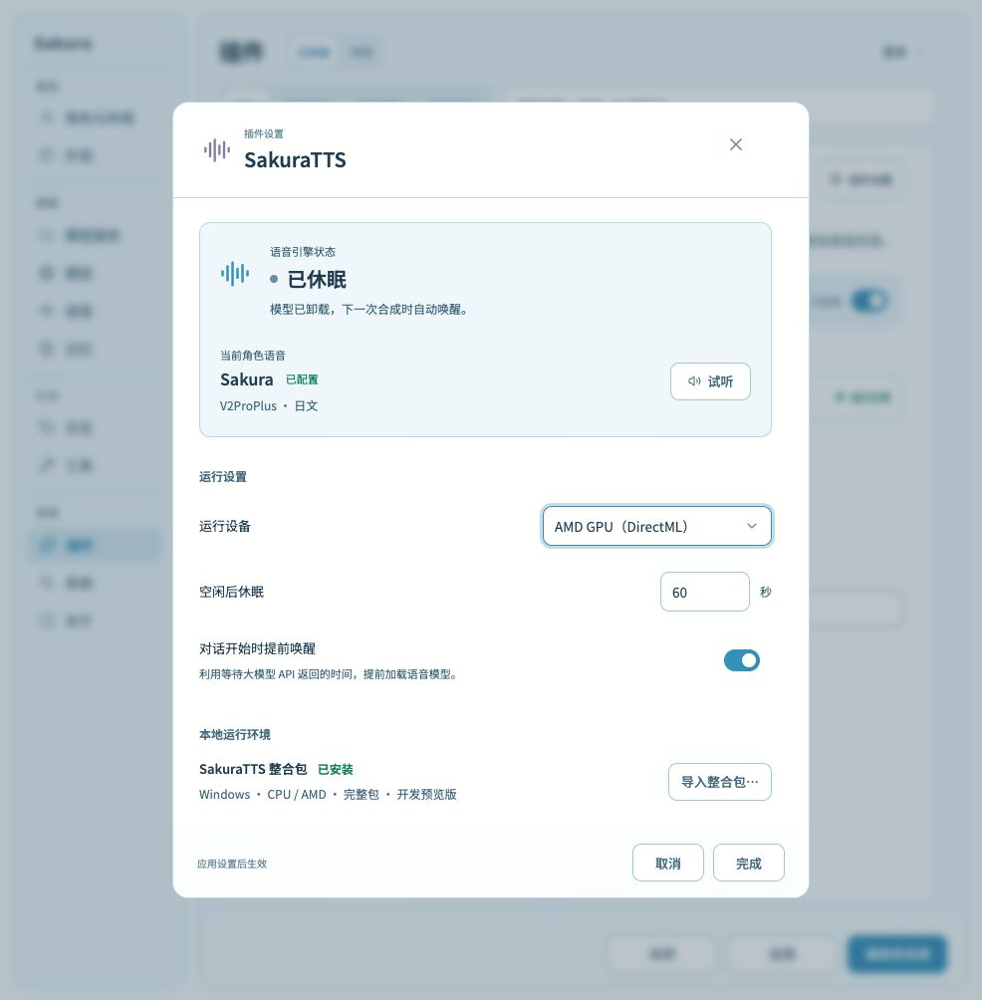
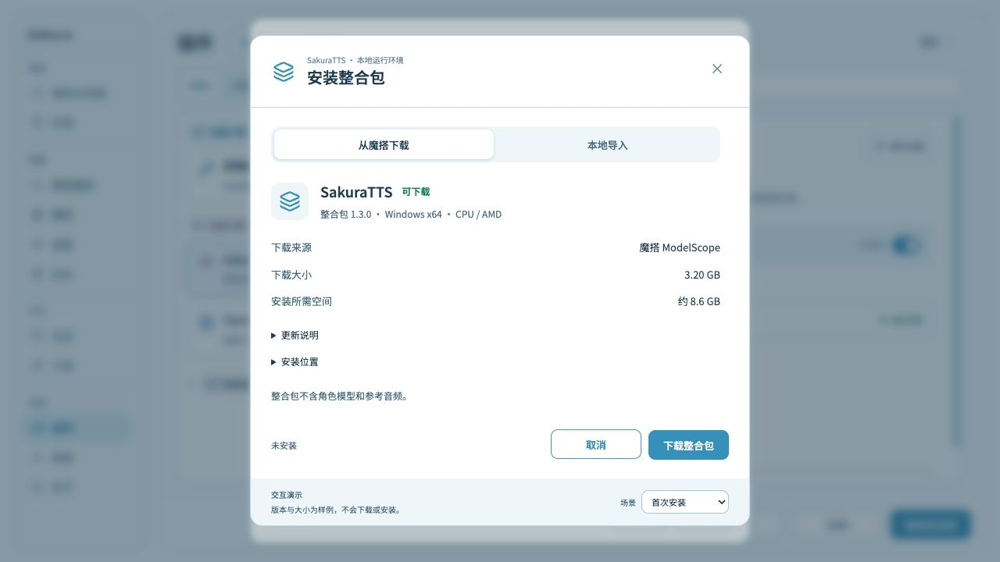
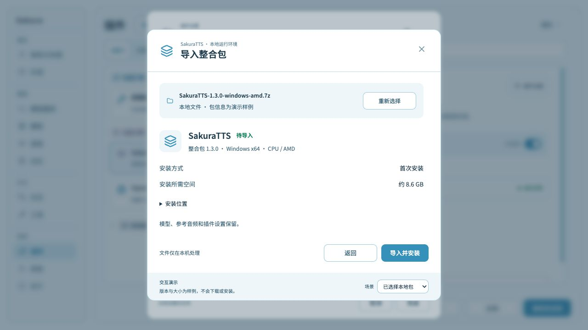

# SakuraTTS 插件与设置界面

## 范围与实现状态

SakuraTTS 作为内置 TTS Provider，负责本地角色语音合成，利用引擎的空闲休眠和提前唤醒降低待机占用。
整合包支持本机导入和魔搭 ModelScope 在线下载；首次安装和更新复用同一安装流程。

插件实现位于 `plugins/builtin/sakura_sakuratts/`，随主程序分发并默认启用，可由用户停用。已有启停设置和角色语音选择保持不变；内置插件沿用原插件 ID 和数据目录，复用已安装整合包、配置与缓存。整合包仍需在插件设置中下载或导入，不随主程序捆绑，也不在启动时自动下载。当前代码已接入本地 ZIP、7z 和 tar.gz 导入、原生文件选择、推理后端、空闲休眠和对话开始时提前唤醒。
插件设置使用宿主通用状态、Resource 与表单控件，依次显示运行状态、运行设置、本地运行环境。当前角色语音概况、试听和整合包管理弹窗仍是设计目标；在线下载和检查更新已接入资源控件，一键回退尚未接入。演示中的版本、设备和角色信息均为样例。

### 已实现的运行与安装契约

- 角色模型和参考音频读取角色工作室保存的 `extensions.sakura.tts.gpt-sovits`；显式的 `extensions.sakura.tts.sakuratts` 字段优先。通过宿主资源接口解析角色包路径，不要求角色 ID 与目录名相同，不复制或改写角色配置。
- `plugin.py:DEFAULTS` 定义设置默认值；设置保存只更新提交的字段。Windows 自动模式在每次启动服务时做实际 CUDA 运行检查，检查进程返回失败后选 CPU 并保留原因；超时、取消或无法执行检查时直接报告错误。连续合成复用正在运行的服务，停止后再次启动会重新检查设备。macOS 使用 MLX；手动选择的后端失败时保留错误，不自动换设备。DirectML 需要手动选择。
- 手动选择 NVIDIA 时显示 `cudaProfile` 推理模式，选项由 `plugin.py:CUDA_PROFILES` 定义。应用档位后停止旧服务，下次启动通过 `sakuratts.profile` 传给引擎，启动与合成日志保留所选档位。其他设备及自动模式不传此字段，保留选择值供切回 NVIDIA 时使用。FP16 自动转换需要更新引擎整合包。
- 修改运行设备、空闲休眠时间或当前 NVIDIA 档位时取消未完成任务并停止旧服务，下次合成应用新设置。提前唤醒、自动检查更新以及当前设备未使用的 NVIDIA 档位变更只更新设置，不中断正在进行的合成。
- 导入在新的版本目录解压，校验平台、必要入口和完整准备组件，再执行随包运行检查。检查通过后等待当前合成结束，停止自有服务并原子切换当前目录指针。取消或失败保留旧目录；不会自动删除旧版本。
- 7z 解压优先使用插件依赖 py7zz 自带的原生程序，其次查找本机 7-Zip；均不可用时使用 py7zr。解压时不下载工具。所有 7z 包在启动解压进程前检查成员路径与链接，取消时回收进程；解压报错直接报告，不切换工具重复解压。
- 插件启动时读取并检查当前整合包，状态刷新和合成复用已确认的目录与元数据。已有安装损坏时显示错误并保留重新导入入口；新包成功激活后立即使用新目录。运行中发生的文件缺失由实际启动或合成操作报告。
- 插件数据目录下的 `runtime-data/cache` 独立保存模型与参考缓存，通过 `SAKURATTS_CACHE_DIR` 交给引擎。更新不修改角色资源；跨版本是否可复用由引擎判断。
- `sakura.host.chat.request.started` 在用户发起的对话调用 Assistant 前发出，仅携带 `characterId`。插件只为已启用语音且选中自身的角色提前唤醒，并准备默认参考音频；不生成测试语音。调用唤醒接口时不追加保活期限，休眠遵循配置的空闲时间。应用启动时的 Provider `warmup` 不加载模型。
- 合成串行执行，空闲休眠启用时服务采用 managed 模式，设为 0 时采用不自动休眠的 direct 模式。取消当前任务、关闭或停用插件时终止自有进程树，等待写入停止后释放音频产物。服务启动、就绪、停止以及引擎加载、释放、休眠的状态变化写入宿主日志；状态监听随服务停止，不依赖设置窗口刷新。运行错误通过宿主日志保留诊断，完整子进程输出保存在 `runtime-data/server.log` 和整合包目录的 `logs/plugin-check.log`。
- HTTP 失败保留引擎返回的原因，不只显示 `Bad Request`。本地准备进程失败时，引擎保留末尾诊断行，完整输出仍写入运行日志。
- 插件通过 `sakura.host.logging` 将启动、排队、预加载、合成耗时和异常发送到“TTS”栏。引擎响应提供参考准备、文本处理、GPT、SoVITS、音频时长与参考缓存来源；不支持这些响应头的旧包仅显示可测得的请求耗时，不虚构阶段数据。正常插件设置轮询使用 debug 级别，失败仍可见。
- 导入通过后即可接收合成请求，无需重启应用。没有请求时显示“未加载”；加载、合成和卸载分别显示实际状态，空闲释放模型后显示“已休眠”。模型已加载与插件已安装分别展示。
- 打开的状态弹窗持续刷新，刷新保留可编辑草稿且不覆盖最新只读状态。关闭后不因静止的引擎状态继续轮询。
- 本地文件路径只由原生文件选择器传给导入操作，不显示路径输入框或对应的高级设置。

构建与本地验证记录见 [2026-10-04 联调记录](../../records/releases/2026-10-04-sakuratts-integration.md)。

## 插件信息与状态归属

沿用主程序的“插件列表＋详情”页面。详情显示简介、版本、作者、来源、依赖和“插件设置”入口；
设置继续使用主程序的弹窗、主题、字体、图标和公共控件。

列表右侧只反映插件自身的生命周期，例如运行正常、启动失败、已停用，以及实际发生的启动或停止过渡状态。
引擎休眠、模型准备和语音合成不覆盖插件状态；引擎已休眠时，正常运行的插件仍显示“运行正常”。

插件设置弹窗内分别展示语音引擎状态、当前角色语音和整合包安装状态。整合包已安装不代表模型已经加载，
角色已配置也不代表当前可以成功合成。

## 设置弹窗布局

从上到下依次为运行概况、运行设置和本地运行环境。
信息分组遵循[界面文案规范：信息分组与分隔线](../../devdocs/UI_COPY_GUIDELINES.md#信息分组与分隔线)，
不在设置项之间、角色资料前或整合包区域前重复添加横线。
分组标题使用高于字段标签的字号、字重和主文字颜色；不能用弱化的提示文字样式充当标题。

### 运行概况

顶部使用独立的浅底状态区域，包含两个只读部分：

- **语音引擎状态**：明确显示“未加载”“正在加载”“正在准备”“正在合成”“已加载”“已休眠”等状态，并附必要结果说明。
  已休眠时说明模型资源已释放，下一次合成自动加载；准备、合成和失败信息来自引擎实际状态。
- **当前角色语音**：显示角色名称、配置状态、模型类型和语言，旁边提供“试听”。
  模型和参考资源沿用角色配置，不在此重复编辑。缺少环境或角色资源时显示具体缺失项，禁用不可执行的试听。

两个部分通过内容顺序、标签和间距区分，状态不能仅作为设置分组标题旁的小字。
不提供手动“立即休眠”按钮。

### 运行设置

| 项目 | 行为 |
|---|---|
| 运行设备 | 只列当前整合包支持的设备；只有一个可用选项时显示只读设备信息 |
| 推理模式 | 手动选择 NVIDIA 时显示；支持 FP32、FP16 标准、FP16 低显存和 FP16 极低显存 |
| 空闲后休眠 | 单位为秒，0 为不休眠；默认值见插件 `plugin.py` 的 `DEFAULTS` |

对话开始时，已启用语音且选中 SakuraTTS 的角色自动提前加载模型，不提供开关。
查看设置和查询状态不唤醒模型，也不延长保活时间。

标签和控件按行对齐。设备选择与秒数输入位于右侧；休眠时间说明为“0 为不休眠”。
窄窗口下自然换行，保留完整标签和可达的底部操作，不依赖逐行分割线区分字段。

### 本地运行环境

显示整合包名称、安装状态及实际版本和平台信息。提供“导入整合包”和“检查更新”；发现可用版本后提供下载入口，完整下载后提供安装入口。独立管理弹窗仍为下方草案。
不要求用户填写 Python 路径、端口或启动命令。
整合包不包含角色发声模型和个人参考音频。

导入需要区分未安装、处理中、失败与已安装。离线解压不能显示为“下载中”；失败说明保留具体原因。
新环境检查通过后才替换旧环境，失败或取消不破坏原有安装、角色资源和配置。

### 在线整合包与角色提醒

`_bundle.py:REPOSITORY_URL` 指定魔搭发行仓库。检查读取 `latest-preview.json`，按 `local_target()` 选择唯一的平台包；不按显卡另选压缩包。发布端必须在两个平台包上传并检查完成后更新索引，单独构建新文件不会改变客户端候选版本。
索引使用发布编号、源码提交、包路径、压缩大小和解压大小；客户端从固定仓库与发布路径构造下载地址。当前渠道为预览版，界面明确展示。

在线安装将发布编号随当前目录指针保存。再次检查时比较发布编号；旧版或本地导入包没有发布编号时，只有包内源码提交相同且 `source_dirty` 为 false 才认定与线上相同。索引未提供可排序的语义版本，发布编号不同显示为可用版本，不推断自定义本地包比线上更旧。

资源卡片优先显示“下载并安装”，其次为“检查更新”和“导入整合包”。未检查版本时也可直接下载并安装，操作内查询本机版本索引；下载完成后自动解压、运行检查并安装，中间不进入成功状态。已有完整待安装包时，首个操作改为“安装已下载整合包”，复用下载文件。取消完成后恢复当前安装状态，不持续显示“已取消”；实际取消与清理失败仍保留日志。下载前检查压缩包与解压所需空间，流式显示已下载大小、速度和估算剩余时间；按索引字节数检查完整性。完整包和待安装记录留在插件数据目录，重启后可安装；下载失败或取消清除未完成文件，不自动重试或断点续传。网络连接和读取使用 20 秒超时，取消或退出等待在途读取返回后关闭文件。安装再次检查空间，并检查包内源码提交与索引一致、源码工作树干净，再复用运行检查与原子切换。成功后清理下载文件，保留旧安装目录。

`plugin.py:DEFAULTS.autoCheckUpdates` 默认开启，每次插件启动检查一次；手动检查不受该设置影响。自动检查不下载、不安装、不加载语音模型。关闭开关也停止尚未发送的角色提醒，不取消已经开始的回复。

已有安装且线上版本不同时，`_updates.py:UpdateAnnouncement` 等待当前角色会话连续空闲 3 秒，再通过 `sakura.host.chat.submit` 调用当前对话模型。提示词只要求提醒 SakuraTTS 有更新，可前往插件设置更新，不附带发布编号、平台或来源。提交时附带 `notification: {kind: "update", text: "SakuraTTS 有可用更新"}`，聊天记录以“更新提醒”展示。未安装时只在设置显示下载入口，不主动请求角色提醒。

同一发布编号在同一本地自然日成功提醒后不再播报。通过完成事实事件的 `operationId` 关联自己的请求，成功回复后原子写入提醒记录；其他聊天的完成、失败或取消不会写入。受理后的请求本次插件运行中不自动重发，重启后无成功记录仍可提醒；忙碌或会话切换引起的拒绝会重新等待空闲。停用插件时撤销其未完成请求。检查失败和模型提醒失败保留诊断，原有运行环境继续可用。

### 整合包管理界面草案

管理弹窗复用主程序的主题、字体、图标和公共控件。下载与本地导入使用两个入口，操作期间只显示当前任务。
内容依靠留白与对齐分组，不逐行画线；更新说明和安装位置默认折叠。版本、平台、大小和空间信息以实际包为准。

| 场景 | 内容与操作 |
|---|---|
| 首次下载 | 展示目标版本、平台、来源、下载大小和安装所需空间；主操作为“下载并安装” |
| 本地导入 | 选择文件后展示文件名、包信息及首次安装或更新目标；主操作为“导入并安装”或“导入并更新” |
| 下载中 | 展示进度、已下载大小、速度及可估算的剩余时间；允许取消下载 |
| 下载完成 | 自动进入安装；取消安装或重启后保留“安装已下载整合包”入口 |
| 安装中 | 区分解压与新环境检查；本地导入不显示下载速度或网络进度 |
| 已安装 | 展示已安装版本，提供“检查更新”；不因检查更新唤醒模型 |
| 发现更新 | 展示已安装版本、目标版本和更新说明；主操作为“下载并安装” |
| 下载失败 | 保留当前安装，提供重试下载和本地导入；错误详情使用主程序统一错误弹窗 |
| 更新失败 | 只有恢复成功后才显示“已恢复”及版本；恢复失败需显示实际状态与原因 |

下载期间可继续使用旧环境。安装更新时等待当前语音任务结束，再停止自有服务并切换环境。
模型、参考音频和插件设置与版本目录分开保存；缓存兼容性由引擎判断，不能承诺跨版本缓存一定可复用。
检查更新、下载并安装、本地导入和继续安装不依赖设置页“应用”，也不隐式保存其他设置草稿。

演示提供首次安装、下载中、离线导入、已选择本地包、发现更新、下载失败和更新失败的场景切换。
“使用示例文件”与场景切换属于演示工具，不进入产品界面；演示不读取整合包内容、不访问魔搭、不解压或启动服务。
所选文件只展示名称，包信息使用标明的样例数据。真实离线导入见上面的已实现契约；在线下载和取消使用上面的已实现契约；一键恢复旧版仍需实现。

## 交互与运行边界

“完成”接受弹窗内的编辑，外层“应用”才保存并应用设置；“取消”或关闭弹窗还原本次未接受的编辑。
试听与导入是独立操作，不能隐式保存其他待应用设置。试听使用已应用的配置。

接入遵循现有 [TTS Provider 合同](sakura-plugin-runtime-v4.md#62-tts-provider-跨进程合同)。
插件管理其启动的控制服务，启用自动休眠时，引擎使用 `managed` 模式管理推理进程和空闲计时；不休眠时使用 `direct` 模式。
提前唤醒与正式合成等待同一次准备，连续分句串行提交；不通过生成并丢弃假句子预热。
禁用插件和退出应用时回收自有服务及其子进程。

后台历史语音补齐不得反复唤醒已休眠的引擎；用户主动重播缺失语音可以唤醒。
首次转换和参考准备与普通唤醒分别呈现，不能将演示中的状态切换时间作为加载时限。

## 验证

- 插件正常、启动失败和停用分别显示正确状态；引擎准备、合成、休眠不覆盖列表中的插件状态。
- 设置可编辑，取消恢复原值；完成后保留草稿，应用后才生效。状态刷新不覆盖正在编辑的值。
- 默认窗口和最小设置窗口下，标签、状态及底部操作不被裁剪；分组不依赖重复分割线。
- 离线导入、首次准备、试听、自动休眠、再次唤醒和进程退出需要真实整合包验证。
  检查取消、角色切换及安装失败对旧资源和在途任务的影响。

## 界面参考

状态用语参考 [Ollama FAQ：模型加载、卸载与内存保留](https://docs.ollama.com/faq) 的 loaded/unloaded 和按需加载行为；空闲释放后自动恢复的说明参考 [Docker Desktop Resource Saver](https://docs.docker.com/desktop/use-desktop/resource-saver/)。中文名称是本产品的对应表达，不是这些项目的官方中文翻译。

下图为 2026-10-04 的界面演示快照，仅说明布局，设备、版本和状态均为样例。

- [SakuraTTS 后台驻留与提前唤醒](https://github.com/Rvosy/SakuraTTS/blob/main/docs/background-runtime.md)
- [SakuraTTS HTTP 生命周期与默认值](https://github.com/Rvosy/SakuraTTS/blob/main/docs/http-api.md)
- [Docker Desktop Resource Saver](https://docs.docker.com/desktop/use-desktop/resource-saver/)：运行状态与空闲策略设置分别呈现。
- [VS Code 扩展管理](https://code.visualstudio.com/docs/configure/extensions/extension-marketplace)：扩展管理与扩展配置分开组织。

- [Docker Desktop 软件更新设置](https://docs.docker.com/desktop/settings-and-maintenance/settings/#software-updates)：区分检查更新与后台下载。
- [VS Code 手动安装与更新](https://code.visualstudio.com/docs/configure/extensions/extension-marketplace)：在线安装、本地 VSIX 导入和手动更新分别提供入口。

## 运行诊断

插件记录实际引擎启动、预加载及合成的成功、失败、取消结果，并为错误补充运行配置与可获取的设备信息。损坏的安装记录和下载记录同样产生错误日志。事件口径、采集字段、上传开关和平台统计统一遵循[远程诊断与运行统计](remote-diagnostics-telemetry.md#sakuratts-运行结果)。
