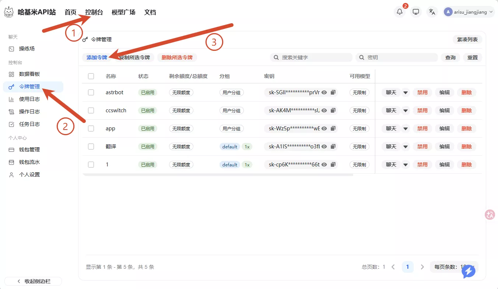
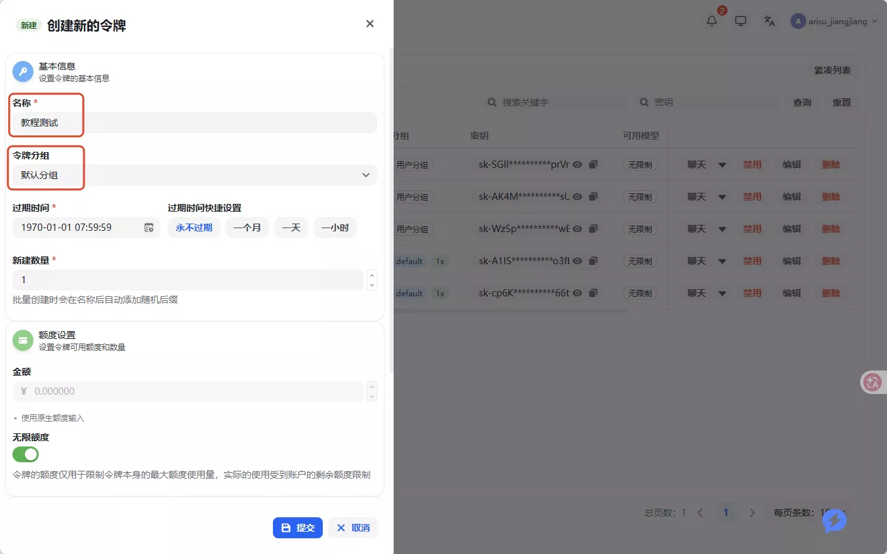
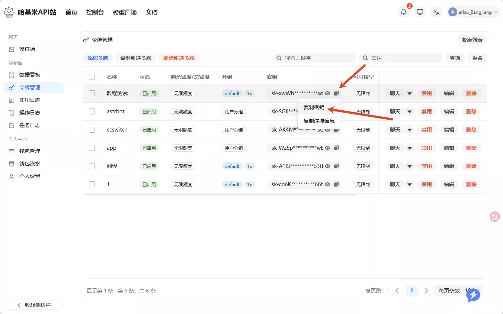
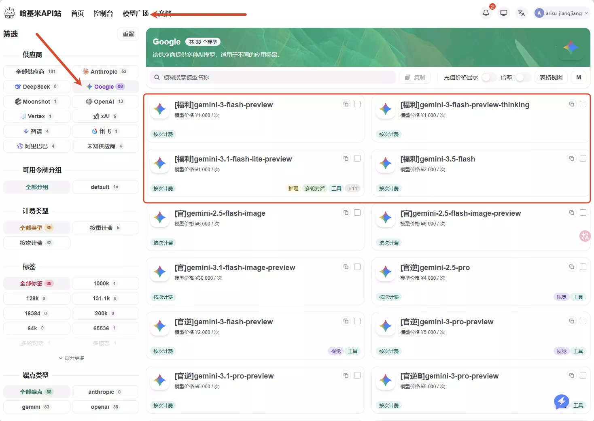

# API 模型服务与模型

Sakura 通过 OpenAI-compatible 接口连接模型。配置一套模型服务需要 API 地址、API Key 和至少一个模型名称。

| 配置项 | 内容 |
|---|---|
| API 地址 | 服务商提供的 Base URL，通常以 `/v1` 结尾 |
| API Key | 服务商生成的访问密钥 |
| 模型 | 服务商模型列表中的准确名称 |

API Key 保存在本机配置中，设置页不会回显完整密钥。日志也不会记录它。

## 添加模型服务

1. 打开“设置 → 模型服务”。
2. 新建模型服务，填写名称、API 地址 和 API Key。
3. 保存后运行连接测试。
4. 打开“设置 → 模型”，为各用途选择模型服务和模型。

Sakura 可以保存多套模型服务。修改其中一套不会重写其他模型服务，也不会把模型选择和密钥合并成一个配置。

## 模型用途

“模型”页至少包含两个固定用途：

- 对话模型处理日常聊天、工具调用和角色回复；
- 视觉对话模型处理截图和其他图片消息。

Memory、TTS 或其他插件可以在同一页面注册自己的模型用途。插件停用后，它拥有的项目会从页面移除，其他选择不受影响。

视觉模型必须支持图片输入。只支持文字的模型仍可用于普通聊天，但收到截图时会返回明确错误。

## 使用中转服务

以下截图以哈基米 API 为例，其他 OpenAI-compatible 服务的填写方式相同。

1. [注册账号并进入令牌管理](https://api.gemai.cc/register?aff=rwbQ)。
2. 创建令牌并复制密钥。
3. 在模型列表中确认可用的模型名称。
4. 回到 Sakura 添加模型服务，再为对话和视觉用途选择模型。

## 验证与排查

连接测试会向列表中的第一个模型发送请求，成功提示会显示该模型名称。它不验证其他模型或图片能力；使用截图功能前，应另发一张图片验证视觉模型。失败时可展开“错误详情”查看 HTTP 状态和服务端原因。

- `401`：检查 API Key。
- `403`：服务拒绝访问，根据错误详情检查账号权限或服务限制。
- `404`：检查 API 地址 是否包含正确的 API 前缀，模型名称是否存在。
- `429`：服务商限流或额度不足，稍后重试或更换模型服务。
- 图片请求失败：确认视觉用途没有选到纯文字模型。

代理由系统环境和 Runtime 的网络库读取。排查时不要把带密钥的配置、完整请求头或 Agent Trace 发到公开 Issue。
