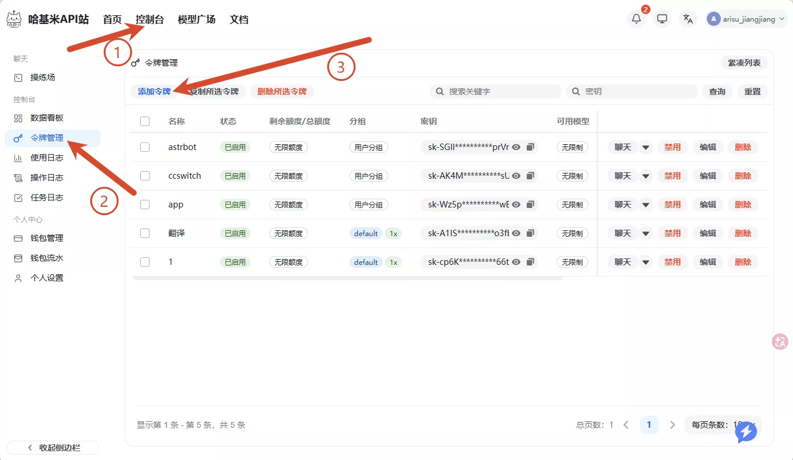
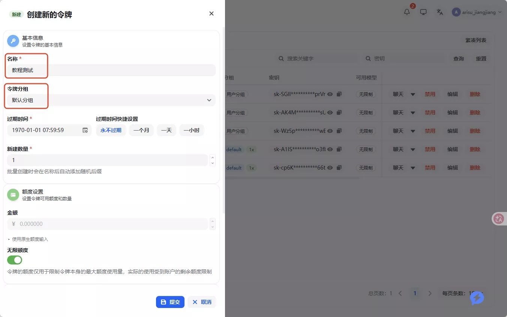
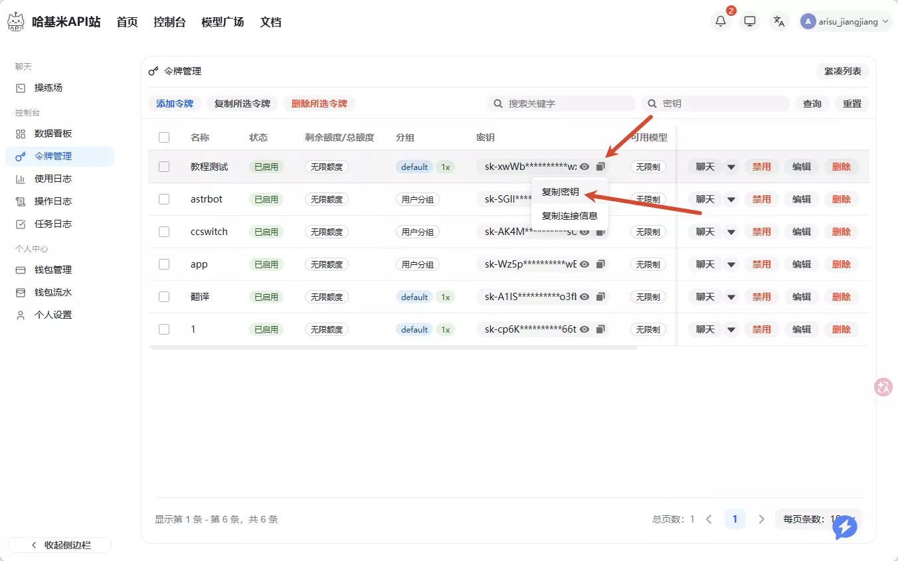
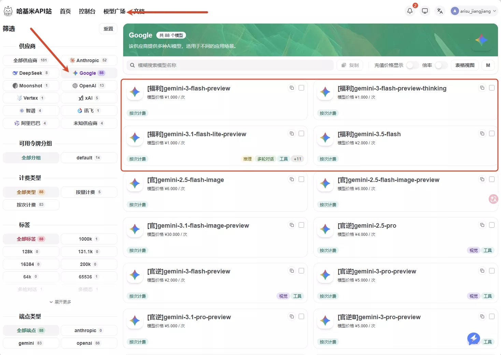

# API 模型服务与模型

Sakura 默认通过“OpenAI 兼容模型服务”插件连接模型 API。配置一套连接需要 API 地址和至少一个模型名称；服务需要认证时再填写 API Key。

| 配置项 | 内容 |
|---|---|
| API 地址 | 服务商提供的 Base URL，通常以 `/v1` 结尾 |
| API Key | 服务商生成的访问密钥；无需认证的服务可留空，包括局域网服务 |
| 模型 | 服务商模型列表中的准确名称 |

API Key 保存在本机配置中，设置页不会回显完整密钥。日志会对已知密钥和常见凭据格式脱敏；分享日志前仍需检查错误详情。

## 添加模型服务

1. 打开“设置 → 模型服务”。
2. 点击“添加模型服务”，填写 API 地址。需要密钥时选择“替换”并填写密钥。名称可留空，重复添加的模型会自动去重。
3. 手动添加模型 ID，或点击“获取模型列表”并勾选需要的模型。
4. 点击“测试连接”，检查列表中的第一个模型。获取列表和测试连接都可以使用尚未保存的配置。
5. 打开“设置 → 模型”，为各用途选择模型服务和模型，再点击窗口底部的“应用”或“保存并关闭”。

Sakura 可以保存多套模型服务。修改其中一套不影响其他连接；模型选择与连接密钥分别保存。

修改密钥时选择“替换”，不修改时选择“保留”；选择“清除”会删除已保存的密钥。

保存连接或模型参数后，新配置通过重载模型插件生效。正在运行的请求仍使用原配置；当前对话未结束时，配置可以保存，等对话结束后再应用。
应用期间刚启动的后台整理或连接测试可能被取消；已保存的记忆会保留，未完成的整理留待后续处理。

“模型参数”可以设置已添加模型的上下文窗口、文本／图像输入能力和工具调用能力。不确定的能力保持“未知”；
上下文窗口应依据服务商文档填写，留空使用默认值。温度、Top P 和最大输出 Token 在“模型 → 对话生成”中设置。

## 模型用途

“模型”页至少包含两个固定用途：

- 对话模型处理日常聊天、工具调用和角色回复；
- 视觉对话模型处理截图和其他图片消息。

记忆、语音等插件可以在同一页面添加各自需要的模型选项。停用插件后，对应选项会从页面移除，其他选择不受影响。

可选用途勾选“继承对话模型”时随对话模型使用同一选择。模型服务停用或模型被删除后，原选择会标为不可用并保留，
重新启用服务或更换选择即可恢复。Memory 的整理模型不可用时，只停止自动整理，已有记忆仍可管理和召回。

视觉模型必须支持图片输入。只支持文字的模型仍可用于普通聊天，但收到截图时会返回明确错误。

## 使用中转服务

以下截图以哈基米 API 为例，其他 OpenAI 兼容服务的填写方式相同。

1. [注册账号并进入令牌管理](https://api.gemai.cc/register?aff=rwbQ)。
2. 创建令牌并复制密钥。
3. 在模型列表中确认可用的模型名称。
4. 回到 Sakura 添加模型服务，再为对话和视觉用途选择模型。

## 验证与排查

连接测试只检查该连接列表中的第一个模型，成功后会显示模型名称。其他模型和图片输入能力需要分别验证；使用截图功能前，先发送一张图片测试视觉模型。
测试期间可以取消；失败状态显示错误码，可结合运行日志查看原因。

- `401`：检查 API Key。
- `403`：服务拒绝访问，检查账号权限或服务限制。
- `404`：检查 API 地址是否包含正确的 API 前缀，模型名称是否存在。
- `429`：服务商限流或额度不足，稍后重试或更换模型服务。
- 图片请求失败：确认视觉用途没有选到纯文字模型。

代理由系统环境和 Runtime 的网络库读取。排查时不要把带密钥的配置、完整请求头或 Agent Trace 发到公开 Issue。
