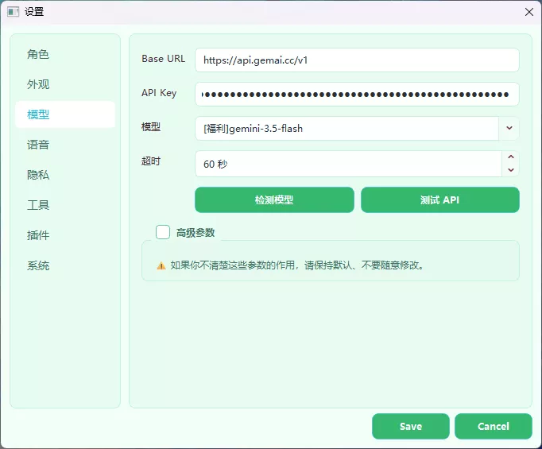
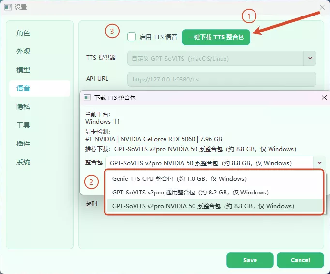
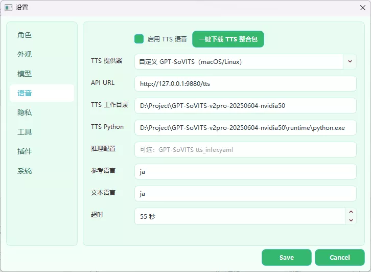
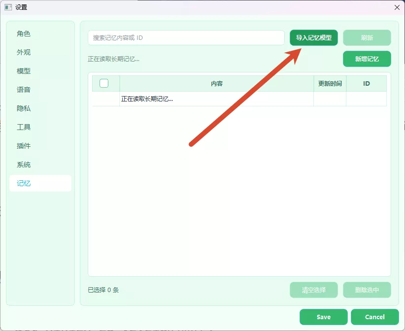

# 安装与首次配置

想直接使用 Sakura，请从 [Releases](https://github.com/Rvosy/sakura/releases) 下载完整包。GitHub 自动生成的源码压缩包不包含 bundled Python Runtime，也没有已经构建好的桌面程序。

## 下载和安装

### Windows

1. 下载 Windows x64 完整包并解压到普通目录。
2. 双击 `install.bat` 安装 Python 依赖。
3. 双击 `start.bat` 启动 Sakura。

`install.bat` 只使用根目录中的 `runtime/python.exe`。如果脚本提示找不到 Runtime，说明下载的不是完整包，或者解压时漏了 `runtime/`。

### macOS

优先使用 Releases 中与处理器架构匹配的完整包。没有对应包时，请按 [macOS 使用说明](MACOS_SETUP.md) 从源码构建。

### Linux

Linux 需要从源码构建 Tauri Shell，并准备项目自带布局的 Python Runtime。不同桌面环境对透明窗口、点击穿透和绝对定位的支持不完全相同。

## 从源码运行

源码检出需要根目录下的 `runtime/`。先从 Releases 获取对应平台的 Runtime，再安装依赖并构建桌面端。

Windows：

```powershell
.\install.bat
cargo build --manifest-path desktop\src-tauri\Cargo.toml
.\start.bat
```

macOS / Linux：

```bash
bash scripts/install.sh
bash scripts/start.sh
```

`scripts/start.sh` 会增量编译并启动 debug 开发版。`main.py` 也是开发启动入口，但它只负责定位已经构建的 Tauri Shell。

## 第一次启动

首次启动需要完成两件事：添加角色、配置模型供应商。设置窗口会自动打开。

### 添加角色

在“角色与布局”页导入 `.char` 文件。角色包可以包含角色卡、立绘、主题和语音参考资源。完成导入后，从“当前角色”选择要显示的角色。


应用内角色工作室可以新建或修改角色。入口位于“设置 → 角色与布局 → 修改角色”。正式包会在支持的平台提供工作室二进制；从源码运行时需要先构建 `tools/studio-tauri/`。

### 配置供应商和模型

1. 在“供应商”页填写 Base URL、API Key，并保存。
2. 在“模型”页选择对话模型和视觉对话模型。
3. 发送一条普通消息验证聊天；需要截图功能时，再发送一张图片验证视觉模型。

详细字段和错误说明见 [API 供应商与模型](API_CONFIG.md)。



## 设置页面

设置按用途分成四组：

| 分组 | 页面 | 内容 |
|---|---|---|
| 角色 | 角色与布局、外观 | 角色包、立绘、气泡、输入栏、字体和主题 |
| 智能 | 供应商、模型、语音、记忆 | 模型连接、TTS、长期记忆和本地资源 |
| 行为 | 交互、隐私、工具 | 回复表现、主动屏幕感知、MCP 与工具 |
| 系统 | 插件、系统 | 插件管理、日志等级、Agent Trace 和开机自启动 |

大部分设置在保存后立即生效。需要重建 Core 或重新加载目标插件时，设置窗口会自动连接当前实例。保存失败会保留页面中的草稿，并显示稳定原因码。

## 聊天与截图

在桌宠输入栏输入文字即可聊天。输入栏左侧 `+` 提供截图和插件动作。截图会随下一条消息发送，框选取消后不会留下附件。

“设置 → 隐私”可以开启主动屏幕感知，并调整检查间隔、冷却时间、批次数和分辨率。忙时跳过，不会补跑积压截图。完整说明见 [聊天、截图与屏幕感知](CHAT_SCREEN_AND_CONTEXT.md)。

回复保存在本地 Timeline。气泡顶部的左右按钮可以翻阅当前运行会话中已经完成的回复；输入框草稿不会因 Core 重启被自动发送。

## 语音

语音是可选功能。关闭“启用角色语音”后，Sakura 不提交 TTS 合成任务，聊天和字幕照常工作。

当前内置语音插件包括 GPT-SoVITS 和 Genie。配置步骤：

1. 打开“设置 → 语音”。
2. 开启当前角色语音并选择语音引擎。
3. 填写该引擎需要的地址、路径或运行参数。
4. 点击“测试语音”，成功后保存。

GPT-SoVITS 可以使用 Sakura 管理的本地服务，也可以填写自定义服务地址。Genie 使用对应的服务接口。配置保存后若页面提示 `restart_required`，点击该引擎区块的重新加载动作。





## 长期记忆

Memory 插件使用本地 ONNX 向量模型查找相关记忆。第一次使用时，在“设置 → 记忆”安装模型；下载、校验和初始化期间，普通聊天仍可使用，只是暂时没有记忆召回。

记忆页支持搜索、新增、编辑和删除。编辑内容必须点击页面内的保存按钮才会提交。自动整理使用“模型”页中 Memory 插件注册的模型用途；没有选择整理模型时，手工管理和本地召回仍然可用。



Memory 状态长期停在初始化时，先查看用户数据目录中的 `data/logs/sakura-runtime.log`。不要删除 `data/memory/` 中的 Qdrant、SQLite 或锁文件；正常退出、备份整个用户数据目录后再排查。

## MCP 和插件

MCP Server 配置保存在用户数据目录的 `config/mcp.yaml`。设置页会显示连接状态和工具数量。详见 [MCP 工具](RUNTIME_V2_MCP.md)。

本地插件通过“设置 → 插件”安装。插件与 Sakura 具有相同的本机权限，只安装可信代码。详见 [Python 插件](RUNTIME_V2_PLUGINS.md)。

## 更新

Windows Setup 与 macOS 安装版通过签名的 Tauri Updater 更新。更新只替换发行资源，不迁移或清理用户数据目录。Windows Portable 不自替换，也不会启动 NSIS；发现新版本后下载或打开新版 Portable ZIP，由用户退出 Sakura 后解压到目标目录。

当前 Runtime v2 只接受 v1 数据契约。旧 main 数据不会被扫描、迁移或导入。

`tools/cleanup.py` 默认只预览可清理内容。确认列表后才使用 `--apply`。不要对不确定的目录执行清理。

## 获取帮助

先看 [运行日志与故障排查](RUNTIME_LOG_TROUBLESHOOTING.md)。提交 Issue 时写明系统、Sakura 版本、复现步骤和已经尝试的处理；日志片段要先检查隐私和密钥。
