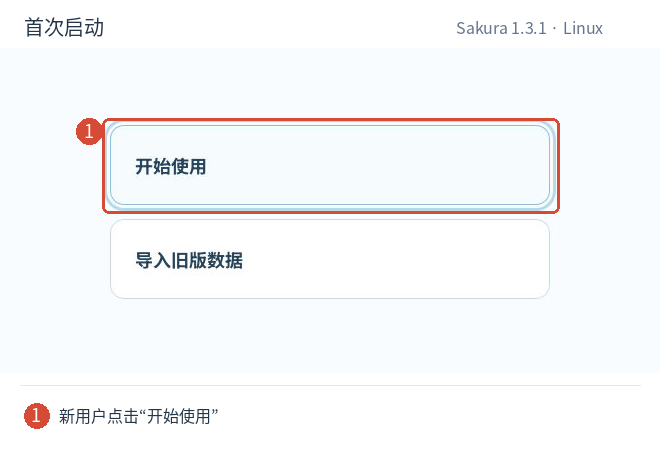
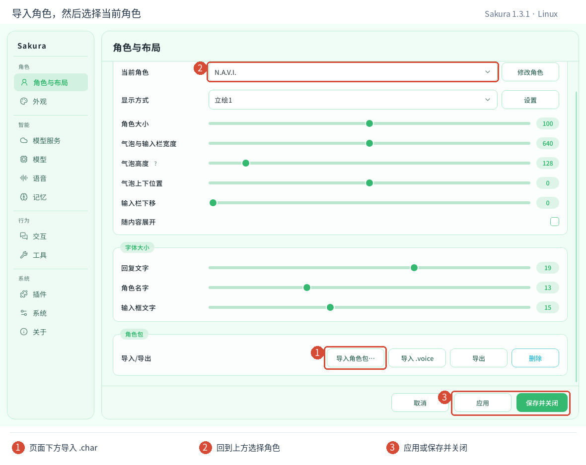
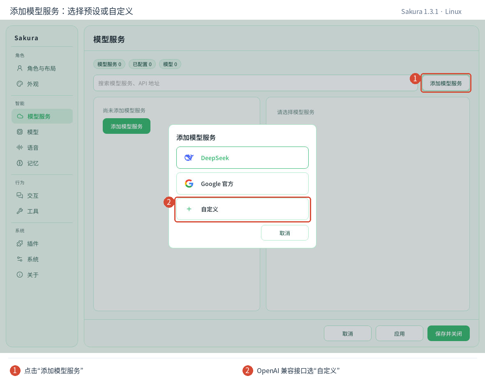
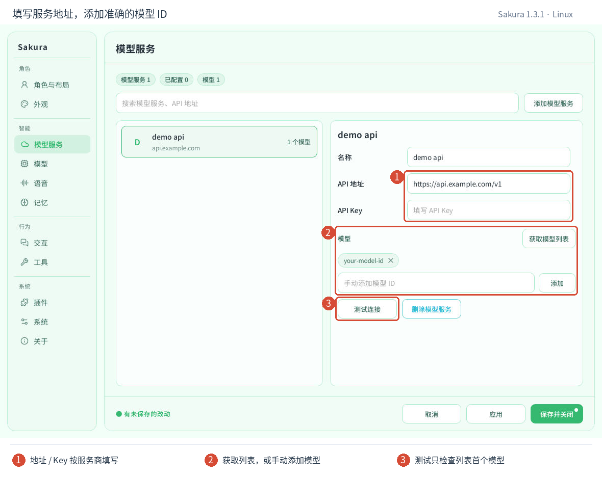
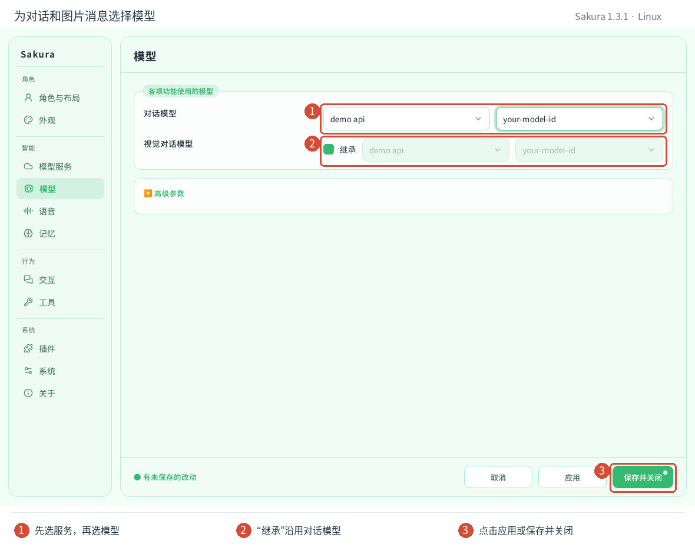
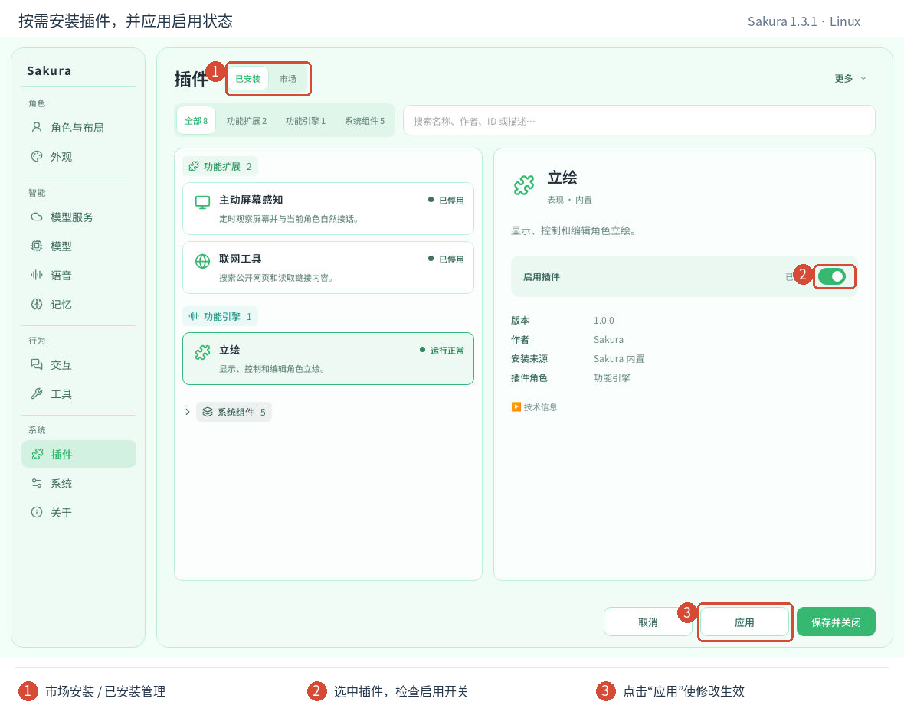
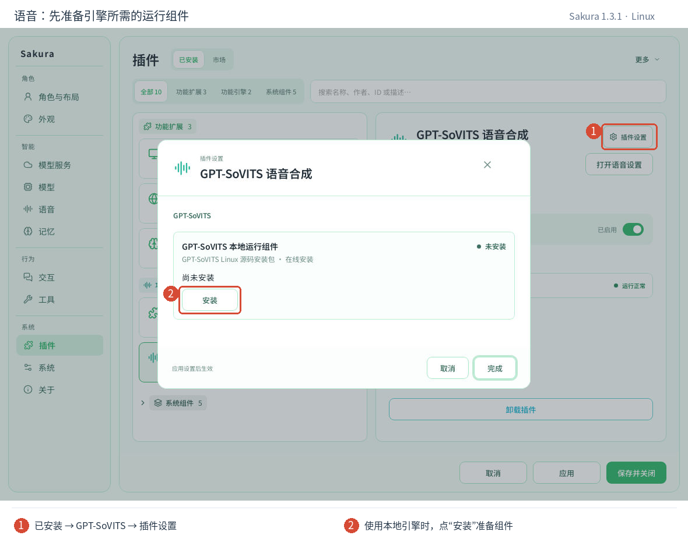
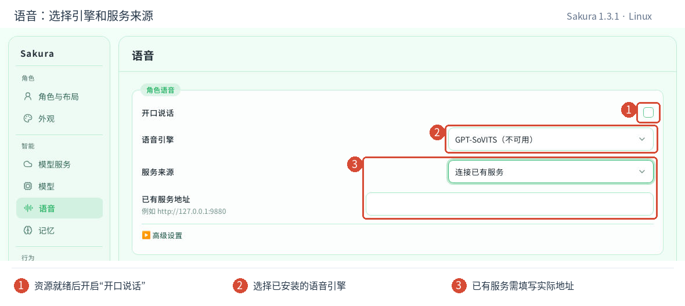
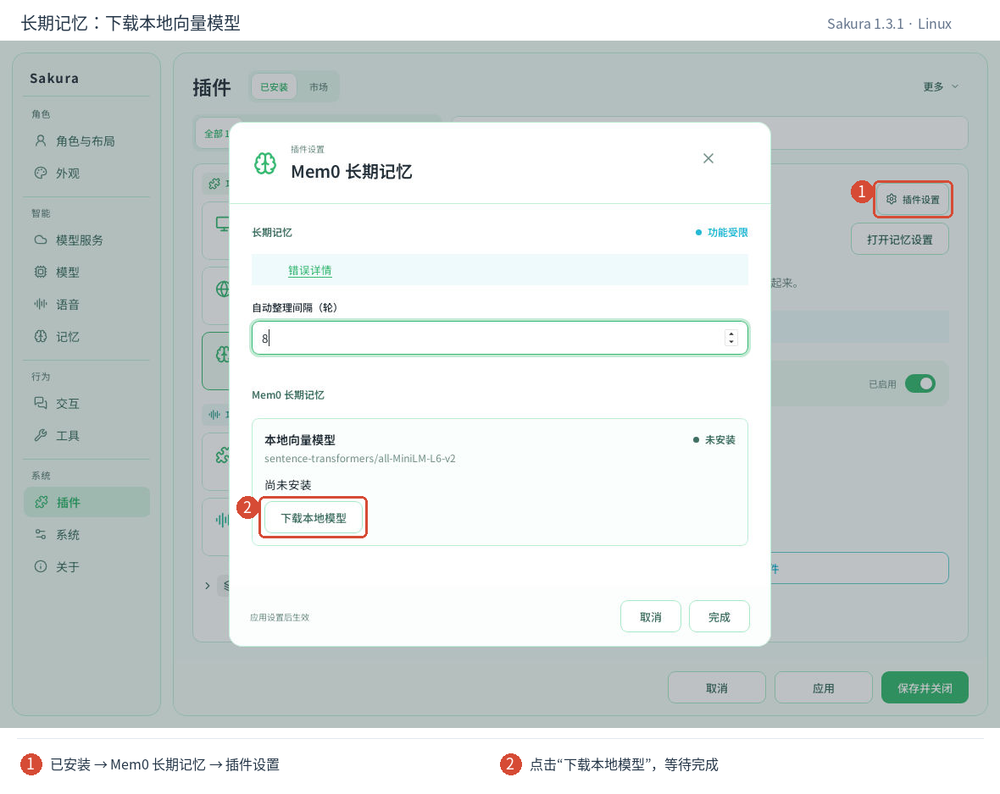

# 安装与首次配置

本教程说明如何安装 Sakura、导入角色并配置模型服务。语音、长期记忆和其他插件按需配置。

截图使用 Sakura 1.3.1 Linux 正式版。其他系统的窗口外观可能不同，按钮和设置入口相同。图中的橙色框和编号是操作标注。

## 开始前准备

需要以下三样：

- **Sakura 安装包**：从[官方 Releases](https://github.com/Rvosy/Sakura/releases)下载，下一节说明选哪个文件。
- **角色文件**：扩展名为 `.char` 或 `.card.char`，里面是角色的外观和人设。没有角色文件，可以下载官方[夜乃桜](https://github.com/Rvosy/Sakura/releases/download/v0.9.6/Sakura.card.char)或 [N.A.V.I.](https://github.com/Rvosy/Sakura/releases/download/v0.9.6/N.A.V.I.card.char)。这是兼容新版的旧版角色资源，不需要安装旧程序。
- **模型服务信息**：从同一家服务商取得 API 地址、API Key 和模型名称。Sakura 通过这个服务生成回复；只有角色文件还不能聊天。

API Key 是调用模型的密钥，不是账号密码。模型服务可能收费，使用前查看服务商的额度和计费方式。还没有这些信息，先看[获取模型服务信息](API_CONFIG.md#获取模型服务信息)。

## 下载和安装

在 Release 页展开 **Assets**，选择与你的系统对应的完整包。不要选择 `Source code`，那是给开发者的源码。

### Windows

1. 一般选择名字以 `windows-x64-setup.exe` 结尾的文件，运行安装器并完成安装。
2. 不想安装时，选择 `windows-x64-portable.zip`，先完整解压，再打开文件夹里的 `sakura.exe`。不要在压缩包内直接运行。

完整包已带 Python Runtime，不需要另外安装 Python 或运行 `pip`。

### macOS

1.3.1 完整包适用于 Apple Silicon（arm64）、macOS 14 及以上，未提供 Intel Mac 包。

下载 `.dmg`，打开后将 Sakura 拖入“应用程序”，再从那里启动。遇到首次打开提示时，按[macOS 使用说明](MACOS_SETUP.md)处理。

### Linux

1.3.1 提供 x64 的 `.AppImage` 和 `.deb`，无需先从源码编译。

- AppImage：在文件属性中允许作为程序执行，再打开。
- Ubuntu/Debian：可选择 DEB，通过系统软件安装器安装。

系统要求、依赖和 Wayland 限制见 [Linux 使用说明](LINUX_SETUP.md)。

## 第一次启动

点击“开始使用”。已有旧版数据才选择“导入旧版数据”。

进入设置后，按“下一步”“完成”看完引导，或点“跳过”后按下面的图示操作。以后要改配置，右键点击桌宠立绘，选择“设置”。

### 添加角色

1. 打开左侧“角色与布局”，向下滚动到“角色包”。
2. 点击“导入角色包…”，选择下载的 `.char` 或 `.card.char` 文件。它是导入文件，不需要双击安装，也不用解压。
3. 导入完成后，在页面上方“当前角色”中选中它。
4. 点击底部“应用”。

完成后，“当前角色”应显示角色名字。角色太大或挡住其他窗口时，在同一页调整“角色大小”和“气泡与输入栏宽度”，再点“应用”。

### 配置模型服务和模型

#### 添加模型服务

1. 打开左侧“模型服务”，点击“添加模型服务”。
2. DeepSeek、Google 官方可选择对应预设；其他 OpenAI 兼容接口选择“自定义”。预设只填写连接默认值，仍需准备该服务的密钥和模型。

3. 填写下面三项，其他参数先保留默认。

| 界面字段 | 填什么 | 从哪里找 |
|---|---|---|
| API 地址 | 服务商提供的 Base URL，常以 `/v1` 结尾 | 服务商的 API 接入说明；不要填网站首页或网页聊天地址 |
| API Key | 该服务的访问密钥 | 服务商控制台的密钥或令牌管理；不要填账号密码 |
| 模型 | 服务商列出的准确模型 ID | 点“获取模型列表”后勾选，或按服务商说明手动添加 |

1.3.1 正式版需要填写 API Key。免认证服务的版本区别见 [API 配置说明](API_CONFIG.md)。

截图中的 `api.example.com` 和 `your-model-id` 是占位示例，不能直接使用；密钥未填写，所以“已配置”仍为 0。请填入自己的真实信息。

4. 点击“测试连接”。成功提示只代表列表中的第一个模型可用，其他模型和图片输入仍需分别验证。获取模型列表和测试连接会请求服务商，可能消耗 API 额度。

如果失败，先看[常见问题](#常见问题)，不要反复点击测试。

#### 选择对话模型

1. 打开左侧“模型”。
2. 在“对话模型”这一行，先选择刚添加的模型服务，再选择模型。
3. “视觉对话模型”的“继承”表示沿用对话模型。需要图片能力时，所选模型必须支持图片；否则取消继承并另选视觉模型。
4. 点击底部“保存并关闭”。

保存后设置窗口关闭，基础配置完成。需要确认已保存的内容时，重新打开“设置 → 模型”，检查对话模型的服务和模型名称。

只添加模型服务、不在“模型”页选择对话模型，还没有完成用途配置。语音和长期记忆可以按下面的步骤另行配置。

## 常见问题

| 看到什么 | 先检查什么 |
|---|---|
| 导入后没有角色 | “当前角色”是否选中刚导入的角色，是否点了“应用”；“立绘”插件是否启用 |
| 已添加模型服务，但对话模型仍为空 | 在“模型”页选择服务和模型，点击“应用”或“保存并关闭” |
| 测试返回 `401` 或 `403` | Key 是否属于当前 API 地址，是否有权限或可用额度 |
| 测试返回 `404` | API 地址是否是服务商指定的 Base URL，模型 ID 是否写对 |
| 返回 `429` | 可能限流或额度不足，查看服务商控制台后再试 |
| 不知道如何选择视觉模型 | 查看服务商说明，选择支持图片输入的模型；不要继承纯文字模型 |
| 插件市场打不开 | 点击“查看错误详情”，按[插件指南](RUNTIME_V2_PLUGINS.md#安装和卸载)检查下载源 |
| 语音引擎显示“不可用” | 是否已安装运行组件，或正确填写已有服务的地址 |

仍有问题时，右键桌宠打开“运行日志”，按[故障排查](RUNTIME_LOG_TROUBLESHOOTING.md)查看原因。提交 Issue 时附系统、Sakura 版本、复现步骤和错误码；先删去日志中的密钥与隐私信息。

## MCP 和插件

下面都是可选功能，可在基础配置完成后按需安装。

1. 打开“设置 → 插件”，在“市场”选择需要的插件并安装。
2. 回到“已安装”，选中插件，检查右侧启用开关。
3. 点击底部“应用”。有资源或参数要配置时，再打开该插件右上角的“插件设置”。

图中用内置“立绘”插件说明开关位置，它负责显示桌宠，请保持启用。语音、记忆等插件需要按需安装。

已有可信插件包时，可从右上角“更多”选择“从 ZIP 安装…”或“从文件夹安装…”。插件与 Sakura 具有相同的本机权限，只安装可信来源。完整说明见[插件指南](RUNTIME_V2_PLUGINS.md)。

MCP 基础组件为其他插件提供连接能力，普通聊天不需要单独配置，见 [MCP 基础组件](RUNTIME_V2_PLUGINS.md#mcp-基础组件)。

## 语音

语音需要角色语音资源和语音引擎。先完成角色与模型配置，再做以下设置。

### 准备角色语音

如果角色另附 `.voice`，先在“角色与布局”选中目标角色并点“应用”，再点击页面下方“导入 .voice”。官方轻量角色卡的对应语音包在 [v0.9.6 资源页](https://github.com/Rvosy/Sakura/releases/tag/v0.9.6)。

导入会立即替换当前角色的语音资源，先确认角色选对。有未保存的角色或配置修改时，先保存或放弃草稿。

### 安装语音引擎

1. 在“插件 → 市场”安装 GPT-SoVITS 或 Genie，启用并应用。
2. 使用本地引擎时，打开该插件的“插件设置”，安装所需组件。下图以 GPT-SoVITS 为例。

图中“未安装”表示还缺运行组件。插件显示“运行正常”不代表模型或语音服务已经准备好。等待组件安装完成，再配置语音；已经部署好服务的用户可以直接连接已有服务。

### 配置当前角色的语音

1. 打开“设置 → 语音”，选择“语音引擎”。
2. GPT-SoVITS 的“服务来源”可选“Sakura 内置”或“连接已有服务”。选后者时，填写实际服务地址，例如本机服务通常使用 `http://127.0.0.1:9880`，以自己的部署为准。
3. 确认服务和角色语音资源就绪后，打开“开口说话”，点击底部“应用”。

图中引擎仍标为“不可用”，需要先完成资源和服务配置。GPT-SoVITS 的语音服务不使用聊天用的 API Key。

关闭“开口说话”后，只停止语音合成，文字聊天仍可使用。其他引擎参数和安装问题见[插件指南](RUNTIME_V2_PLUGINS.md#下载插件资源)。

## 语音输入

安装并启用 SenseVoice，在插件设置中下载识别模型和语音活动检测（VAD）资源，再选择语音输入引擎、语言和麦克风。

修改后点击底部“应用”或“保存并关闭”。

## 长期记忆

1. 在“插件 → 市场”安装 Mem0 长期记忆，启用并应用。
2. 打开该插件的“插件设置”，点击“下载本地模型”，等待安装和初始化完成。

“未安装”或“功能受限”时先检查本地模型状态。下载期间普通聊天仍可用，但不能据此认为长期记忆已经可用。

3. 要自动整理对话，打开“模型”页的“记忆整理模型”。保持“继承”会沿用对话模型，也可取消继承另选，最后点“应用”。整理模型不可用时，自动整理会停止，手工管理和本地召回仍可用。

Mem0 长时间停在初始化时，查看用户数据目录下的 `data/logs/sakura-runtime.log`。不要删除 `data/memory/` 中的 Qdrant、SQLite 或锁文件；先正常退出并备份用户数据，再排查。

## 设置页面

设置按用途分成四组，插件还可以添加页面或功能区块：

| 分组 | 页面 | 内容 |
|---|---|---|
| 角色 | 角色与布局、外观 | 角色包、立绘、气泡、输入栏、字体和主题 |
| 智能 | 模型服务、模型、语音、记忆 | 模型连接、TTS、长期记忆和本地资源 |
| 行为 | 交互、工具 | 回复表现、主动屏幕感知与工具 |
| 系统 | 插件、系统 | 插件管理、日志等级和开机自启动 |

大部分设置在保存后立即生效。需要重启后台服务或重新加载插件时，Sakura 会处理这些操作，并显示保存和生效结果。保存失败时保留页面中的草稿，并显示原因码。

## 更新与源码运行

已安装用户见[更新与迁移](RUNTIME_V2_STORAGE.md#更新)。从源码开发或打包见[贡献指南](../../.github/CONTRIBUTING.md#开发环境)。

## 获取帮助

查看[运行日志与故障排查](RUNTIME_LOG_TROUBLESHOOTING.md)，或回到[用户文档目录](README.md)查找对应功能。
