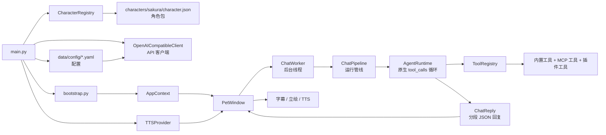

# 技术架构

Sakura 的运行时结构：UI 收集用户输入、截图、确认面板和主动事件；`ChatWorker` 与 `ChatPipeline` 把上下文整理成一次运行请求；真正的对话决策和工具循环交给 `AgentRuntime`。

`AgentRuntime` 直接走 OpenAI 兼容接口的原生 `tool_calls` 协议。模型在同一轮对话里决定是否调用工具，工具结果以 tool role 回填，模型再产出最终角色回复。

最终回复统一为分段 JSON：每段包含日文原文、中文字幕、语气和立绘标识。UI 只消费这份结构，同步驱动字幕、表情切换和 TTS 播放。如果模型输出格式不合格，运行时会尝试一次格式修复。

## 启动流程

`python main.py` 启动后：

1. 创建 `QApplication`
2. `AppSettingsService` 从 `data/config/api.yaml` 加载 API 配置
3. `CharacterRegistry` 扫描角色包
4. 加载角色人格卡和可用语气/立绘
5. `bootstrap.py` 组装 `AppContext`：工具注册表、记忆库、提醒库、MCP、插件、TTS
6. 后台线程装配耗时服务
7. 显示 `PetWindow`



## 模块结构

```text
app/
├── agent/      # Agent 决策层、工具、记忆、MCP、主动关怀
├── core/       # AppContext、启动装配、ChatPipeline、ChatWorker
├── config/     # 配置模型、YAML 读写、角色包加载
├── llm/        # OpenAI 兼容客户端、回复解析、上下文修剪
├── plugins/    # 插件模型、发现、能力注册和管理
├── storage/    # 本地数据、聊天历史、视觉观察记录
├── ui/         # 桌宠窗口、设置页、历史窗口、字幕和确认面板
└── voice/      # GPT-SoVITS / Null Provider、语音播放控制
```

项目根目录还包含：

```text
plugins/          # 本地插件
characters/       # 角色资源
data/             # 本地配置、聊天记录、记忆和视觉观察
tests/            # pytest 测试
docs/             # 文档
tools/mcp/        # MCP Server 运行时
```

## 运行与测试

Release 完整包包含 `runtime/`。Windows 可用 `./runtime/python.exe` 运行；源码开发时也可以用 Python 3.10+ 虚拟环境。

```powershell
python main.py
```

运行测试：

```powershell
python -m pytest
python -m pytest tests/unit
```

## 关键配置

所有配置集中在 `data/config/` 下的 YAML 文件中。

| YAML 路径 | 作用 | 默认值 |
|---|---|---|
| `api.yaml: llm.base_url` | API 地址 | `https://api.openai.com/v1` |
| `api.yaml: llm.api_key` | API Key | 空 |
| `api.yaml: llm.model` | 模型名称 | `gpt-4.1-mini` |
| `api.yaml: llm.timeout_seconds` | 超时时间 | `60` |
| `api.yaml: tts.enabled` | 启用 TTS | `false` |
| `api.yaml: tts.gpt_sovits.api_url` | TTS 接口 | `http://127.0.0.1:9880/tts` |
| `system_config.yaml: ui.subtitle_language` | 字幕语言 `ja` / `zh` | `zh` |
| `system_config.yaml: ui.portrait_scale_percent` | 立绘缩放百分比 | `100` |
| `system_config.yaml: proactive_care.enabled` | 主动感知（屏幕观察 + 主动发言） | `true` |
| `system_config.yaml: proactive_care.check_interval_minutes` | 主动评估间隔（分钟） | `20` |
| `system_config.yaml: proactive_care.cooldown_minutes` | 主动发言冷却（分钟） | `10` |
| `system_config.yaml: memory_curation.enabled` | 自动记忆整理 | `true` |
| `system_config.yaml: mcp.windows_enabled` | Windows MCP | `false` |
| `characters.yaml: current_character_id` | 当前角色 | `sakura` |

## TTS 技术配置

语音默认关闭。需要自行启动兼容以下接口的本地 GPT-SoVITS API：

- `POST /tts`
- `GET /set_gpt_weights`
- `GET /set_sovits_weights`

配置示例：

```yaml
tts:
  provider: gpt-sovits
  enabled: true
  gpt_sovits:
    api_url: http://127.0.0.1:9880/tts
    ref_lang: ja
    text_lang: ja
    timeout_seconds: 60
```

插件相关代码位于 `plugins/` 和 `app/plugins/`；插件只通过 `app.plugins.*` 公开 API 接入。继续阅读[插件 SDK](/developers/plugin-sdk/)。
